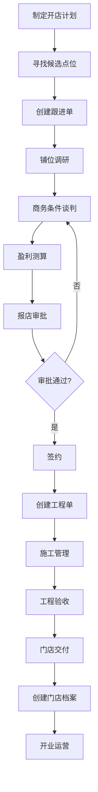
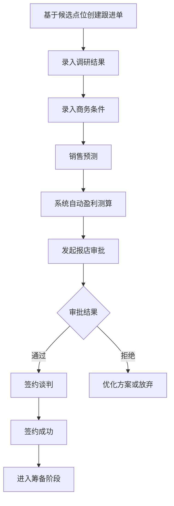
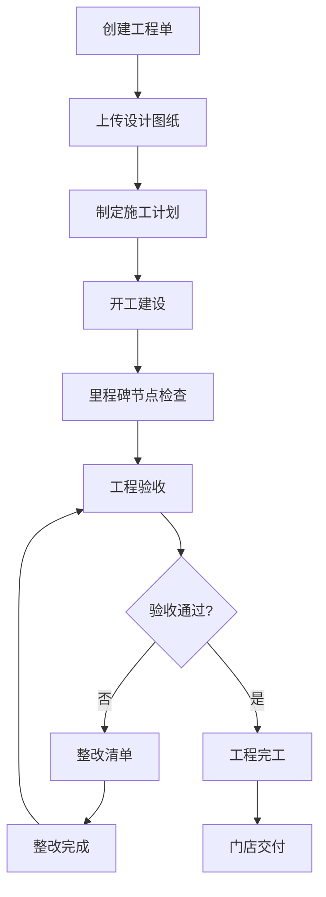
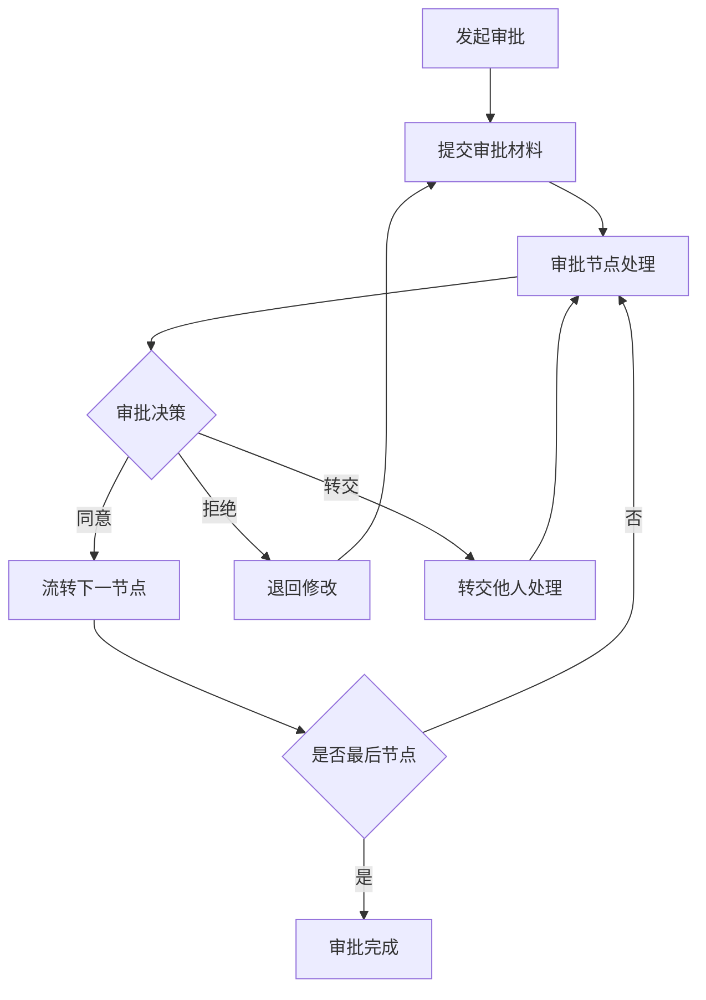

# PRD_好饭碗门店生命周期管理系统_v1.0_draft

## 文档信息

| 属性 | 值 |
|------|-----|
| 文档标题 | 好饭碗门店生命周期管理系统产品需求文档 |
| 文档版本 | v1.0 |
| 文档状态 | draft |
| 创建日期 | 2025-08-28 |
| 最后更新 | 2025-08-28 |
| 创建者 | 产品团队 |
| 审核者 | 待定 |
| 批准者 | 待定 |

---

## 1. 产品概述

### 1.1 产品背景

好饭碗门店生命周期管理系统是一套为连锁餐饮企业量身定制的全流程门店管理平台，旨在通过数字化手段优化从开店计划制定、拓店跟进、开店筹备到门店运营的全生命周期管理流程。

### 1.2 产品愿景

建立一体化的门店生命周期管理平台，实现门店从规划到运营的全流程数字化管控，提升门店开发效率，降低运营成本，支撑企业快速扩张战略。

### 1.3 产品目标

#### 业务目标
- 提升开店效率30%以上
- 降低门店开发成本20%以上
- 实现门店数据统一管理和实时监控
- 建立标准化的门店开发和运营流程

#### 技术目标
- 构建稳定可扩展的企业级应用架构
- 实现PC端和移动端一体化体验
- 集成企业微信，提升用户使用便捷性
- 建立完善的审批流程引擎

### 1.4 产品范围

**包含功能**：
- 开店计划管理
- 拓店管理（候选点位、跟进管理）
- 开店筹备管理（工程、交付）
- 门店档案管理
- 门店运营管理
- 审批中心
- 基础数据管理
- 移动端应用

**不包含功能**：
- 库存管理
- 采购管理
- 供应商账号管理
- 在线点位数据采集
- 日报周报系统

---

## 2. 用户角色分析

### 2.1 核心用户角色

| 角色名称 | 角色描述 | 主要职责 | 使用场景 |
|---------|---------|---------|---------|
| 总裁办人员 | 高级管理人员 | 战略决策、进度监控 | 查看经营大屏、数据报表 |
| 商务人员 | 门店开发负责人 | 拓店、工程管理、门店档案维护 | 全流程参与门店开发 |
| 运营人员 | 门店运营管理 | 计划管理、点位管理、运营监控 | 开店计划制定和执行监督 |
| 销售人员 | 门店销售支持 | 跟进管理、交付管理 | 协助门店开发和交付 |
| 财务人员 | 财务管理 | 成本控制、盈利测算审核 | 跟进管理中的财务审核 |
| 加盟商 | 门店投资方 | 门店信息管理、资料查看 | 门店档案查看、交付确认 |
| 店长 | 门店运营者 | 门店日常管理 | 门店档案维护、资产管理 |
| IT人员 | 技术支持 | 资产管理、系统维护 | 门店资产管理 |
| 系统管理员 | 系统管理 | 基础数据维护、权限管理 | 系统配置和用户管理 |

### 2.2 用户权限矩阵

| 功能模块 | 总裁办 | 商务 | 运营 | 销售 | 财务 | 加盟商 | 店长 | IT | 系统管理员 |
|---------|--------|------|------|------|------|--------|------|----|-----------
| 开店计划管理 | 查看 | 管理 | 管理 | 查看 | 查看 | - | - | - | 配置 |
| 候选点位管理 | 查看 | 管理 | 管理 | 查看 | - | - | - | - | 配置 |
| 跟进管理 | 查看 | 管理 | 管理 | 管理 | 审核 | 查看 | - | - | 配置 |
| 工程管理 | 查看 | 管理 | 查看 | 查看 | - | 查看 | - | - | 配置 |
| 交付管理 | 查看 | 管理 | 查看 | 管理 | - | 管理 | 管理 | - | 配置 |
| 门店档案 | 查看 | 管理 | 管理 | 管理 | 查看 | 查看 | 管理 | 查看 | 配置 |
| 门店运营管理 | 查看 | 管理 | 查看 | 查看 | 查看 | 查看 | 管理 | 管理 | 配置 |
| 经营大屏 | 查看 | 查看 | 查看 | - | - | - | - | - | 配置 |
| 审批中心 | 审批 | 审批 | 审批 | 审批 | 审批 | 审批 | 审批 | 审批 | 管理 |

---

## 3. 核心功能模块详细描述

### 3.1 系统首页

#### 功能概述
为用户提供个性化的工作台，集成待办事项、消息通知和常用功能快捷入口。

#### 功能详情

**3.1.1 待办事项工作区**
- **功能描述**：展示当前用户的待处理事项列表
- **业务规则**：
  - 按紧急程度和截止时间排序
  - 支持一键跳转到具体处理页面
  - 显示事项类型、标题、截止时间
- **用户故事**：作为用户，我希望在首页看到我的待办事项，以便及时处理重要工作

**3.1.2 消息通知列表**
- **功能描述**：展示系统推送的各类通知消息
- **业务规则**：
  - 区分已读/未读状态
  - 支持消息分类筛选
  - 支持批量标记已读
- **用户故事**：作为用户，我希望收到相关业务通知，以便及时了解业务动态

**3.1.3 常用功能管理区**
- **功能描述**：用户自定义的常用功能快捷入口
- **业务规则**：
  - 支持拖拽调整顺序
  - 支持添加/删除常用功能
  - 最多支持12个常用功能
- **用户故事**：作为用户，我希望能自定义常用功能，以便快速访问经常使用的功能

### 3.2 开店计划管理

#### 功能概述
支持企业按年度、季度制定和管理开店计划，提供多维度的计划导入和维护功能。

#### 功能详情

**3.2.1 计划导入功能**
- **功能描述**：支持批量导入开店计划数据
- **业务规则**：
  - 支持按年度/季度维度导入
  - 支持按省份/城市地域维度导入
  - 支持按店贡献率分型导入
  - 支持按门店类型导入
  - 导入数据需体现商务预算明细
- **数据格式**：Excel模板导入，包含字段：计划年度、季度、省份、城市、门店类型、贡献率类型、计划数量、预算金额
- **用户故事**：作为运营人员，我希望能批量导入开店计划，以便高效管理大量计划数据

**3.2.2 计划维护功能**
- **功能描述**：对已导入的开店计划进行维护管理
- **业务规则**：
  - 支持按多条件查询计划
  - 支持单条和批量编辑
  - 支持软删除，保留历史记录
  - 变更需要审批流程确认
- **用户故事**：作为商务人员，我希望能随时调整开店计划，以便应对市场变化

### 3.3 拓店管理

#### 3.3.1 候选点位管理

**功能概述**
管理潜在的门店选址点位信息，建立点位资源库。

**功能详情**
- **新建点位功能**
  - 录入点位基本信息：地址、面积、租金、交通情况等
  - 支持上传点位照片和位置地图
  - 自动生成点位编号
- **点位维护功能**
  - 多条件查询：按地区、面积、租金范围等筛选
  - 批量操作：批量修改状态、批量删除
  - 状态管理：待调研、调研中、已签约、已放弃
- **用户故事**：作为商务人员，我希望能系统化管理候选点位，以便建立完整的点位资源库

#### 3.3.2 跟进管理

**功能概述**
管理铺位从调研到签约的全过程跟进，包含调研、商务条件、盈利测算等关键环节。

**功能详情**

**跟进单创建**
- 基于候选点位创建跟进单
- 录入铺位调研结果：人流量、竞争情况、周边环境等
- 自动关联点位基础信息

**商务条件管理**
- 录入租赁条件：租金、押金、租期、递增幅度等
- 录入装修条件：装修补贴、免租期等
- 录入其他费用：物业费、水电费标准等

**销售预测与盈利测算**
- 录入销售预测数据：预估日均客流、客单价等
- 根据预设公式自动计算盈利测算
- 展示投资回收期、年回报率等关键指标
- 支持盈利测算公式的动态配置（二期功能）

**审批流程集成**
- 跟进结果自动关联报店审批流程
- 跟进信息自动带入审批单据
- 低贡献率门店数量预警机制

**签约管理**
- 录入签约信息：签约主体、签约时间、合同期限等
- 合同到期提醒设置
- 合同档案管理

**跟进优先级管理**
- 设置跟进优先级：高、中、低
- 支持优先级排序展示
- 支持标记"放弃跟进"状态

**用户故事**：
- 作为商务人员，我希望能系统化跟进铺位谈判过程，以便提高签约成功率
- 作为财务人员，我希望能看到准确的盈利测算，以便做出投资决策
- 作为运营人员，我希望能实时了解跟进进展，以便合理分配资源

### 3.4 开店筹备管理

#### 3.4.1 工程管理

**功能概述**
管理门店的施工建设过程，从设计图纸到验收交付的全流程管控。

**功能详情**

**工程单管理**
- 新建门店工程单，关联已签约铺位
- 上传设计图纸：平面图、效果图、施工图等
- 支持多版本图纸管理
- 工程单状态跟踪：待开工、施工中、验收中、已完成

**施工计划管理**
- 录入关键时间节点：开工日期、主体完工、装修完工、验收日期等
- 自定义里程碑节点设置
- 里程碑到期提醒功能
- 进度甘特图展示

**验收管理**
- 使用标准化验收核对表单
- 支持验收项目自定义配置
- 验收结果记录：合格、不合格、待整改
- 整改项管理：标记待整改项，生成整改清单
- 整改完成确认流程

**用户故事**：作为商务人员，我希望能清晰跟踪工程进度，以便确保按期开店

#### 3.4.2 交付管理

**功能概述**
提供门店交付过程中的资料管理功能，确保交付过程的完整性和规范性。

**功能详情**
- 交接清单管理：设备清单、资料清单、钥匙清单等
- 交接资料上传：合同、图纸、证照、操作手册等
- 交接确认流程：双方签字确认
- 交接历史记录查看

**用户故事**：作为店长，我希望能清晰了解门店交付内容，以便顺利接手门店运营

### 3.5 门店档案管理

#### 功能概述
建立门店的主数据档案，集成拓店和筹备阶段的各项资料，形成门店的完整信息库。

#### 功能详情

**基本信息管理**
- 门店基本信息：门店名称、地址、面积、座位数等
- 门店分类信息：门店类型、贡献率级别、业务区域等
- 门店状态管理：筹备中、试营业、正常营业、暂停营业、已关闭

**关联资料集成**
- 自动关联拓店阶段资料：商务条件、签约信息、调研报告等
- 自动关联筹备阶段资料：设计图纸、工程资料、交接清单等
- 支持资料分类管理和快速检索

**档案维护功能**
- 支持档案信息的查询、编辑
- 档案变更历史记录
- 档案访问权限控制

**用户故事**：作为各角色用户，我希望能在一个地方查看门店的完整信息，以便全面了解门店情况

### 3.6 门店运营管理（二期功能）

#### 3.6.1 待付款项管理

**功能概述**
管理门店运营过程中的各类待付款项，提供付款提醒和跟踪功能。

**功能详情**
- 款项录入：租金、物业费、水电费等
- 付款周期设置：月付、季付、年付等
- 自动提醒规则配置
- 付款状态跟踪

#### 3.6.2 资产管理

**功能概述**
管理门店内的各类资产，支持资产清单维护和盘点管理。

**功能详情**
- 资产清单维护：设备、家具、电器等
- 资产状态管理：正常、维修、报废等
- 资产盘点功能
- 资产调拨管理

### 3.7 经营大屏（二期功能）

#### 功能概述
为管理层提供门店开发和运营的可视化监控大屏，支持实时数据展示和决策支持。

#### 功能详情

**3.7.1 开店地图**
- 基于城市地图展示门店分布
- 区分展示：计划中、拓店中、筹备中、已开店的门店
- 支持点击查看门店详细信息
- 数据实时更新

**3.7.2 跟进漏斗**
- 展示拓店过程各环节数据：调研、谈判、测算、报店、签约
- 漏斗转化率分析
- 各环节用时分析
- 异常数据预警

**3.7.3 计划完成进度**
- 按贡献率类型展示计划执行情况
- 实际开店数量与计划对比
- 完成率趋势分析
- 预警提示功能

### 3.8 数据报表（二期功能）

#### 功能概述
提供开店过程中的各类数据报表，支持数据导出和外部数据集成。

#### 功能详情
- 开店计划报表：计划执行情况、完成率分析等
- 拓店跟进报表：跟进进度、签约成功率等
- 筹备进度报表：工程进度、交付情况等
- 门店资产报表：资产清单、资产状态等
- 外部数据接口：预留销售数据对接端口
- 投资回报分析：基于实际经营数据计算ROI

### 3.9 审批中心

#### 功能概述
提供完整的在线审批功能，支持审批流程的发起、处理和管理。

#### 功能详情

**3.9.1 审批操作处理**
- 审批发起：基于权限发起相关审批
- 审批处理：支持撤销、审批、转交、加签、关注、评论操作
- 审批导出：支持按模板批量导出审批台账

**3.9.2 审批业务管理**
- 待办审批：当前用户未处理的审批列表
- 已办审批：当前用户已处理的审批历史
- 抄送审批：抄送给当前用户的审批信息
- 关注审批：用户关注的审批流程
- 全部审批：权限范围内的所有审批信息

**3.9.3 审批模板配置**
- 自定义审批流程设计
- 预设审批模板：
  - 报店审批
  - 执照申请审批
  - 施工供应商比价审批
  - 交付确认审批
  - 开业申请审批
  - 门店报修审批
  - 闭店审批

### 3.10 基础数据管理

#### 功能概述
提供系统运行所需的各类基础数据管理功能。

#### 功能详情

**3.10.1 业务大区管理**
- 业务地区的新建、编辑、删除
- 设置业务地区与省市、门店的关联关系
- 设置业务地区负责人

**3.10.2 供应商管理**
- 供应商档案管理：新建、编辑、删除
- 供应商合作状态标记
- 供应商信息被业务模块引用

**3.10.3 主体信息管理**
- 主体档案管理：新建、编辑、删除
- 主体营运状态管理
- 主体信息被业务模块引用

**3.10.4 客户信息管理**
- 加盟商档案管理：新建、编辑、删除
- 客户合作状态管理
- 客户信息被业务模块引用

**3.10.5 商务预算管理**
- 门店商务预算维护：新建、编辑、删除
- 预算状态管理
- 预算信息被业务模块引用

### 3.11 系统管理

#### 功能概述
提供系统运行的基础管理功能。

#### 功能详情

**3.11.1 部门管理**
- 从企业微信同步部门架构信息
- 支持手动调整部门结构

**3.11.2 人员管理**
- 从企业微信同步人员信息
- 账号启停用设置
- 账号角色分配

**3.11.3 角色管理**
- 角色的新增、删除、修改
- 角色功能操作权限配置
- 角色成员管理

### 3.12 基础服务

#### 功能概述
提供系统的基础服务功能。

#### 功能详情

**3.12.1 登录服务**
- 账号/手机号+密码登录
- 手机号+验证码登录
- 企业微信集成登录

**3.12.2 消息中心**
- 接收业务系统事务通知
- 快速链接到业务单据
- 消息状态管理

**3.12.3 个人中心**
- 个人信息管理
- 账号密码修改
- 个人设置管理

---

## 4. 移动端功能

### 4.1 移动端工作台

#### 功能概述
为移动端用户提供核心业务功能的便捷访问。

#### 功能详情

**4.1.1 审批中心**
- 审批流的发起、处理、查看
- 审批消息推送
- 离线审批支持

**4.1.2 点位库**
- 查看点位库信息
- 点位地图展示
- 点位照片查看

**4.1.3 铺位跟进**
- 新建跟进单
- 添加跟进内容
- 上传现场照片

**4.1.4 工程验收**
- 移动端工程验收确认
- 标记整改问题
- 生成整改清单

**4.1.5 门店交付**
- 交付资料管理
- 交付确认操作
- 交接清单查看

**4.1.6 门店档案**
- 查看门店档案信息
- 档案资料下载
- 基本信息更新

**4.1.7 资产管理（二期）**
- 查看门店资产
- 资产信息维护
- 资产盘点功能

### 4.2 个人中心

#### 功能概述
移动端的个人信息管理功能。

#### 功能详情
- 企业微信工作台登录
- 消息通知管理
- 个人信息设置

---

## 5. 业务流程梳理

### 5.1 门店开发主流程



### 5.2 关键子流程

#### 5.2.1 跟进管理流程



#### 5.2.2 工程管理流程



#### 5.2.3 审批流程



---

## 6. 技术架构建议

### 6.1 整体架构

#### 6.1.1 架构模式
- **架构风格**：分层架构 + 微服务架构
- **部署模式**：云原生容器化部署
- **数据架构**：读写分离 + 缓存 + 数据仓库

#### 6.1.2 技术栈选型

**前端技术栈**：
- **框架**：React 18 + TypeScript
- **状态管理**：Redux Toolkit
- **UI组件库**：Ant Design
- **构建工具**：Vite
- **移动端**：React Native 或 H5 + PWA

**后端技术栈**：
- **运行时**：Node.js 18+
- **框架**：Express.js + TypeScript
- **数据库**：PostgreSQL（主库）+ Redis（缓存）
- **ORM**：Prisma
- **认证**：JWT + 企业微信 OAuth

**基础设施**：
- **容器化**：Docker + Kubernetes
- **API网关**：Kong 或 Nginx
- **消息队列**：Redis + Bull Queue
- **文件存储**：阿里云 OSS
- **监控**：Prometheus + Grafana

### 6.2 核心架构组件

#### 6.2.1 应用架构层次

```
┌─────────────────────────────────────────┐
│                前端层                    │
├─────────────────────────────────────────┤
│              API网关层                   │
├─────────────────────────────────────────┤
│              应用服务层                   │
├─────────────────────────────────────────┤
│              业务逻辑层                   │
├─────────────────────────────────────────┤
│              数据访问层                   │
├─────────────────────────────────────────┤
│              数据存储层                   │
└─────────────────────────────────────────┘
```

#### 6.2.2 微服务拆分建议

| 服务名称 | 职责范围 | 核心功能 |
|---------|---------|---------|
| 用户服务 | 用户管理、认证授权 | 登录、权限、角色管理 |
| 拓店服务 | 拓店业务逻辑 | 点位管理、跟进管理 |
| 筹备服务 | 筹备业务逻辑 | 工程管理、交付管理 |
| 门店服务 | 门店档案管理 | 门店信息、档案管理 |
| 审批服务 | 审批流程引擎 | 工作流、审批处理 |
| 基础数据服务 | 基础数据管理 | 字典数据、配置管理 |
| 通知服务 | 消息通知 | 消息推送、通知管理 |
| 文件服务 | 文件处理 | 文件上传、存储、下载 |

### 6.3 数据库设计

#### 6.3.1 核心数据模型

**用户相关**：
- users（用户表）
- roles（角色表）
- user_roles（用户角色关联表）
- departments（部门表）

**拓店相关**：
- store_plans（开店计划表）
- candidate_sites（候选点位表）
- follow_records（跟进记录表）
- business_conditions（商务条件表）

**筹备相关**：
- construction_orders（工程单表）
- construction_plans（施工计划表）
- acceptance_records（验收记录表）
- delivery_records（交付记录表）

**门店相关**：
- stores（门店档案表）
- store_assets（门店资产表）
- store_payments（门店付款项表）

**审批相关**：
- approval_templates（审批模板表）
- approval_instances（审批实例表）
- approval_tasks（审批任务表）

#### 6.3.2 数据库架构

- **主库**：PostgreSQL，承担事务性读写操作
- **从库**：PostgreSQL只读实例，承担查询操作
- **缓存**：Redis，缓存热点数据和会话信息
- **搜索**：Elasticsearch，支持全文检索（可选）

### 6.4 安全架构

#### 6.4.1 认证授权
- JWT Token认证机制
- 企业微信单点登录集成
- 基于角色的权限控制（RBAC）
- API接口鉴权中间件

#### 6.4.2 数据安全
- 数据传输：HTTPS/TLS加密
- 数据存储：敏感数据加密存储
- 数据备份：定期备份和恢复测试
- 操作审计：关键操作日志记录

### 6.5 性能优化

#### 6.5.1 前端优化
- 代码分割和懒加载
- 图片优化和CDN加速
- 缓存策略：浏览器缓存 + Service Worker
- Bundle优化和Tree Shaking

#### 6.5.2 后端优化
- 数据库查询优化和索引设计
- Redis缓存策略
- API响应时间监控
- 数据库连接池优化

---

## 7. 项目规划

### 7.1 项目分期计划

#### 7.1.1 一期功能范围（核心功能）

**目标**：建立门店生命周期管理的核心流程，实现从计划制定到门店开业的基本功能闭环。

**功能清单**：

| 功能模块 | 子功能 | 优先级 | 工期估算 |
|---------|--------|-------|---------|
| 系统首页 | 待办事项、消息通知、常用功能 | P0 | 1周 |
| 开店计划管理 | 计划导入、计划维护 | P0 | 2周 |
| 拓店管理 | 候选点位管理、跟进管理 | P0 | 4周 |
| 开店筹备管理 | 工程管理、交付管理 | P0 | 3周 |
| 门店档案 | 门店档案管理 | P0 | 2周 |
| 审批中心 | 审批操作、业务管理、模板配置 | P0 | 3周 |
| 基础数据管理 | 业务大区、供应商、主体、客户、商务预算 | P1 | 2周 |
| 系统管理 | 部门、人员、角色管理 | P1 | 1周 |
| 基础服务 | 登录、消息中心、个人中心 | P0 | 1周 |
| 移动端核心功能 | 审批、点位、跟进、验收、交付、档案 | P1 | 3周 |

**一期总工期**：约22周（5.5个月）

#### 7.1.2 二期功能范围（增值功能）

**目标**：完善门店运营管理功能，增加数据分析和可视化能力，提升系统的管理价值。

**功能清单**：

| 功能模块 | 子功能 | 优先级 | 工期估算 |
|---------|--------|-------|---------|
| 门店运营管理 | 待付款项管理、资产管理 | P2 | 3周 |
| 经营大屏 | 开店地图、跟进漏斗、计划进度分析 | P2 | 4周 |
| 数据报表 | 各类数据报表、外部数据集成 | P2 | 3周 |
| 跟进管理增强 | 损益测算模型配置、批量导出 | P2 | 2周 |
| 移动端资产管理 | 移动端资产功能 | P2 | 1周 |

**二期总工期**：约13周（3.2个月）

### 7.2 项目里程碑

#### 7.2.1 一期里程碑

| 里程碑 | 时间节点 | 主要交付物 | 验收标准 |
|--------|---------|-----------|---------|
| 需求确认 | 第2周 | PRD文档、原型设计 | 业务方确认需求 |
| 技术方案确认 | 第4周 | 技术方案、架构设计 | 技术评审通过 |
| 基础框架搭建 | 第8周 | 基础框架、核心组件 | 框架功能验证通过 |
| 核心功能完成 | 第16周 | 拓店、筹备、审批功能 | 核心业务流程验证 |
| 系统集成测试 | 第20周 | 完整系统、测试报告 | 系统功能验证通过 |
| 用户验收测试 | 第22周 | 生产环境部署 | 用户验收通过 |

#### 7.2.2 二期里程碑

| 里程碑 | 时间节点 | 主要交付物 | 验收标准 |
|--------|---------|-----------|---------|
| 需求细化 | 第2周 | 二期详细需求 | 需求评审通过 |
| 运营功能开发 | 第6周 | 运营管理模块 | 功能测试通过 |
| 数据分析功能 | 第10周 | 大屏和报表功能 | 数据展示验证 |
| 系统整体测试 | 第12周 | 完整系统测试 | 性能和功能验证 |
| 项目上线交付 | 第13周 | 项目交付文档 | 项目验收完成 |

### 7.3 资源需求

#### 7.3.1 人员配置

| 角色 | 人数 | 技能要求 | 主要职责 |
|------|-----|---------|---------|
| 项目经理 | 1 | 项目管理、业务理解 | 项目统筹、进度管控 |
| 产品经理 | 1 | 产品设计、需求分析 | 需求管理、产品设计 |
| 前端开发 | 2 | React、TypeScript | 前端开发、移动端开发 |
| 后端开发 | 2 | Node.js、数据库 | 后端开发、API设计 |
| UI/UX设计师 | 1 | 界面设计、交互设计 | 界面设计、原型设计 |
| 测试工程师 | 1 | 功能测试、自动化测试 | 测试用例、质量保证 |
| 运维工程师 | 1 | 云服务、DevOps | 部署运维、监控告警 |

#### 7.3.2 技术资源

**开发环境**：
- 开发服务器：云服务器 4核8G × 3台
- 测试服务器：云服务器 2核4G × 2台
- 生产服务器：云服务器 8核16G × 3台

**基础设施**：
- 数据库：PostgreSQL高可用版
- 缓存：Redis高可用版
- 对象存储：阿里云OSS
- CDN：阿里云CDN
- 监控：云监控服务

### 7.4 风险管控

#### 7.4.1 技术风险

| 风险项 | 风险等级 | 影响 | 应对措施 |
|-------|---------|------|---------|
| 企业微信集成复杂度 | 中 | 开发延期 | 提前技术预研，备选方案 |
| 审批流程引擎复杂 | 高 | 功能实现困难 | 选择成熟的开源方案 |
| 数据库性能瓶颈 | 中 | 系统响应慢 | 数据库优化，读写分离 |
| 移动端兼容性 | 中 | 用户体验差 | 充分的兼容性测试 |

#### 7.4.2 业务风险

| 风险项 | 风险等级 | 影响 | 应对措施 |
|-------|---------|------|---------|
| 需求变更频繁 | 高 | 项目延期 | 需求冻结机制，变更管控 |
| 用户接受度低 | 中 | 推广困难 | 用户培训，分阶段推广 |
| 业务流程不匹配 | 中 | 功能不实用 | 深度业务调研，试点验证 |

#### 7.4.3 项目风险

| 风险项 | 风险等级 | 影响 | 应对措施 |
|-------|---------|------|---------|
| 关键人员离职 | 中 | 项目延期 | 知识文档化，备用人员 |
| 资源投入不足 | 高 | 质量下降 | 资源计划，及时调整 |
| 第三方依赖延期 | 中 | 集成困难 | 备选方案，提前对接 |

---

## 8. 验收标准

### 8.1 功能验收标准

#### 8.1.1 系统首页

| 验收项 | 验收标准 | 验收方式 |
|-------|---------|---------|
| 待办事项显示 | 正确显示用户待处理事项，支持跳转 | 功能测试 |
| 消息通知 | 正确接收和显示系统消息 | 功能测试 |
| 常用功能 | 支持自定义配置，最多12个 | 功能测试 |

#### 8.1.2 开店计划管理

| 验收项 | 验收标准 | 验收方式 |
|-------|---------|---------|
| 计划导入 | 支持Excel批量导入，数据准确性100% | 功能测试 + 数据验证 |
| 计划维护 | 支持查询、编辑、删除，操作响应时间<2秒 | 功能测试 + 性能测试 |

#### 8.1.3 拓店管理

| 验收项 | 验收标准 | 验收方式 |
|-------|---------|---------|
| 候选点位管理 | 支持新建、编辑、删除、查询点位信息 | 功能测试 |
| 跟进管理 | 完整的跟进流程，盈利测算准确性 | 业务流程测试 |
| 审批集成 | 跟进信息自动带入审批单据 | 集成测试 |

#### 8.1.4 开店筹备管理

| 验收项 | 验收标准 | 验收方式 |
|-------|---------|---------|
| 工程管理 | 支持工程单管理、进度跟踪、验收管理 | 功能测试 |
| 交付管理 | 支持交接清单管理、交接确认 | 功能测试 |

#### 8.1.5 门店档案

| 验收项 | 验收标准 | 验收方式 |
|-------|---------|---------|
| 档案创建 | 支持门店档案创建和基本信息维护 | 功能测试 |
| 资料集成 | 自动关联拓店和筹备阶段资料 | 集成测试 |

#### 8.1.6 审批中心

| 验收项 | 验收标准 | 验收方式 |
|-------|---------|---------|
| 审批操作 | 支持完整的审批操作流程 | 功能测试 |
| 模板配置 | 支持审批模板的自定义配置 | 功能测试 |
| 预设模板 | 提供7个预设审批模板 | 功能测试 |

#### 8.1.7 移动端功能

| 验收项 | 验收标准 | 验收方式 |
|-------|---------|---------|
| 响应式设计 | 适配主流移动设备，界面友好 | 兼容性测试 |
| 核心功能 | 移动端核心功能完整可用 | 功能测试 |
| 企微集成 | 企业微信工作台正常登录 | 集成测试 |

### 8.2 性能验收标准

#### 8.2.1 响应时间标准

| 功能类别 | 响应时间要求 | 并发用户数 |
|---------|-------------|------------|
| 页面加载 | <3秒 | 100用户 |
| 数据查询 | <2秒 | 100用户 |
| 数据提交 | <5秒 | 50用户 |
| 文件上传 | <30秒（10MB） | 20用户 |

#### 8.2.2 系统容量标准

| 容量指标 | 标准值 |
|---------|--------|
| 并发用户数 | 100 |
| 数据库连接数 | 200 |
| 门店数量 | 10,000 |
| 年度跟进单 | 50,000 |
| 文件存储 | 1TB |

### 8.3 安全验收标准

#### 8.3.1 身份认证

| 验收项 | 验收标准 |
|-------|---------|
| 登录安全 | 支持多种登录方式，密码复杂度要求 |
| 会话管理 | 会话超时机制，安全退出 |
| 权限控制 | 基于角色的权限控制，权限最小化原则 |

#### 8.3.2 数据安全

| 验收项 | 验收标准 |
|-------|---------|
| 数据传输 | HTTPS加密传输 |
| 数据存储 | 敏感数据加密存储 |
| 数据备份 | 定期自动备份，备份数据完整性验证 |
| 操作审计 | 关键操作完整日志记录 |

### 8.4 易用性验收标准

#### 8.4.1 用户界面

| 验收项 | 验收标准 |
|-------|---------|
| 界面设计 | 符合企业设计规范，界面美观统一 |
| 交互体验 | 操作流畅，反馈及时明确 |
| 错误处理 | 友好的错误提示和异常处理 |

#### 8.4.2 用户体验

| 验收项 | 验收标准 |
|-------|---------|
| 学习成本 | 新用户30分钟内上手核心功能 |
| 操作效率 | 常用操作步骤不超过3步 |
| 帮助文档 | 提供完整的用户手册和在线帮助 |

### 8.5 兼容性验收标准

#### 8.5.1 浏览器兼容性

| 浏览器 | 版本要求 | 支持程度 |
|-------|---------|---------|
| Chrome | 90+ | 完全支持 |
| Firefox | 88+ | 完全支持 |
| Safari | 14+ | 完全支持 |
| Edge | 90+ | 完全支持 |

#### 8.5.2 移动端兼容性

| 平台 | 版本要求 | 支持程度 |
|------|---------|---------|
| iOS | 13+ | 完全支持 |
| Android | 8+ | 完全支持 |
| 企业微信 | 最新版 | 完全支持 |

---

## 9. 用户故事汇总

### 9.1 管理层用户故事

**总裁办人员**：
- 作为总裁办人员，我希望通过经营大屏实时了解开店进展，以便做出战略决策
- 作为总裁办人员，我希望查看各类数据报表，以便分析业务状况和趋势
- 作为总裁办人员，我希望审批重要的开店申请，以便控制投资风险

### 9.2 业务人员用户故事

**商务人员**：
- 作为商务人员，我希望系统化管理候选点位，以便建立完整的点位资源库
- 作为商务人员，我希望跟踪铺位跟进过程，以便提高签约成功率
- 作为商务人员，我希望管理门店工程进度，以便确保按期开店
- 作为商务人员，我希望在移动端处理工程验收，以便现场及时确认

**运营人员**：
- 作为运营人员，我希望制定和调整开店计划，以便合理分配资源
- 作为运营人员，我希望监控拓店进展，以便及时发现问题
- 作为运营人员，我希望查看门店档案，以便全面了解门店情况

**销售人员**：
- 作为销售人员，我希望参与跟进管理，以便提供销售支持
- 作为销售人员，我希望管理门店交付过程，以便确保顺利开业
- 作为销售人员，我希望在移动端查看门店信息，以便随时了解门店状况

### 9.3 财务人员用户故事

**财务人员**：
- 作为财务人员，我希望审核盈利测算结果，以便控制投资风险
- 作为财务人员，我希望跟踪门店待付款项，以便合理安排资金
- 作为财务人员，我希望参与相关审批流程，以便进行财务把控

### 9.4 门店人员用户故事

**加盟商**：
- 作为加盟商，我希望查看门店档案信息，以便了解门店详细情况
- 作为加盟商，我希望参与门店交付确认，以便保障自身权益
- 作为加盟商，我希望在移动端方便地查看门店资料

**店长**：
- 作为店长，我希望维护门店基本信息，以便保持信息准确性
- 作为店长，我希望管理门店资产，以便做好资产保管
- 作为店长，我希望在移动端处理门店相关事务，以便提高工作效率

### 9.5 系统管理员用户故事

**系统管理员**：
- 作为系统管理员，我希望管理用户账号和权限，以便保障系统安全
- 作为系统管理员，我希望配置审批模板，以便满足业务流程需求
- 作为系统管理员，我希望维护基础数据，以便支撑业务正常运行
- 作为系统管理员，我希望同步企微组织架构，以便简化用户管理

---

## 10. 附录

### 10.1 术语表

| 术语 | 定义 |
|------|-----|
| 开店计划 | 企业年度或季度的门店开发计划，包含数量、区域、预算等信息 |
| 候选点位 | 潜在的门店选址位置，需要经过调研和评估 |
| 跟进单 | 记录铺位从调研到签约全过程的业务单据 |
| 盈利测算 | 基于销售预测和成本分析计算的门店投资回报评估 |
| 工程单 | 记录门店施工建设过程的管理单据 |
| 门店档案 | 门店的完整信息记录，包含基本信息和历史资料 |
| 审批模板 | 预先配置的审批流程模板，用于标准化审批过程 |
| 业务大区 | 企业按地理区域划分的业务管理单元 |

### 10.2 需求来源

本PRD基于以下需求输入：
1. 《好饭碗产品功能清单0814.csv》原始需求文档
2. 业务方需求访谈结果
3. 现有业务流程调研
4. 竞品分析结果

### 10.3 相关文档

- 《好饭碗产品功能清单0814.csv》- 原始需求清单
- 《系统架构设计文档》- 技术架构设计
- 《数据库设计文档》- 数据模型设计
- 《API接口设计文档》- 接口规范文档
- 《UI设计规范》- 界面设计标准

### 10.4 版本历史

| 版本 | 日期 | 修改内容 | 修改人 |
|------|------|---------|--------|
| v1.0 | 2025-08-28 | 初始版本，完整PRD文档 | 产品团队 |

---

**文档状态**：草稿版  
**下一步行动**：需求评审会议，确认功能范围和优先级  
**预计完成时间**：2025-09-01