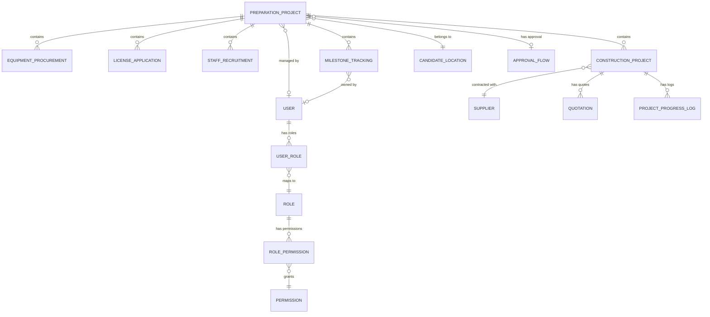

# 开店筹备管理 - 数据库设计文档

## 文档信息

- **版本**: v1.0
- **创建日期**: 2025-08-29
- **作者**: 后端架构师
- **文档类型**: 数据库设计

## 1. 概述

本文档详细描述了开店筹备管理模块的数据库设计，包括核心数据表结构、字段定义、索引设计、关联关系等。

### 1.1 设计原则

- **数据完整性**: 通过外键约束和业务验证确保数据一致性
- **扩展性**: 支持业务扩展，预留扩展字段和表结构
- **性能优化**: 合理设计索引，支持高并发查询
- **审计追踪**: 完整的创建/更新时间记录，支持数据变更追踪

### 1.2 技术栈

- **数据库**: PostgreSQL 14+
- **ORM**: Prisma
- **数据类型**: 使用PostgreSQL原生数据类型优化性能

## 2. 核心数据表设计

### 2.1 筹备项目主表 (preparation_projects)

筹备项目是整个开店筹备管理的核心实体，统筹管理工程、设备、证照、人员等各个方面。

#### 表结构

| 字段名 | 数据类型 | 约束 | 说明 |
|--------|----------|------|------|
| id | String | PK, CUID | 主键ID |
| projectCode | String(50) | UNIQUE, NOT NULL | 筹备项目编号 |
| projectName | String(200) | NOT NULL | 筹备项目名称 |
| candidateLocationId | String | FK, NOT NULL | 候选点位ID |
| storeCode | String(50) | NULL | 门店编码 |
| storeName | String(200) | NULL | 门店名称 |
| status | String(20) | DEFAULT 'PLANNING' | 项目状态 |
| priority | Priority | DEFAULT 'MEDIUM' | 优先级 |
| plannedStartDate | DateTime | NOT NULL | 计划开始日期 |
| plannedEndDate | DateTime | NOT NULL | 计划结束日期 |
| actualStartDate | DateTime | NULL | 实际开始日期 |
| actualEndDate | DateTime | NULL | 实际结束日期 |
| budget | Decimal(15,2) | NOT NULL | 预算金额 |
| actualBudget | Decimal(15,2) | NULL | 实际预算 |
| progressPercentage | SmallInt | DEFAULT 0 | 总体进度百分比(0-100) |
| description | Text | NULL | 项目描述 |
| notes | Text | NULL | 备注 |
| managerId | String | FK, NULL | 项目经理ID |
| approvalFlowId | String | FK, NULL | 审批流ID |
| createdAt | DateTime | DEFAULT now() | 创建时间 |
| updatedAt | DateTime | AUTO UPDATE | 更新时间 |

#### 状态枚举
- `PLANNING`: 规划中
- `APPROVED`: 已批准
- `IN_PROGRESS`: 进行中
- `SUSPENDED`: 已暂停
- `COMPLETED`: 已完成
- `CANCELLED`: 已取消
- `OVERDUE`: 已逾期

#### 索引设计
```sql
-- 复合索引
CREATE INDEX idx_preparation_projects_candidate_status ON preparation_projects (candidateLocationId, status);
CREATE INDEX idx_preparation_projects_status_priority ON preparation_projects (status, priority);
CREATE INDEX idx_preparation_projects_planned_dates ON preparation_projects (plannedStartDate, plannedEndDate);

-- 单字段索引
CREATE INDEX idx_preparation_projects_manager ON preparation_projects (managerId);
CREATE UNIQUE INDEX idx_preparation_projects_code ON preparation_projects (projectCode);
```

### 2.2 工程任务管理 (construction_projects)

复用现有的工程项目表，新增与筹备项目的关联关系。

#### 新增字段

| 字段名 | 数据类型 | 约束 | 说明 |
|--------|----------|------|------|
| preparationProjectId | String | FK, NULL | 筹备项目ID |

#### 新增索引
```sql
CREATE INDEX idx_construction_projects_preparation ON construction_projects (preparationProjectId);
```

### 2.3 设备采购管理 (equipment_procurements)

管理门店开业所需的各类设备采购全流程。

#### 表结构

| 字段名 | 数据类型 | 约束 | 说明 |
|--------|----------|------|------|
| id | String | PK, CUID | 主键ID |
| procurementCode | String(50) | UNIQUE, NOT NULL | 采购编号 |
| preparationProjectId | String | FK, NOT NULL | 筹备项目ID |
| category | String(50) | NOT NULL | 设备类别 |
| equipmentName | String(200) | NOT NULL | 设备名称 |
| brand | String(100) | NULL | 品牌 |
| model | String(100) | NULL | 型号 |
| specifications | JSON | NULL | 规格参数 |
| quantity | SmallInt | NOT NULL | 采购数量 |
| unitPrice | Decimal(12,2) | NULL | 单价 |
| totalPrice | Decimal(15,2) | NULL | 总价 |
| currency | String(10) | DEFAULT 'CNY' | 币种 |
| status | String(20) | DEFAULT 'PENDING' | 状态 |
| priority | Priority | DEFAULT 'MEDIUM' | 优先级 |
| plannedDeliveryDate | DateTime | NULL | 计划交付日期 |
| actualDeliveryDate | DateTime | NULL | 实际交付日期 |
| installationDate | DateTime | NULL | 安装日期 |
| acceptanceDate | DateTime | NULL | 验收日期 |
| warrantyPeriod | SmallInt | NULL | 保修期(月) |
| warrantyExpiry | DateTime | NULL | 保修到期日期 |
| supplier | String(200) | NULL | 供应商 |
| supplierContact | String(200) | NULL | 供应商联系方式 |
| purchaseOrder | String(100) | NULL | 采购订单号 |
| deliveryAddress | String(500) | NULL | 交付地址 |
| installationRequirements | Text | NULL | 安装要求 |
| operationManual | JSON | NULL | 操作手册URL数组 |
| maintenanceSchedule | JSON | NULL | 维护计划 |
| photos | JSON | NULL | 设备照片URL数组 |
| documents | JSON | NULL | 相关文档URL数组 |
| notes | Text | NULL | 备注 |
| createdAt | DateTime | DEFAULT now() | 创建时间 |
| updatedAt | DateTime | AUTO UPDATE | 更新时间 |

#### 设备类别枚举
- `KITCHEN`: 厨房设备
- `DINING`: 餐厅设备
- `COOLING`: 制冷设备
- `CLEANING`: 清洁设备
- `SAFETY`: 安全设备
- `FURNITURE`: 家具设备
- `TECHNOLOGY`: 技术设备
- `DECORATION`: 装饰设备
- `OTHER`: 其他设备

#### 状态枚举
- `PENDING`: 待采购
- `QUOTED`: 已报价
- `APPROVED`: 已批准
- `ORDERED`: 已下单
- `DELIVERED`: 已交付
- `INSTALLED`: 已安装
- `ACCEPTED`: 已验收
- `WARRANTY`: 保修期
- `MAINTENANCE`: 维护中

#### 索引设计
```sql
CREATE INDEX idx_equipment_procurements_preparation_category ON equipment_procurements (preparationProjectId, category);
CREATE INDEX idx_equipment_procurements_status_priority ON equipment_procurements (status, priority);
CREATE INDEX idx_equipment_procurements_delivery_date ON equipment_procurements (plannedDeliveryDate);
CREATE UNIQUE INDEX idx_equipment_procurements_code ON equipment_procurements (procurementCode);
```

### 2.4 证照办理管理 (license_applications)

管理门店开业所需的各种证照办理全流程。

#### 表结构

| 字段名 | 数据类型 | 约束 | 说明 |
|--------|----------|------|------|
| id | String | PK, CUID | 主键ID |
| applicationCode | String(50) | UNIQUE, NOT NULL | 申请编号 |
| preparationProjectId | String | FK, NOT NULL | 筹备项目ID |
| licenseType | String(50) | NOT NULL | 证照类型 |
| licenseName | String(200) | NOT NULL | 证照名称 |
| issuingAuthority | String(200) | NOT NULL | 发证机关 |
| status | String(20) | DEFAULT 'PENDING' | 状态 |
| priority | Priority | DEFAULT 'MEDIUM' | 优先级 |
| applicationDate | DateTime | NULL | 申请日期 |
| submissionDate | DateTime | NULL | 提交日期 |
| reviewStartDate | DateTime | NULL | 审核开始日期 |
| approvalDate | DateTime | NULL | 批准日期 |
| issuanceDate | DateTime | NULL | 发证日期 |
| expiryDate | DateTime | NULL | 有效期截止日期 |
| renewalDate | DateTime | NULL | 续期日期 |
| licenseNumber | String(100) | NULL | 证照编号 |
| applicationFee | Decimal(10,2) | NULL | 申请费用 |
| actualFee | Decimal(10,2) | NULL | 实际费用 |
| currency | String(10) | DEFAULT 'CNY' | 币种 |
| applicant | String(100) | NULL | 申请人 |
| contactPerson | String(50) | NULL | 联系人 |
| contactPhone | String(20) | NULL | 联系电话 |
| applicationAddress | String(500) | NULL | 申请地址 |
| requiredDocuments | String[] | DEFAULT [] | 所需材料清单 |
| submittedDocuments | String[] | DEFAULT [] | 已提交材料 |
| missingDocuments | String[] | DEFAULT [] | 缺失材料 |
| rejectionReason | Text | NULL | 拒绝原因 |
| conditions | Text | NULL | 批准条件 |
| renewalReminder | DateTime | NULL | 续期提醒日期 |
| attachments | JSON | NULL | 附件URL数组 |
| notes | Text | NULL | 备注 |
| createdAt | DateTime | DEFAULT now() | 创建时间 |
| updatedAt | DateTime | AUTO UPDATE | 更新时间 |

#### 证照类型枚举
- `BUSINESS`: 营业执照
- `FOOD_SERVICE`: 食品经营许可证
- `FIRE_SAFETY`: 消防安全检查合格证
- `HEALTH`: 健康证
- `TAX`: 税务登记证
- `SIGNBOARD`: 门头招牌许可证
- `ENVIRONMENTAL`: 环保许可证
- `SPECIAL`: 特殊许可证
- `OTHER`: 其他证照

#### 状态枚举
- `PENDING`: 待办理
- `SUBMITTED`: 已提交
- `UNDER_REVIEW`: 审核中
- `APPROVED`: 已批准
- `ISSUED`: 已发证
- `REJECTED`: 已拒绝
- `EXPIRED`: 已过期
- `RENEWED`: 已续期

#### 索引设计
```sql
CREATE INDEX idx_license_applications_preparation_type ON license_applications (preparationProjectId, licenseType);
CREATE INDEX idx_license_applications_status_priority ON license_applications (status, priority);
CREATE INDEX idx_license_applications_authority ON license_applications (issuingAuthority);
CREATE INDEX idx_license_applications_expiry ON license_applications (expiryDate);
CREATE INDEX idx_license_applications_renewal ON license_applications (renewalReminder);
CREATE UNIQUE INDEX idx_license_applications_code ON license_applications (applicationCode);
```

### 2.5 人员招聘管理 (staff_recruitments)

管理门店开业所需的人员招聘全流程。

#### 表结构

| 字段名 | 数据类型 | 约束 | 说明 |
|--------|----------|------|------|
| id | String | PK, CUID | 主键ID |
| recruitmentCode | String(50) | UNIQUE, NOT NULL | 招聘编号 |
| preparationProjectId | String | FK, NOT NULL | 筹备项目ID |
| positionType | String(50) | NOT NULL | 职位类型 |
| positionTitle | String(200) | NOT NULL | 职位标题 |
| department | String(100) | NULL | 所属部门 |
| plannedCount | SmallInt | NOT NULL | 计划招聘人数 |
| recruitedCount | SmallInt | DEFAULT 0 | 已招聘人数 |
| onboardedCount | SmallInt | DEFAULT 0 | 已入职人数 |
| status | String(20) | DEFAULT 'PLANNING' | 状态 |
| priority | Priority | DEFAULT 'MEDIUM' | 优先级 |
| startDate | DateTime | NULL | 招聘开始日期 |
| endDate | DateTime | NULL | 招聘结束日期 |
| salaryRange | JSON | NULL | 薪资范围 |
| workLocation | String(200) | NULL | 工作地点 |
| workSchedule | String(500) | NULL | 工作安排 |
| qualificationRequirements | Text | NOT NULL | 资格要求 |
| jobDescription | Text | NOT NULL | 职位描述 |
| benefits | Text | NULL | 福利待遇 |
| recruitmentChannels | String[] | DEFAULT [] | 招聘渠道 |
| recruiters | String[] | DEFAULT [] | 招聘负责人ID数组 |
| interviewers | String[] | DEFAULT [] | 面试官ID数组 |
| candidates | JSON | NULL | 候选人信息JSON数组 |
| notes | Text | NULL | 备注 |
| createdAt | DateTime | DEFAULT now() | 创建时间 |
| updatedAt | DateTime | AUTO UPDATE | 更新时间 |

#### 职位类型枚举
- `MANAGER`: 店长/经理
- `CHEF`: 厨师
- `SERVER`: 服务员
- `CASHIER`: 收银员
- `CLEANER`: 保洁员
- `SECURITY`: 保安
- `MAINTENANCE`: 维修工
- `SALES`: 销售员
- `OTHER`: 其他职位

#### 状态枚举
- `PLANNING`: 规划中
- `PUBLISHED`: 已发布
- `INTERVIEWING`: 面试中
- `OFFERED`: 已发offer
- `ONBOARDED`: 已入职
- `CANCELLED`: 已取消
- `COMPLETED`: 已完成

#### 索引设计
```sql
CREATE INDEX idx_staff_recruitments_preparation_position ON staff_recruitments (preparationProjectId, positionType);
CREATE INDEX idx_staff_recruitments_status_priority ON staff_recruitments (status, priority);
CREATE INDEX idx_staff_recruitments_dates ON staff_recruitments (startDate, endDate);
CREATE UNIQUE INDEX idx_staff_recruitments_code ON staff_recruitments (recruitmentCode);
```

### 2.6 里程碑跟踪 (milestone_tracking)

管理筹备项目的关键里程碑和进度跟踪。

#### 表结构

| 字段名 | 数据类型 | 约束 | 说明 |
|--------|----------|------|------|
| id | String | PK, CUID | 主键ID |
| preparationProjectId | String | FK, NOT NULL | 筹备项目ID |
| name | String(200) | NOT NULL | 里程碑名称 |
| description | Text | NULL | 描述 |
| category | String(50) | NOT NULL | 类别 |
| status | String(20) | DEFAULT 'PENDING' | 状态 |
| priority | Priority | DEFAULT 'MEDIUM' | 优先级 |
| plannedDate | DateTime | NOT NULL | 计划日期 |
| actualDate | DateTime | NULL | 实际日期 |
| dependencies | String[] | DEFAULT [] | 依赖的里程碑ID |
| relatedTasks | String[] | DEFAULT [] | 相关任务ID |
| deliverables | String[] | DEFAULT [] | 交付物 |
| criteria | Text | NULL | 完成标准 |
| ownerId | String | FK, NULL | 负责人ID |
| stakeholders | String[] | DEFAULT [] | 利益相关者ID数组 |
| riskLevel | String(20) | DEFAULT 'MEDIUM' | 风险等级 |
| notes | Text | NULL | 备注 |
| createdAt | DateTime | DEFAULT now() | 创建时间 |
| updatedAt | DateTime | AUTO UPDATE | 更新时间 |

#### 状态枚举
- `PENDING`: 待开始
- `IN_PROGRESS`: 进行中
- `COMPLETED`: 已完成
- `OVERDUE`: 已逾期
- `CANCELLED`: 已取消
- `BLOCKED`: 被阻塞

#### 风险等级枚举
- `LOW`: 低风险
- `MEDIUM`: 中等风险
- `HIGH`: 高风险

#### 索引设计
```sql
CREATE INDEX idx_milestone_tracking_preparation_status ON milestone_tracking (preparationProjectId, status);
CREATE INDEX idx_milestone_tracking_planned_date ON milestone_tracking (plannedDate);
CREATE INDEX idx_milestone_tracking_owner ON milestone_tracking (ownerId);
CREATE INDEX idx_milestone_tracking_category_status ON milestone_tracking (category, status);
```

## 3. 数据关联关系

### 3.1 主要关联关系图



### 3.2 外键约束

#### 筹备项目关联
- `preparation_projects.candidateLocationId` → `candidate_locations.id`
- `preparation_projects.managerId` → `users.id`
- `preparation_projects.approvalFlowId` → `approval_flows.id`

#### 子模块关联
- `equipment_procurements.preparationProjectId` → `preparation_projects.id`
- `license_applications.preparationProjectId` → `preparation_projects.id`
- `staff_recruitments.preparationProjectId` → `preparation_projects.id`
- `milestone_tracking.preparationProjectId` → `preparation_projects.id`
- `construction_projects.preparationProjectId` → `preparation_projects.id`

#### 其他关联
- `milestone_tracking.ownerId` → `users.id`
- `construction_projects.supplierId` → `suppliers.id`

## 4. 索引策略

### 4.1 查询性能优化

#### 高频查询场景
1. **按筹备项目查询子模块**: 使用 `preparationProjectId` 索引
2. **按状态和优先级筛选**: 使用复合索引 `(status, priority)`
3. **按时间范围查询**: 使用日期字段索引
4. **全文搜索**: 使用名称、描述字段（考虑使用PostgreSQL全文搜索）

#### 索引优化原则
- **复合索引**: 将筛选条件多的字段放在前面
- **选择性**: 优先为高选择性字段创建索引
- **维护成本**: 平衡查询性能和写入性能

### 4.2 分区策略（可选）

对于大数据量场景，可考虑按时间分区：

```sql
-- 按年份分区（示例）
CREATE TABLE preparation_projects_2024 PARTITION OF preparation_projects
FOR VALUES FROM ('2024-01-01') TO ('2025-01-01');

CREATE TABLE preparation_projects_2025 PARTITION OF preparation_projects
FOR VALUES FROM ('2025-01-01') TO ('2026-01-01');
```

## 5. 数据完整性约束

### 5.1 业务规则约束

#### CHECK约束
```sql
-- 进度百分比约束
ALTER TABLE preparation_projects 
ADD CONSTRAINT chk_progress_range 
CHECK (progressPercentage >= 0 AND progressPercentage <= 100);

-- 预算金额约束
ALTER TABLE preparation_projects 
ADD CONSTRAINT chk_budget_positive 
CHECK (budget > 0);

-- 数量约束
ALTER TABLE equipment_procurements 
ADD CONSTRAINT chk_quantity_positive 
CHECK (quantity > 0);

ALTER TABLE staff_recruitments 
ADD CONSTRAINT chk_count_positive 
CHECK (plannedCount > 0 AND recruitedCount >= 0 AND onboardedCount >= 0);

ALTER TABLE staff_recruitments 
ADD CONSTRAINT chk_count_logic 
CHECK (onboardedCount <= recruitedCount AND recruitedCount <= plannedCount);
```

#### 触发器（可选）
```sql
-- 自动更新筹备项目进度
CREATE OR REPLACE FUNCTION update_preparation_progress()
RETURNS TRIGGER AS $$
BEGIN
  -- 根据子任务完成情况更新总体进度
  UPDATE preparation_projects 
  SET progressPercentage = calculate_overall_progress(NEW.preparationProjectId)
  WHERE id = NEW.preparationProjectId;
  
  RETURN NEW;
END;
$$ LANGUAGE plpgsql;

-- 绑定触发器到相关表
CREATE TRIGGER tr_update_progress_equipment
  AFTER UPDATE OF status ON equipment_procurements
  FOR EACH ROW EXECUTE FUNCTION update_preparation_progress();
```

### 5.2 数据验证规则

#### 状态转换验证
- 实现状态机，确保状态转换的合法性
- 防止非法的状态跳转（如从CANCELLED直接到COMPLETED）

#### 日期逻辑验证
- 确保实际日期不早于计划日期（特殊情况除外）
- 确保结束日期不早于开始日期

#### 金额计算验证
- 单价 × 数量 = 总价的一致性检查
- 预算金额的合理性检查

## 6. 性能监控与优化

### 6.1 查询性能监控

#### 慢查询监控
```sql
-- 开启慢查询日志
ALTER SYSTEM SET log_min_duration_statement = 1000; -- 1秒以上的查询

-- 查询慢查询统计
SELECT query, mean_exec_time, calls, total_exec_time
FROM pg_stat_statements
WHERE query LIKE '%preparation%'
ORDER BY mean_exec_time DESC;
```

#### 索引使用率监控
```sql
-- 检查索引使用情况
SELECT schemaname, tablename, indexname, idx_tup_read, idx_tup_fetch
FROM pg_stat_user_indexes
WHERE schemaname = 'public' AND tablename LIKE '%preparation%'
ORDER BY idx_tup_read DESC;
```

### 6.2 存储优化

#### 数据归档策略
- 定期归档历史完成的筹备项目数据
- 保留最近2年的活跃数据在主表

#### 压缩存储
- 对JSON字段使用压缩存储
- 大文本字段使用TOAST压缩

## 7. 数据安全与备份

### 7.1 访问控制

#### 行级安全策略（RLS）
```sql
-- 启用行级安全
ALTER TABLE preparation_projects ENABLE ROW LEVEL SECURITY;

-- 创建策略：用户只能访问自己管理的项目
CREATE POLICY preparation_project_manager_policy 
ON preparation_projects
FOR ALL 
TO preparation_manager_role
USING (managerId = current_user_id());
```

### 7.2 数据备份

#### 备份策略
- **全量备份**: 每日全量备份
- **增量备份**: 每小时增量备份WAL日志
- **测试恢复**: 定期测试备份恢复流程

#### 备份脚本示例
```bash
#!/bin/bash
# 每日备份脚本
pg_dump -h localhost -U postgres -d mendian_db \
  --format=custom \
  --compress=9 \
  --file="/backup/mendian_$(date +%Y%m%d).dump"
```

## 8. 迁移和部署

### 8.1 数据库迁移

#### Prisma迁移命令
```bash
# 生成迁移文件
npx prisma migrate dev --name "add_preparation_management"

# 应用迁移到生产环境
npx prisma migrate deploy
```

#### 迁移脚本
```sql
-- 创建新表
-- （由Prisma自动生成）

-- 数据迁移
-- 将现有工程项目关联到筹备项目（如需要）
UPDATE construction_projects 
SET preparationProjectId = (
  SELECT pp.id 
  FROM preparation_projects pp 
  WHERE pp.candidateLocationId = construction_projects.candidateLocationId
  LIMIT 1
)
WHERE preparationProjectId IS NULL;
```

### 8.2 环境配置

#### 数据库配置优化
```sql
-- 连接池配置
max_connections = 200
shared_buffers = 256MB
effective_cache_size = 1GB
work_mem = 4MB

-- 查询优化
random_page_cost = 1.1
seq_page_cost = 1.0
cpu_tuple_cost = 0.01
```

## 9. 监控与维护

### 9.1 数据库监控指标

#### 关键指标
- 连接数使用率
- 查询响应时间
- 索引命中率
- 磁盘IO使用率
- 数据库大小增长趋势

#### 监控工具
- PostgreSQL内置统计视图
- pgAdmin监控功能
- 自定义监控脚本
- Grafana + Prometheus（可选）

### 9.2 定期维护任务

#### 每日任务
- 检查慢查询日志
- 监控数据库性能指标
- 验证备份完整性

#### 每周任务
- 分析表统计信息更新
- 检查索引碎片化
- 清理临时文件

#### 每月任务
- 全面性能分析
- 容量规划评估
- 安全审计检查

## 10. 总结

本数据库设计文档详细描述了开店筹备管理模块的完整数据架构，包括：

### 10.1 核心特点
- **完整性**: 涵盖筹备管理全流程的数据需求
- **扩展性**: 支持未来业务扩展和功能增强
- **性能**: 合理的索引设计和查询优化
- **安全性**: 完整的访问控制和数据保护机制

### 10.2 技术优势
- 使用PostgreSQL的高级特性（JSON、数组、全文搜索等）
- Prisma ORM提供类型安全和迁移管理
- 完善的约束和验证机制确保数据一致性
- 支持高并发和大数据量的性能优化

### 10.3 后续工作
1. **API接口开发**: 基于此数据模型开发完整的CRUD接口
2. **业务逻辑实现**: 实现状态转换、进度计算等业务逻辑
3. **性能测试**: 在实际数据量下进行性能测试和优化
4. **安全测试**: 进行数据安全和访问控制测试
5. **监控部署**: 部署完整的监控和告警系统

---

**文档维护**: 本文档将随着业务需求变化和技术演进持续更新维护。