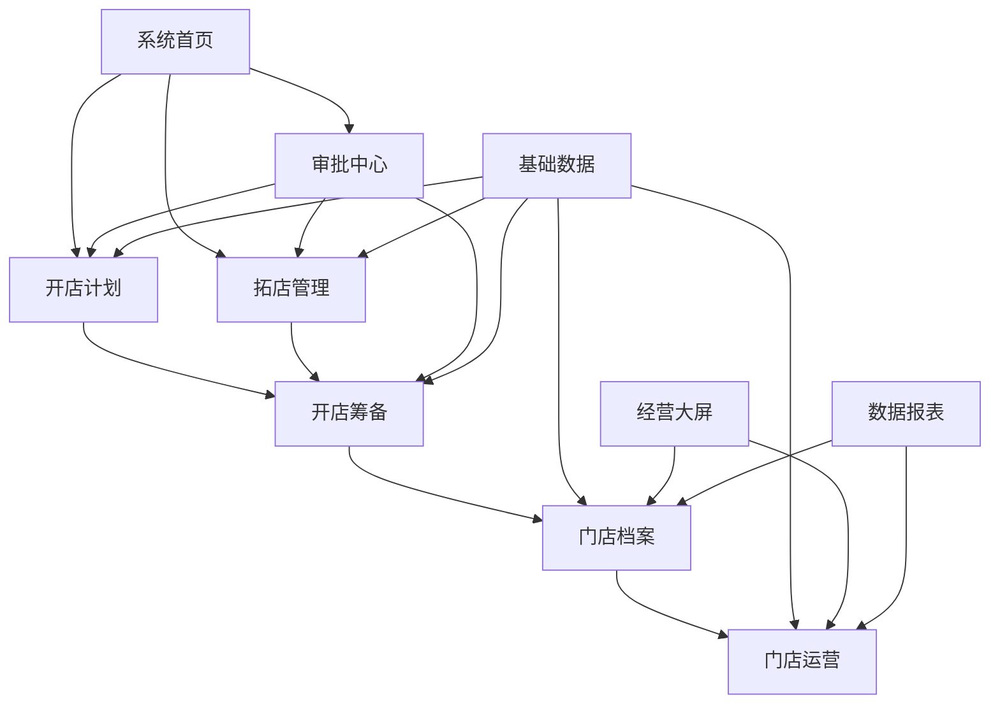

# 前端架构设计_v1.0

## 文档信息

| 属性 | 值 |
|------|-----|
| 文档标题 | 好饭碗门店生命周期管理系统-前端架构设计 |
| 文档版本 | v1.0 |
| 文档状态 | draft |
| 创建日期 | 2025-08-28 |
| 最后更新 | 2025-08-28 |
| 创建者 | 前端架构师 |
| 审核者 | 技术总监 |

---

## 1. 整体架构方案

### 1.1 前端技术栈选型

#### 核心技术栈

| 技术分类 | 选择 | 版本 | 选型理由 |
|---------|------|------|---------|
| **前端框架** | React | 18.x | 生态成熟，组件化开发，支持SSR，团队熟悉度高 |
| **语言** | TypeScript | 5.x | 类型安全，代码可维护性强，企业级开发标准 |
| **状态管理** | Zustand + React Query | 4.x + 3.x | 轻量级状态管理+服务端状态缓存，降低复杂度 |
| **路由管理** | React Router | 6.x | 成熟的React路由解决方案，支持代码分割 |
| **UI组件库** | Ant Design | 5.x | 企业级设计规范，组件丰富，中后台系统首选 |
| **构建工具** | Vite | 5.x | 快速的开发服务器，现代化构建工具 |
| **包管理器** | pnpm | 9.x | 高效的磁盘空间利用，快速安装，Monorepo支持 |

#### 辅助工具栈

| 工具分类 | 选择 | 用途 |
|---------|------|------|
| **CSS预处理器** | Sass/SCSS | 样式编写和主题管理 |
| **代码规范** | ESLint + Prettier | 代码质量和格式统一 |
| **Git钩子** | Husky + lint-staged | 提交前代码检查 |
| **测试框架** | Vitest + Testing Library | 单元测试和组件测试 |
| **E2E测试** | Playwright | 端到端测试 |
| **文档生成** | Storybook | 组件文档和设计系统 |
| **监控工具** | Sentry | 错误监控和性能监控 |
| **移动端适配** | Responsive Design + PWA | 响应式设计和渐进式Web应用 |

### 1.2 工程化配置

#### 项目结构设计
```
mendian/
├── frontend/                    # 前端主应用
│   ├── public/                 # 静态资源
│   ├── src/
│   │   ├── components/         # 通用组件
│   │   │   ├── business/       # 业务组件
│   │   │   ├── common/         # 通用组件
│   │   │   └── layout/         # 布局组件
│   │   ├── pages/              # 页面组件
│   │   │   ├── store-plan/     # 开店计划
│   │   │   ├── expansion/      # 拓店管理
│   │   │   ├── preparation/    # 开店筹备
│   │   │   ├── store-files/    # 门店档案
│   │   │   ├── operation/      # 门店运营
│   │   │   ├── approval/       # 审批中心
│   │   │   ├── basic-data/     # 基础数据
│   │   │   └── dashboard/      # 系统首页
│   │   ├── services/           # API服务层
│   │   ├── stores/             # 状态管理
│   │   ├── hooks/              # 自定义Hooks
│   │   ├── utils/              # 工具函数
│   │   ├── types/              # TypeScript类型定义
│   │   ├── constants/          # 常量定义
│   │   ├── styles/             # 全局样式和主题
│   │   └── assets/             # 静态资源
│   ├── .env                    # 环境变量
│   ├── vite.config.ts          # Vite配置
│   ├── tsconfig.json           # TypeScript配置
│   └── package.json
├── shared/                     # 共享类型和工具（可选）
│   ├── types/                  # 共享类型定义
│   └── utils/                  # 共享工具函数
└── package.json                # 工作区配置
```

#### 构建配置策略

**开发环境配置**
```typescript
// vite.config.ts
export default defineConfig({
  plugins: [
    react(),
    // 企业微信JSSDK支持
    // PWA配置
    // Mock数据配置
  ],
  server: {
    port: 7000,
    proxy: {
      '/api': {
        target: 'http://localhost:7100',
        changeOrigin: true
      }
    }
  },
  define: {
    __APP_VERSION__: JSON.stringify(process.env.npm_package_version)
  }
})
```

**生产环境优化**
- 代码分割：按路由和业务模块分割
- Tree Shaking：移除未使用代码
- 资源压缩：Gzip/Brotli压缩
- CDN配置：静态资源CDN分发
- 缓存策略：长期缓存+版本控制

### 1.3 部署方案

#### 开发环境
```bash
# 启动开发服务器
pnpm dev                 # 前后端同时启动
pnpm --filter frontend dev    # 仅前端开发服务器
```

#### 生产环境部署
```bash
# 构建生产版本
pnpm build
pnpm --filter frontend build

# Docker化部署
FROM nginx:alpine
COPY dist/ /usr/share/nginx/html/
COPY nginx.conf /etc/nginx/conf.d/default.conf
EXPOSE 80
```

---

## 2. 模块架构设计

### 2.1 业务模块划分

#### 核心业务模块
```
业务模块架构
├── 系统首页模块 (Dashboard)
│   ├── 待办事项组件
│   ├── 消息通知组件
│   ├── 常用功能组件
│   └── 数据概览组件
├── 开店计划模块 (StorePlan)
│   ├── 计划列表组件
│   ├── 计划表单组件
│   ├── 计划详情组件
│   └── 计划统计组件
├── 拓店管理模块 (Expansion)
│   ├── 候选点位管理
│   ├── 跟进记录管理
│   ├── 商务条件管理
│   └── 拓店统计分析
├── 开店筹备模块 (Preparation)
│   ├── 工程管理组件
│   ├── 交付管理组件
│   ├── 筹备进度组件
│   └── 筹备文档管理
├── 门店档案模块 (StoreFiles)
│   ├── 门店信息管理
│   ├── 证照管理
│   ├── 档案查询
│   └── 历史记录
├── 门店运营模块 (Operation)
│   ├── 付款项管理
│   ├── 资产管理(二期)
│   ├── 运营数据
│   └── 绩效分析
├── 审批中心模块 (Approval)
│   ├── 待办审批
│   ├── 审批历史
│   ├── 审批模板管理
│   └── 审批流程引擎
├── 基础数据模块 (BasicData)
│   ├── 组织架构管理
│   ├── 供应商管理
│   ├── 客户管理
│   └── 字典数据管理
├── 经营大屏模块 (Analytics) [二期]
│   ├── 实时数据大屏
│   ├── 门店经营分析
│   ├── 趋势分析
│   └── 自定义报表
└── 数据报表模块 (Reports) [二期]
    ├── 报表配置
    ├── 报表生成
    ├── 报表导出
    └── 报表订阅
```

#### 模块间依赖关系


### 2.2 组件库和设计系统规划

#### 设计系统架构
```
设计系统 (Design System)
├── 设计令牌 (Design Tokens)
│   ├── 颜色系统
│   ├── 字体系统
│   ├── 间距系统
│   ├── 圆角系统
│   └── 阴影系统
├── 基础组件库 (Foundation)
│   ├── Button (按钮)
│   ├── Input (输入框)
│   ├── Select (选择器)
│   ├── Table (表格)
│   ├── Form (表单)
│   ├── Modal (弹窗)
│   ├── Card (卡片)
│   └── Layout (布局)
├── 复合组件库 (Composition)
│   ├── SearchForm (搜索表单)
│   ├── DataTable (数据表格)
│   ├── PageHeader (页面头部)
│   ├── FilterPanel (筛选面板)
│   ├── StatusTag (状态标签)
│   └── ActionButton (操作按钮)
└── 业务组件库 (Business)
    ├── StoreSelector (门店选择器)
    ├── ApprovalFlow (审批流程)
    ├── LocationMap (位置地图)
    ├── ProgressTracker (进度跟踪)
    ├── DocumentUpload (文档上传)
    └── DataVisualization (数据可视化)
```

#### 主题配置系统
```typescript
// 主题配置
export const themeConfig = {
  token: {
    // 主色调
    colorPrimary: '#1890ff',
    colorSuccess: '#52c41a',
    colorWarning: '#faad14',
    colorError: '#ff4d4f',
    colorInfo: '#1890ff',
    
    // 中性色
    colorTextBase: '#000000',
    colorBgBase: '#ffffff',
    
    // 组件配置
    borderRadius: 6,
    wireframe: false,
  },
  components: {
    // 表格配置
    Table: {
      headerBg: '#fafafa',
      headerColor: '#262626',
    },
    // 表单配置
    Form: {
      itemMarginBottom: 24,
    }
  }
}
```

### 2.3 公共服务和工具库设计

#### API服务层设计
```typescript
// services/api/base.ts
class BaseService {
  protected baseURL: string
  protected client: AxiosInstance
  
  constructor(baseURL: string) {
    this.baseURL = baseURL
    this.client = this.createClient()
  }
  
  private createClient() {
    const client = axios.create({
      baseURL: this.baseURL,
      timeout: 10000,
      headers: {
        'Content-Type': 'application/json',
      }
    })
    
    // 请求拦截器
    client.interceptors.request.use(
      (config) => {
        // 添加认证信息
        const token = getAuthToken()
        if (token) {
          config.headers.Authorization = `Bearer ${token}`
        }
        return config
      },
      (error) => Promise.reject(error)
    )
    
    // 响应拦截器
    client.interceptors.response.use(
      (response) => response.data,
      (error) => {
        // 统一错误处理
        handleApiError(error)
        return Promise.reject(error)
      }
    )
    
    return client
  }
}

// 具体业务服务
export class StorePlanService extends BaseService {
  constructor() {
    super('/api/v1/store-plans')
  }
  
  async getStorePlans(params: StorePlanQueryParams): Promise<StorePlan[]> {
    return this.client.get('/', { params })
  }
  
  async createStorePlan(data: CreateStorePlanDto): Promise<StorePlan> {
    return this.client.post('/', data)
  }
  
  async updateStorePlan(id: string, data: UpdateStorePlanDto): Promise<StorePlan> {
    return this.client.put(`/${id}`, data)
  }
  
  async deleteStorePlan(id: string): Promise<void> {
    return this.client.delete(`/${id}`)
  }
}
```

#### 工具库设计
```typescript
// utils/index.ts
export * from './date'
export * from './format'
export * from './validation'
export * from './permission'
export * from './file'
export * from './wechat'

// utils/date.ts
export const dateUtils = {
  format: (date: Date, format: string) => dayjs(date).format(format),
  isBusinessDay: (date: Date) => { /* 实现 */ },
  getQuarter: (date: Date) => Math.floor(dayjs(date).month() / 3) + 1,
  // 其他日期工具函数
}

// utils/permission.ts
export const permissionUtils = {
  hasPermission: (permission: string, userPermissions: string[]) => {
    return userPermissions.includes(permission)
  },
  hasRole: (role: string, userRoles: string[]) => {
    return userRoles.includes(role)
  },
  canAccess: (resource: string, action: string, context: any) => {
    // 细粒度权限控制逻辑
  }
}
```

---

## 3. 状态管理方案

### 3.1 全局状态管理策略

#### 状态分层设计
```
状态管理架构
├── 应用状态 (Application State)
│   ├── 用户信息状态
│   ├── 权限状态
│   ├── 主题配置状态
│   └── 全局配置状态
├── 业务状态 (Business State)
│   ├── 门店计划状态
│   ├── 候选点位状态
│   ├── 审批流程状态
│   └── 基础数据状态
├── UI状态 (UI State)
│   ├── 加载状态
│   ├── 弹窗状态
│   ├── 表单状态
│   └── 路由状态
└── 服务端状态 (Server State)
    ├── API缓存
    ├── 同步状态
    ├── 乐观更新
    └── 错误状态
```

#### Zustand状态管理实现
```typescript
// stores/useAppStore.ts
interface AppState {
  // 用户信息
  user: User | null
  permissions: string[]
  roles: string[]
  
  // 应用配置
  theme: 'light' | 'dark'
  locale: 'zh-CN' | 'en-US'
  sidebarCollapsed: boolean
  
  // 操作方法
  setUser: (user: User) => void
  setPermissions: (permissions: string[]) => void
  toggleSidebar: () => void
  updateTheme: (theme: 'light' | 'dark') => void
}

export const useAppStore = create<AppState>((set, get) => ({
  user: null,
  permissions: [],
  roles: [],
  theme: 'light',
  locale: 'zh-CN',
  sidebarCollapsed: false,
  
  setUser: (user) => set({ user }),
  setPermissions: (permissions) => set({ permissions }),
  toggleSidebar: () => set((state) => ({ 
    sidebarCollapsed: !state.sidebarCollapsed 
  })),
  updateTheme: (theme) => set({ theme }),
}))

// stores/useStorePlanStore.ts
interface StorePlanState {
  plans: StorePlan[]
  selectedPlan: StorePlan | null
  loading: boolean
  
  setPlans: (plans: StorePlan[]) => void
  selectPlan: (plan: StorePlan) => void
  updatePlan: (id: string, updates: Partial<StorePlan>) => void
}

export const useStorePlanStore = create<StorePlanState>((set) => ({
  plans: [],
  selectedPlan: null,
  loading: false,
  
  setPlans: (plans) => set({ plans }),
  selectPlan: (plan) => set({ selectedPlan: plan }),
  updatePlan: (id, updates) => set((state) => ({
    plans: state.plans.map((plan) => 
      plan.id === id ? { ...plan, ...updates } : plan
    )
  }))
}))
```

### 3.2 数据流设计和缓存策略

#### React Query配置
```typescript
// services/queryClient.ts
export const queryClient = new QueryClient({
  defaultOptions: {
    queries: {
      staleTime: 5 * 60 * 1000, // 5分钟
      cacheTime: 10 * 60 * 1000, // 10分钟
      retry: 3,
      retryDelay: (attemptIndex) => Math.min(1000 * 2 ** attemptIndex, 30000),
      refetchOnWindowFocus: false,
    },
    mutations: {
      retry: 1,
    }
  }
})

// hooks/useStorePlans.ts
export const useStorePlans = (params: StorePlanQueryParams) => {
  return useQuery({
    queryKey: ['storePlans', params],
    queryFn: () => storePlanService.getStorePlans(params),
    select: (data) => {
      // 数据转换和处理
      return data.map(plan => ({
        ...plan,
        formattedDate: dateUtils.format(plan.createdAt, 'YYYY-MM-DD')
      }))
    }
  })
}

export const useCreateStorePlan = () => {
  const queryClient = useQueryClient()
  
  return useMutation({
    mutationFn: storePlanService.createStorePlan,
    onSuccess: () => {
      // 乐观更新缓存
      queryClient.invalidateQueries({ queryKey: ['storePlans'] })
      message.success('开店计划创建成功')
    },
    onError: (error) => {
      message.error('创建失败：' + error.message)
    }
  })
}
```

#### 缓存策略设计
```typescript
// 缓存层级设计
const CACHE_STRATEGIES = {
  // 基础数据 - 长期缓存
  basicData: {
    staleTime: 60 * 60 * 1000, // 1小时
    cacheTime: 24 * 60 * 60 * 1000, // 24小时
  },
  
  // 业务数据 - 中期缓存
  businessData: {
    staleTime: 5 * 60 * 1000, // 5分钟
    cacheTime: 30 * 60 * 1000, // 30分钟
  },
  
  // 实时数据 - 短期缓存
  realtimeData: {
    staleTime: 0, // 立即过期
    cacheTime: 60 * 1000, // 1分钟
  }
}
```

### 3.3 API层设计和错误处理

#### 统一错误处理
```typescript
// utils/errorHandler.ts
export class ApiError extends Error {
  public code: string
  public status: number
  
  constructor(message: string, code: string, status: number) {
    super(message)
    this.code = code
    this.status = status
  }
}

export const handleApiError = (error: any) => {
  if (error.response) {
    const { status, data } = error.response
    
    switch (status) {
      case 401:
        // 未授权，跳转登录
        window.location.href = '/login'
        break
      case 403:
        // 权限不足
        message.error('权限不足')
        break
      case 404:
        // 资源不存在
        message.error('请求的资源不存在')
        break
      case 500:
        // 服务器错误
        message.error('服务器内部错误')
        break
      default:
        message.error(data.message || '请求失败')
    }
    
    throw new ApiError(data.message, data.code, status)
  } else if (error.request) {
    // 网络错误
    message.error('网络连接失败，请检查网络')
    throw new ApiError('网络错误', 'NETWORK_ERROR', 0)
  } else {
    // 其他错误
    message.error('请求配置错误')
    throw error
  }
}

// 重试机制
export const retryConfig = {
  retries: 3,
  retryDelay: (retryCount: number) => {
    return Math.min(1000 * 2 ** retryCount, 30000)
  },
  retryCondition: (error: any) => {
    // 只重试网络错误和5xx错误
    return !error.response || error.response.status >= 500
  }
}
```

---

## 4. 路由和权限

### 4.1 路由结构设计

#### 路由层级架构
```typescript
// router/routes.ts
export const routes: RouteConfig[] = [
  {
    path: '/',
    element: <MainLayout />,
    children: [
      {
        path: '',
        element: <Navigate to="/dashboard" replace />
      },
      {
        path: 'dashboard',
        element: <Dashboard />,
        meta: {
          title: '系统首页',
          requireAuth: true,
          permissions: ['dashboard:view']
        }
      },
      {
        path: 'store-plan',
        element: <StorePlanLayout />,
        meta: {
          title: '开店计划',
          requireAuth: true,
          permissions: ['store-plan:view']
        },
        children: [
          {
            path: '',
            element: <StorePlanList />,
            meta: { title: '计划列表' }
          },
          {
            path: 'create',
            element: <StorePlanCreate />,
            meta: { 
              title: '新建计划',
              permissions: ['store-plan:create']
            }
          },
          {
            path: ':id',
            element: <StorePlanDetail />,
            meta: { title: '计划详情' }
          },
          {
            path: ':id/edit',
            element: <StorePlanEdit />,
            meta: { 
              title: '编辑计划',
              permissions: ['store-plan:update']
            }
          }
        ]
      },
      {
        path: 'expansion',
        element: <ExpansionLayout />,
        meta: {
          title: '拓店管理',
          requireAuth: true,
          permissions: ['expansion:view']
        },
        children: [
          {
            path: 'candidates',
            element: <CandidateLocationList />,
            meta: { title: '候选点位' }
          },
          {
            path: 'follow-up',
            element: <FollowUpManagement />,
            meta: { title: '跟进管理' }
          }
        ]
      },
      // 其他业务模块路由...
      {
        path: 'approval',
        element: <ApprovalLayout />,
        meta: {
          title: '审批中心',
          requireAuth: true,
          permissions: ['approval:view']
        },
        children: [
          {
            path: 'pending',
            element: <PendingApprovals />,
            meta: { title: '待办审批' }
          },
          {
            path: 'history',
            element: <ApprovalHistory />,
            meta: { title: '审批历史' }
          },
          {
            path: 'templates',
            element: <ApprovalTemplates />,
            meta: { 
              title: '审批模板',
              permissions: ['approval:template:manage']
            }
          }
        ]
      }
    ]
  },
  {
    path: '/login',
    element: <LoginPage />,
    meta: { title: '登录', requireAuth: false }
  },
  {
    path: '/mobile',
    element: <MobileLayout />,
    meta: { title: '移动端', requireAuth: true },
    children: [
      // 移动端路由配置
    ]
  },
  {
    path: '*',
    element: <NotFoundPage />,
    meta: { title: '页面不存在' }
  }
]
```

#### 路由守卫实现
```typescript
// router/guards.ts
interface RouteGuard {
  beforeEach?: (to: RouteLocation, from: RouteLocation) => boolean | Promise<boolean>
  afterEach?: (to: RouteLocation, from: RouteLocation) => void
}

export const authGuard: RouteGuard = {
  beforeEach: async (to, from) => {
    const { user } = useAppStore.getState()
    const requireAuth = to.meta?.requireAuth
    
    if (requireAuth && !user) {
      // 跳转到登录页
      window.location.href = '/login'
      return false
    }
    
    // 权限检查
    const permissions = to.meta?.permissions
    if (permissions && !permissionUtils.hasPermissions(permissions, user?.permissions || [])) {
      message.error('权限不足')
      return false
    }
    
    return true
  },
  
  afterEach: (to, from) => {
    // 更新页面标题
    document.title = `${to.meta?.title} - 好饭碗门店管理系统`
    
    // 埋点统计
    analytics.track('page_view', {
      path: to.pathname,
      title: to.meta?.title
    })
  }
}

// 路由组件懒加载
const lazyLoad = (componentImport: () => Promise<any>) => {
  return React.lazy(() => 
    componentImport().catch(() => ({
      default: () => <div>页面加载失败，请刷新重试</div>
    }))
  )
}
```

### 4.2 权限控制方案

#### 权限模型设计
```typescript
// types/permission.ts
export interface Permission {
  id: string
  code: string // 权限编码，如：store-plan:create
  name: string
  description: string
  resource: string // 资源类型
  action: string // 操作类型
}

export interface Role {
  id: string
  code: string
  name: string
  permissions: Permission[]
}

export interface User {
  id: string
  username: string
  name: string
  roles: Role[]
  permissions: Permission[]
  department: Department
}

// 权限编码规范
export const PERMISSIONS = {
  // 开店计划
  STORE_PLAN_VIEW: 'store-plan:view',
  STORE_PLAN_CREATE: 'store-plan:create',
  STORE_PLAN_UPDATE: 'store-plan:update',
  STORE_PLAN_DELETE: 'store-plan:delete',
  
  // 拓店管理
  EXPANSION_VIEW: 'expansion:view',
  EXPANSION_MANAGE: 'expansion:manage',
  EXPANSION_APPROVE: 'expansion:approve',
  
  // 审批中心
  APPROVAL_VIEW: 'approval:view',
  APPROVAL_HANDLE: 'approval:handle',
  APPROVAL_TEMPLATE_MANAGE: 'approval:template:manage',
  
  // 系统管理
  SYSTEM_USER_MANAGE: 'system:user:manage',
  SYSTEM_ROLE_MANAGE: 'system:role:manage',
  SYSTEM_PERMISSION_MANAGE: 'system:permission:manage'
} as const
```

#### 权限控制组件
```typescript
// components/PermissionWrapper.tsx
interface PermissionWrapperProps {
  permission?: string | string[]
  role?: string | string[]
  fallback?: React.ReactNode
  children: React.ReactNode
}

export const PermissionWrapper: React.FC<PermissionWrapperProps> = ({
  permission,
  role,
  fallback = null,
  children
}) => {
  const { user } = useAppStore()
  
  const hasPermission = React.useMemo(() => {
    if (!user) return false
    
    if (permission) {
      const permissions = Array.isArray(permission) ? permission : [permission]
      return permissionUtils.hasPermissions(permissions, user.permissions.map(p => p.code))
    }
    
    if (role) {
      const roles = Array.isArray(role) ? role : [role]
      return permissionUtils.hasRoles(roles, user.roles.map(r => r.code))
    }
    
    return true
  }, [user, permission, role])
  
  return hasPermission ? <>{children}</> : <>{fallback}</>
}

// 权限控制Hook
export const usePermission = () => {
  const { user } = useAppStore()
  
  const hasPermission = React.useCallback((permission: string | string[]) => {
    if (!user) return false
    const permissions = Array.isArray(permission) ? permission : [permission]
    return permissionUtils.hasPermissions(permissions, user.permissions.map(p => p.code))
  }, [user])
  
  const hasRole = React.useCallback((role: string | string[]) => {
    if (!user) return false
    const roles = Array.isArray(role) ? role : [role]
    return permissionUtils.hasRoles(roles, user.roles.map(r => r.code))
  }, [user])
  
  return { hasPermission, hasRole }
}
```

### 4.3 角色管理和菜单控制

#### 菜单配置系统
```typescript
// config/menu.ts
export interface MenuItem {
  key: string
  path?: string
  title: string
  icon?: React.ReactNode
  children?: MenuItem[]
  permissions?: string[]
  roles?: string[]
  hidden?: boolean
}

export const menuConfig: MenuItem[] = [
  {
    key: 'dashboard',
    path: '/dashboard',
    title: '系统首页',
    icon: <DashboardOutlined />,
    permissions: ['dashboard:view']
  },
  {
    key: 'store-plan',
    title: '开店计划',
    icon: <ShopOutlined />,
    permissions: ['store-plan:view'],
    children: [
      {
        key: 'store-plan-list',
        path: '/store-plan',
        title: '计划管理',
        permissions: ['store-plan:view']
      },
      {
        key: 'store-plan-analysis',
        path: '/store-plan/analysis',
        title: '计划分析',
        permissions: ['store-plan:analysis']
      }
    ]
  },
  {
    key: 'expansion',
    title: '拓店管理',
    icon: <EnvironmentOutlined />,
    permissions: ['expansion:view'],
    children: [
      {
        key: 'candidate-locations',
        path: '/expansion/candidates',
        title: '候选点位',
        permissions: ['expansion:view']
      },
      {
        key: 'follow-up',
        path: '/expansion/follow-up',
        title: '跟进管理',
        permissions: ['expansion:manage']
      }
    ]
  },
  {
    key: 'approval',
    title: '审批中心',
    icon: <AuditOutlined />,
    permissions: ['approval:view'],
    children: [
      {
        key: 'pending-approvals',
        path: '/approval/pending',
        title: '待办审批',
        permissions: ['approval:view']
      },
      {
        key: 'approval-history',
        path: '/approval/history',
        title: '审批历史',
        permissions: ['approval:view']
      },
      {
        key: 'approval-templates',
        path: '/approval/templates',
        title: '审批模板',
        permissions: ['approval:template:manage']
      }
    ]
  }
]

// 菜单过滤Hook
export const useFilteredMenu = () => {
  const { user } = useAppStore()
  
  const filterMenu = React.useCallback((menu: MenuItem[]): MenuItem[] => {
    return menu.filter(item => {
      // 权限检查
      if (item.permissions && !permissionUtils.hasPermissions(item.permissions, user?.permissions.map(p => p.code) || [])) {
        return false
      }
      
      // 角色检查
      if (item.roles && !permissionUtils.hasRoles(item.roles, user?.roles.map(r => r.code) || [])) {
        return false
      }
      
      // 隐藏检查
      if (item.hidden) {
        return false
      }
      
      // 递归过滤子菜单
      if (item.children) {
        item.children = filterMenu(item.children)
        return item.children.length > 0
      }
      
      return true
    })
  }, [user])
  
  return React.useMemo(() => filterMenu(menuConfig), [filterMenu])
}
```

---

## 5. 性能优化策略

### 5.1 代码分割和懒加载

#### 路由级代码分割
```typescript
// router/lazy.ts
import { lazy } from 'react'
import { Spin } from 'antd'

const LoadingComponent = () => (
  <div style={{ 
    display: 'flex', 
    justifyContent: 'center', 
    alignItems: 'center', 
    minHeight: '200px' 
  }}>
    <Spin size="large" />
  </div>
)

export const LazyWrapper = (importFunc: () => Promise<any>) => {
  const Component = lazy(importFunc)
  
  return (props: any) => (
    <Suspense fallback={<LoadingComponent />}>
      <Component {...props} />
    </Suspense>
  )
}

// 按模块分割
export const StorePlanList = LazyWrapper(() => import('../pages/store-plan/StorePlanList'))
export const StorePlanCreate = LazyWrapper(() => import('../pages/store-plan/StorePlanCreate'))
export const ExpansionManagement = LazyWrapper(() => import('../pages/expansion/ExpansionManagement'))

// 按功能分割第三方库
export const DataVisualization = LazyWrapper(() => 
  Promise.all([
    import('echarts'),
    import('../components/DataVisualization')
  ]).then(([echarts, component]) => ({
    default: component.default
  }))
)
```

#### 组件级懒加载
```typescript
// components/LazyTable.tsx
import { lazy, Suspense } from 'react'
import { Skeleton } from 'antd'

const HeavyTable = lazy(() => import('./HeavyTable'))

export const LazyTable: React.FC<TableProps> = (props) => {
  return (
    <Suspense fallback={<Skeleton active />}>
      <HeavyTable {...props} />
    </Suspense>
  )
}

// 条件懒加载
export const ConditionalChart: React.FC<ChartProps> = ({ data, ...props }) => {
  const [showChart, setShowChart] = React.useState(false)
  const ChartComponent = React.useMemo(
    () => showChart ? lazy(() => import('./Chart')) : null,
    [showChart]
  )
  
  if (!showChart) {
    return (
      <div>
        <Button onClick={() => setShowChart(true)}>
          显示图表
        </Button>
      </div>
    )
  }
  
  return (
    <Suspense fallback={<Skeleton.Node active />}>
      {ChartComponent && <ChartComponent data={data} {...props} />}
    </Suspense>
  )
}
```

### 5.2 缓存策略和资源优化

#### 多层级缓存策略
```typescript
// utils/cache.ts
export class CacheManager {
  private memoryCache = new Map<string, any>()
  private readonly MAX_MEMORY_SIZE = 100 // 最大内存缓存项数
  
  // 内存缓存
  setMemoryCache(key: string, value: any, ttl?: number) {
    // LRU淘汰策略
    if (this.memoryCache.size >= this.MAX_MEMORY_SIZE) {
      const firstKey = this.memoryCache.keys().next().value
      this.memoryCache.delete(firstKey)
    }
    
    this.memoryCache.set(key, {
      value,
      timestamp: Date.now(),
      ttl: ttl || 5 * 60 * 1000 // 默认5分钟
    })
  }
  
  getMemoryCache(key: string) {
    const item = this.memoryCache.get(key)
    if (!item) return null
    
    if (Date.now() - item.timestamp > item.ttl) {
      this.memoryCache.delete(key)
      return null
    }
    
    return item.value
  }
  
  // sessionStorage缓存
  setSessionCache(key: string, value: any) {
    try {
      sessionStorage.setItem(key, JSON.stringify(value))
    } catch (error) {
      console.warn('SessionStorage quota exceeded')
    }
  }
  
  getSessionCache(key: string) {
    try {
      const value = sessionStorage.getItem(key)
      return value ? JSON.parse(value) : null
    } catch {
      return null
    }
  }
  
  // localStorage缓存（持久化）
  setPersistentCache(key: string, value: any, ttl?: number) {
    const item = {
      value,
      timestamp: Date.now(),
      ttl
    }
    try {
      localStorage.setItem(key, JSON.stringify(item))
    } catch (error) {
      console.warn('LocalStorage quota exceeded')
    }
  }
  
  getPersistentCache(key: string) {
    try {
      const item = JSON.parse(localStorage.getItem(key) || 'null')
      if (!item) return null
      
      if (item.ttl && Date.now() - item.timestamp > item.ttl) {
        localStorage.removeItem(key)
        return null
      }
      
      return item.value
    } catch {
      return null
    }
  }
}

export const cacheManager = new CacheManager()
```

#### 资源优化配置
```typescript
// vite.config.ts 生产优化配置
export default defineConfig({
  build: {
    rollupOptions: {
      output: {
        // 代码分割
        manualChunks: {
          // 第三方库分离
          vendor: ['react', 'react-dom'],
          antd: ['antd', '@ant-design/icons'],
          charts: ['echarts', 'recharts'],
          // 业务模块分离
          'store-plan': ['./src/pages/store-plan'],
          'expansion': ['./src/pages/expansion'],
          'approval': ['./src/pages/approval']
        },
        // 文件命名
        chunkFileNames: 'assets/js/[name]-[hash].js',
        entryFileNames: 'assets/js/[name]-[hash].js',
        assetFileNames: 'assets/[ext]/[name]-[hash].[ext]'
      }
    },
    // 压缩配置
    minify: 'terser',
    terserOptions: {
      compress: {
        drop_console: true,
        drop_debugger: true
      }
    }
  },
  // PWA配置
  plugins: [
    VitePWA({
      registerType: 'autoUpdate',
      workbox: {
        globPatterns: ['**/*.{js,css,html,ico,png,svg}'],
        runtimeCaching: [
          {
            urlPattern: /^https:\/\/api\./i,
            handler: 'NetworkFirst',
            options: {
              cacheName: 'api-cache',
              expiration: {
                maxEntries: 100,
                maxAgeSeconds: 60 * 60 * 24 // 24小时
              }
            }
          }
        ]
      }
    })
  ]
})
```

### 5.3 渲染性能优化

#### 组件优化策略
```typescript
// 使用React.memo优化组件渲染
export const StorePlanCard = React.memo<StorePlanCardProps>(({ 
  plan, 
  onEdit, 
  onDelete 
}) => {
  return (
    <Card
      title={plan.name}
      extra={
        <Space>
          <Button onClick={() => onEdit(plan.id)}>编辑</Button>
          <Button danger onClick={() => onDelete(plan.id)}>删除</Button>
        </Space>
      }
    >
      {/* 卡片内容 */}
    </Card>
  )
}, (prevProps, nextProps) => {
  // 自定义比较函数
  return (
    prevProps.plan.id === nextProps.plan.id &&
    prevProps.plan.updatedAt === nextProps.plan.updatedAt
  )
})

// 虚拟列表优化大量数据渲染
import { FixedSizeList as List } from 'react-window'

export const VirtualizedTable: React.FC<{ data: any[] }> = ({ data }) => {
  const Row = React.useCallback(({ index, style }) => (
    <div style={style}>
      <TableRow data={data[index]} />
    </div>
  ), [data])
  
  return (
    <List
      height={600}
      itemCount={data.length}
      itemSize={50}
      overscanCount={5}
    >
      {Row}
    </List>
  )
}

// 防抖搜索优化
export const useDebounceSearch = (searchFn: (query: string) => void, delay = 300) => {
  const [query, setQuery] = React.useState('')
  const debouncedQuery = useDebounce(query, delay)
  
  React.useEffect(() => {
    if (debouncedQuery) {
      searchFn(debouncedQuery)
    }
  }, [debouncedQuery, searchFn])
  
  return [query, setQuery] as const
}

// 分页加载优化
export const useInfiniteScroll = <T>(
  fetchFn: (page: number) => Promise<T[]>,
  threshold = 0.8
) => {
  const [data, setData] = React.useState<T[]>([])
  const [loading, setLoading] = React.useState(false)
  const [hasMore, setHasMore] = React.useState(true)
  const [page, setPage] = React.useState(1)
  
  const loadMore = React.useCallback(async () => {
    if (loading || !hasMore) return
    
    setLoading(true)
    try {
      const newData = await fetchFn(page)
      if (newData.length === 0) {
        setHasMore(false)
      } else {
        setData(prev => [...prev, ...newData])
        setPage(prev => prev + 1)
      }
    } catch (error) {
      console.error('加载数据失败:', error)
    } finally {
      setLoading(false)
    }
  }, [fetchFn, loading, hasMore, page])
  
  // 监听滚动事件
  React.useEffect(() => {
    const handleScroll = throttle(() => {
      const { scrollTop, scrollHeight, clientHeight } = document.documentElement
      if (scrollTop + clientHeight >= scrollHeight * threshold) {
        loadMore()
      }
    }, 200)
    
    window.addEventListener('scroll', handleScroll)
    return () => window.removeEventListener('scroll', handleScroll)
  }, [loadMore, threshold])
  
  return { data, loading, hasMore, loadMore }
}
```

---

## 6. 开发规范

### 6.1 代码规范和最佳实践

#### TypeScript编码规范
```typescript
// 类型定义规范
// types/api.ts
export interface BaseResponse<T = any> {
  code: number
  message: string
  data: T
  timestamp: number
}

export interface PaginationResponse<T> extends BaseResponse<T[]> {
  pagination: {
    page: number
    pageSize: number
    total: number
    totalPages: number
  }
}

// 严格类型定义
export interface StorePlan {
  readonly id: string
  name: string
  description?: string
  type: StorePlanType
  status: StorePlanStatus
  region: Region
  targetDate: string
  budget: number
  createdBy: string
  createdAt: string
  updatedAt: string
}

export type StorePlanType = 'direct' | 'franchise' | 'joint_venture'
export type StorePlanStatus = 'draft' | 'pending' | 'approved' | 'in_progress' | 'completed' | 'cancelled'

// 工具类型使用
export type CreateStorePlanDto = Omit<StorePlan, 'id' | 'createdAt' | 'updatedAt' | 'createdBy'>
export type UpdateStorePlanDto = Partial<Pick<StorePlan, 'name' | 'description' | 'targetDate' | 'budget'>>
export type StorePlanListItem = Pick<StorePlan, 'id' | 'name' | 'type' | 'status' | 'region' | 'targetDate'>
```

#### React组件编写规范
```typescript
// 组件Props接口定义
interface StorePlanFormProps {
  // 必需属性
  onSubmit: (values: CreateStorePlanDto) => void
  
  // 可选属性
  initialValues?: Partial<StorePlan>
  loading?: boolean
  disabled?: boolean
  
  // 事件回调
  onCancel?: () => void
  onChange?: (values: Partial<StorePlan>) => void
  
  // 样式和类名
  className?: string
  style?: React.CSSProperties
}

// 组件实现规范
export const StorePlanForm: React.FC<StorePlanFormProps> = ({
  onSubmit,
  initialValues,
  loading = false,
  disabled = false,
  onCancel,
  onChange,
  className,
  style
}) => {
  const [form] = Form.useForm<CreateStorePlanDto>()
  
  // 状态定义
  const [formData, setFormData] = React.useState<Partial<StorePlan>>(initialValues || {})
  
  // 事件处理函数
  const handleSubmit = React.useCallback(async (values: CreateStorePlanDto) => {
    try {
      await onSubmit(values)
      form.resetFields()
    } catch (error) {
      console.error('提交失败:', error)
    }
  }, [onSubmit, form])
  
  const handleFieldChange = React.useCallback((changedFields: any, allFields: any) => {
    const newValues = form.getFieldsValue()
    setFormData(newValues)
    onChange?.(newValues)
  }, [form, onChange])
  
  // 副作用处理
  React.useEffect(() => {
    if (initialValues) {
      form.setFieldsValue(initialValues)
      setFormData(initialValues)
    }
  }, [initialValues, form])
  
  return (
    <Form
      form={form}
      layout="vertical"
      onFinish={handleSubmit}
      onFieldsChange={handleFieldChange}
      disabled={disabled}
      className={className}
      style={style}
    >
      {/* 表单项 */}
    </Form>
  )
}
```

#### API请求规范
```typescript
// services/storePlan.ts
export class StorePlanService {
  // 查询方法
  async getStorePlans(params: StorePlanQueryParams): Promise<PaginationResponse<StorePlan>> {
    const response = await apiClient.get<PaginationResponse<StorePlan>>('/store-plans', {
      params: this.cleanParams(params)
    })
    return response.data
  }
  
  // 创建方法
  async createStorePlan(data: CreateStorePlanDto): Promise<BaseResponse<StorePlan>> {
    const response = await apiClient.post<BaseResponse<StorePlan>>('/store-plans', data)
    return response.data
  }
  
  // 更新方法
  async updateStorePlan(id: string, data: UpdateStorePlanDto): Promise<BaseResponse<StorePlan>> {
    const response = await apiClient.put<BaseResponse<StorePlan>>(`/store-plans/${id}`, data)
    return response.data
  }
  
  // 删除方法
  async deleteStorePlan(id: string): Promise<BaseResponse<void>> {
    const response = await apiClient.delete<BaseResponse<void>>(`/store-plans/${id}`)
    return response.data
  }
  
  // 参数清理工具方法
  private cleanParams(params: Record<string, any>): Record<string, any> {
    const cleaned: Record<string, any> = {}
    for (const [key, value] of Object.entries(params)) {
      if (value !== undefined && value !== null && value !== '') {
        cleaned[key] = value
      }
    }
    return cleaned
  }
}

export const storePlanService = new StorePlanService()
```

### 6.2 组件开发规范

#### 组件分类和职责
```typescript
// 1. 展示组件 (Presentational Components)
interface StorePlanCardProps {
  plan: StorePlan
  onEdit?: (id: string) => void
  onDelete?: (id: string) => void
  className?: string
}

export const StorePlanCard: React.FC<StorePlanCardProps> = React.memo(({ 
  plan, 
  onEdit, 
  onDelete,
  className 
}) => {
  return (
    <Card 
      className={className}
      title={plan.name}
      extra={
        <Space>
          {onEdit && (
            <Button type="primary" size="small" onClick={() => onEdit(plan.id)}>
              编辑
            </Button>
          )}
          {onDelete && (
            <Button danger size="small" onClick={() => onDelete(plan.id)}>
              删除
            </Button>
          )}
        </Space>
      }
    >
      <div>类型：{plan.type}</div>
      <div>状态：<StatusTag status={plan.status} /></div>
      <div>目标日期：{plan.targetDate}</div>
      <div>预算：¥{plan.budget.toLocaleString()}</div>
    </Card>
  )
})

// 2. 容器组件 (Container Components)
export const StorePlanListContainer: React.FC = () => {
  // 状态和逻辑
  const [searchParams, setSearchParams] = React.useState<StorePlanQueryParams>({})
  const { data, loading, error } = useStorePlans(searchParams)
  const editMutation = useUpdateStorePlan()
  const deleteMutation = useDeleteStorePlan()
  
  // 事件处理
  const handleEdit = React.useCallback((id: string) => {
    // 编辑逻辑
  }, [])
  
  const handleDelete = React.useCallback(async (id: string) => {
    // 删除逻辑
  }, [deleteMutation])
  
  // 渲染
  return (
    <div>
      <StorePlanSearch onSearch={setSearchParams} />
      <StorePlanList 
        data={data?.data || []}
        loading={loading}
        onEdit={handleEdit}
        onDelete={handleDelete}
      />
    </div>
  )
}

// 3. 复合组件 (Composite Components)
interface StorePlanManagerProps {
  readonly?: boolean
  showActions?: boolean
}

export const StorePlanManager: React.FC<StorePlanManagerProps> = ({
  readonly = false,
  showActions = true
}) => {
  return (
    <div>
      <StorePlanHeader />
      <StorePlanFilters />
      <StorePlanListContainer readonly={readonly} showActions={showActions} />
      <StorePlanPagination />
    </div>
  )
}
```

#### 自定义Hooks规范
```typescript
// hooks/useStorePlanForm.ts
interface UseStorePlanFormOptions {
  initialValues?: Partial<StorePlan>
  onSuccess?: (plan: StorePlan) => void
  onError?: (error: Error) => void
}

export const useStorePlanForm = (options: UseStorePlanFormOptions = {}) => {
  const { initialValues, onSuccess, onError } = options
  const [form] = Form.useForm()
  const createMutation = useCreateStorePlan()
  const updateMutation = useUpdateStorePlan()
  
  // 表单状态
  const [formData, setFormData] = React.useState(initialValues || {})
  const [hasChanges, setHasChanges] = React.useState(false)
  
  // 提交处理
  const handleSubmit = React.useCallback(async (values: CreateStorePlanDto) => {
    try {
      const result = initialValues?.id
        ? await updateMutation.mutateAsync({ id: initialValues.id, data: values })
        : await createMutation.mutateAsync(values)
        
      onSuccess?.(result.data)
      form.resetFields()
      setHasChanges(false)
    } catch (error) {
      onError?.(error as Error)
    }
  }, [initialValues, createMutation, updateMutation, form, onSuccess, onError])
  
  // 字段变化处理
  const handleFieldsChange = React.useCallback(() => {
    const values = form.getFieldsValue()
    setFormData(values)
    setHasChanges(true)
  }, [form])
  
  // 重置表单
  const resetForm = React.useCallback(() => {
    form.resetFields()
    setFormData(initialValues || {})
    setHasChanges(false)
  }, [form, initialValues])
  
  // 表单验证
  const validateForm = React.useCallback(async () => {
    try {
      await form.validateFields()
      return true
    } catch (error) {
      return false
    }
  }, [form])
  
  return {
    form,
    formData,
    hasChanges,
    loading: createMutation.loading || updateMutation.loading,
    handleSubmit,
    handleFieldsChange,
    resetForm,
    validateForm
  }
}
```

### 6.3 测试策略

#### 单元测试规范
```typescript
// __tests__/components/StorePlanCard.test.tsx
import { render, screen, fireEvent } from '@testing-library/react'
import { StorePlanCard } from '../StorePlanCard'

const mockPlan: StorePlan = {
  id: '1',
  name: '测试门店计划',
  type: 'direct',
  status: 'draft',
  region: { id: '1', name: '北京' },
  targetDate: '2024-12-31',
  budget: 500000,
  createdBy: 'test-user',
  createdAt: '2024-01-01T00:00:00Z',
  updatedAt: '2024-01-01T00:00:00Z'
}

describe('StorePlanCard', () => {
  it('should render plan information correctly', () => {
    render(<StorePlanCard plan={mockPlan} />)
    
    expect(screen.getByText('测试门店计划')).toBeInTheDocument()
    expect(screen.getByText('类型：direct')).toBeInTheDocument()
    expect(screen.getByText('目标日期：2024-12-31')).toBeInTheDocument()
    expect(screen.getByText('预算：¥500,000')).toBeInTheDocument()
  })
  
  it('should call onEdit when edit button is clicked', () => {
    const onEdit = vi.fn()
    render(<StorePlanCard plan={mockPlan} onEdit={onEdit} />)
    
    const editButton = screen.getByText('编辑')
    fireEvent.click(editButton)
    
    expect(onEdit).toHaveBeenCalledWith('1')
  })
  
  it('should not render action buttons when callbacks are not provided', () => {
    render(<StorePlanCard plan={mockPlan} />)
    
    expect(screen.queryByText('编辑')).not.toBeInTheDocument()
    expect(screen.queryByText('删除')).not.toBeInTheDocument()
  })
})

// __tests__/hooks/useStorePlans.test.ts
import { renderHook, waitFor } from '@testing-library/react'
import { QueryClient, QueryClientProvider } from '@tanstack/react-query'
import { useStorePlans } from '../useStorePlans'
import { storePlanService } from '../services/storePlan'

// Mock API service
vi.mock('../services/storePlan', () => ({
  storePlanService: {
    getStorePlans: vi.fn()
  }
}))

const createWrapper = () => {
  const queryClient = new QueryClient({
    defaultOptions: {
      queries: { retry: false },
      mutations: { retry: false }
    }
  })
  
  return ({ children }: { children: React.ReactNode }) => (
    <QueryClientProvider client={queryClient}>
      {children}
    </QueryClientProvider>
  )
}

describe('useStorePlans', () => {
  it('should fetch store plans successfully', async () => {
    const mockData = {
      data: [mockPlan],
      pagination: { page: 1, pageSize: 10, total: 1, totalPages: 1 }
    }
    
    vi.mocked(storePlanService.getStorePlans).mockResolvedValueOnce({
      code: 200,
      message: 'success',
      data: mockData.data,
      pagination: mockData.pagination,
      timestamp: Date.now()
    })
    
    const { result } = renderHook(
      () => useStorePlans({}),
      { wrapper: createWrapper() }
    )
    
    await waitFor(() => {
      expect(result.current.isSuccess).toBe(true)
    })
    
    expect(result.current.data).toEqual(mockData.data)
    expect(storePlanService.getStorePlans).toHaveBeenCalledWith({})
  })
})
```

#### 集成测试规范
```typescript
// __tests__/integration/StorePlanFlow.test.tsx
import { render, screen, fireEvent, waitFor } from '@testing-library/react'
import userEvent from '@testing-library/user-event'
import { App } from '../App'
import { server } from '../mocks/server'

// 模拟API服务器
beforeAll(() => server.listen())
afterEach(() => server.resetHandlers())
afterAll(() => server.close())

describe('Store Plan Management Flow', () => {
  it('should complete full store plan creation flow', async () => {
    const user = userEvent.setup()
    render(<App />)
    
    // 导航到开店计划页面
    await user.click(screen.getByText('开店计划'))
    expect(screen.getByText('计划管理')).toBeInTheDocument()
    
    // 点击新建计划
    await user.click(screen.getByText('新建计划'))
    expect(screen.getByText('新建开店计划')).toBeInTheDocument()
    
    // 填写表单
    await user.type(screen.getByLabelText('计划名称'), '新测试门店')
    await user.selectOptions(screen.getByLabelText('门店类型'), 'direct')
    await user.type(screen.getByLabelText('预算'), '600000')
    
    // 提交表单
    await user.click(screen.getByText('确定'))
    
    // 验证成功消息
    await waitFor(() => {
      expect(screen.getByText('创建成功')).toBeInTheDocument()
    })
    
    // 验证返回列表页面
    expect(screen.getByText('新测试门店')).toBeInTheDocument()
  })
})
```

#### E2E测试规范
```typescript
// e2e/storePlan.spec.ts
import { test, expect } from '@playwright/test'

test.describe('Store Plan Management', () => {
  test.beforeEach(async ({ page }) => {
    // 登录
    await page.goto('/login')
    await page.fill('[data-testid=username]', 'test@example.com')
    await page.fill('[data-testid=password]', 'password')
    await page.click('[data-testid=submit]')
    await page.waitForURL('/dashboard')
  })
  
  test('should create a new store plan', async ({ page }) => {
    // 导航到开店计划
    await page.click('text=开店计划')
    await page.waitForURL('/store-plan')
    
    // 创建新计划
    await page.click('text=新建计划')
    await page.fill('[data-testid=plan-name]', 'E2E测试门店')
    await page.selectOption('[data-testid=plan-type]', 'franchise')
    await page.fill('[data-testid=budget]', '800000')
    await page.click('[data-testid=target-date]')
    await page.click('text=31') // 选择日期
    
    // 提交表单
    await page.click('[data-testid=submit-btn]')
    
    // 验证成功
    await expect(page.locator('text=创建成功')).toBeVisible()
    await expect(page.locator('text=E2E测试门店')).toBeVisible()
  })
  
  test('should search and filter store plans', async ({ page }) => {
    await page.goto('/store-plan')
    
    // 搜索
    await page.fill('[data-testid=search-input]', '测试')
    await page.click('[data-testid=search-btn]')
    
    // 验证搜索结果
    const results = page.locator('[data-testid=plan-card]')
    await expect(results).toHaveCount(1)
    await expect(results.first()).toContainText('测试')
    
    // 筛选
    await page.selectOption('[data-testid=status-filter]', 'draft')
    await page.click('[data-testid=filter-btn]')
    
    // 验证筛选结果
    const filteredResults = page.locator('[data-testid=plan-card]')
    await expect(filteredResults).toHaveCount(1)
  })
})
```

---

## 7. 企业微信集成和移动端适配

### 7.1 企业微信集成方案

#### JSSDK集成配置
```typescript
// utils/wechat.ts
interface WeChatConfig {
  beta: boolean
  debug: boolean
  appId: string
  timestamp: number
  nonceStr: string
  signature: string
  jsApiList: string[]
}

export class WeChatIntegration {
  private config: WeChatConfig | null = null
  private initialized = false
  
  async initialize(config: WeChatConfig) {
    if (this.initialized) return
    
    try {
      // 加载企业微信JSSDK
      await this.loadWeChatSDK()
      
      // 配置
      wx.config(config)
      this.config = config
      
      // 验证配置
      await new Promise((resolve, reject) => {
        wx.ready(() => {
          this.initialized = true
          resolve(true)
        })
        
        wx.error((res: any) => {
          console.error('微信配置失败:', res)
          reject(new Error('微信配置失败'))
        })
      })
    } catch (error) {
      console.error('微信初始化失败:', error)
      throw error
    }
  }
  
  private loadWeChatSDK(): Promise<void> {
    return new Promise((resolve, reject) => {
      if (window.wx) {
        resolve()
        return
      }
      
      const script = document.createElement('script')
      script.src = 'https://res.wx.qq.com/open_js/jweixin-1.2.0.js'
      script.onload = () => resolve()
      script.onerror = () => reject(new Error('加载微信SDK失败'))
      document.head.appendChild(script)
    })
  }
  
  // 获取用户信息
  async getUserInfo(): Promise<any> {
    if (!this.initialized) {
      throw new Error('微信未初始化')
    }
    
    return new Promise((resolve, reject) => {
      wx.invoke('getContext', {}, (res: any) => {
        if (res.err_msg === 'getContext:ok') {
          resolve(res)
        } else {
          reject(new Error('获取用户信息失败'))
        }
      })
    })
  }
  
  // 选择联系人
  async selectContacts(): Promise<any[]> {
    return new Promise((resolve, reject) => {
      wx.invoke('selectExternalContact', {
        filterType: 'single'
      }, (res: any) => {
        if (res.err_msg === 'selectExternalContact:ok') {
          resolve(res.result)
        } else {
          reject(new Error('选择联系人失败'))
        }
      })
    })
  }
  
  // 发送消息
  async sendMessage(params: {
    msgtype: 'text' | 'textcard'
    content: string
    title?: string
    url?: string
  }) {
    const { msgtype, content, title, url } = params
    
    return new Promise((resolve, reject) => {
      const message: any = {
        msgtype,
        [msgtype]: msgtype === 'text' ? {
          content
        } : {
          title,
          description: content,
          url
        }
      }
      
      wx.invoke('sendChatMessage', message, (res: any) => {
        if (res.err_msg === 'sendChatMessage:ok') {
          resolve(res)
        } else {
          reject(new Error('发送消息失败'))
        }
      })
    })
  }
}

export const wechatIntegration = new WeChatIntegration()
```

#### 认证和单点登录
```typescript
// services/auth.ts
export class AuthService {
  // 企业微信登录
  async loginWithWechat(code: string): Promise<LoginResponse> {
    try {
      const response = await apiClient.post<BaseResponse<LoginResponse>>('/auth/wechat/login', {
        code,
        agentid: process.env.VITE_WECHAT_AGENT_ID
      })
      
      const { token, user, permissions } = response.data.data
      
      // 保存认证信息
      this.setAuthToken(token)
      this.setUserInfo(user, permissions)
      
      return response.data.data
    } catch (error) {
      throw new Error('微信登录失败')
    }
  }
  
  // 获取企业微信授权URL
  getWechatAuthUrl(): string {
    const params = new URLSearchParams({
      appid: process.env.VITE_WECHAT_CORP_ID || '',
      redirect_uri: encodeURIComponent(window.location.origin + '/auth/callback'),
      response_type: 'code',
      scope: 'snsapi_base',
      agentid: process.env.VITE_WECHAT_AGENT_ID || '',
      state: this.generateState()
    })
    
    return `https://open.weixin.qq.com/connect/oauth2/authorize?${params.toString()}#wechat_redirect`
  }
  
  // 自动登录检测
  async autoLogin(): Promise<boolean> {
    // 检查是否在企业微信环境
    if (!this.isWechatEnvironment()) {
      return false
    }
    
    try {
      // 尝试静默获取用户信息
      const userInfo = await wechatIntegration.getUserInfo()
      if (userInfo.userid) {
        await this.loginWithWechat(userInfo.userid)
        return true
      }
    } catch (error) {
      console.error('自动登录失败:', error)
    }
    
    return false
  }
  
  private isWechatEnvironment(): boolean {
    return /wxwork/i.test(navigator.userAgent)
  }
}
```

### 7.2 移动端适配策略

#### 响应式设计配置
```scss
// styles/responsive.scss
// 断点定义
$breakpoints: (
  xs: 480px,
  sm: 576px,
  md: 768px,
  lg: 992px,
  xl: 1200px,
  xxl: 1600px
);

// Mixin for responsive design
@mixin respond-to($breakpoint) {
  @if map-has-key($breakpoints, $breakpoint) {
    @media screen and (min-width: map-get($breakpoints, $breakpoint)) {
      @content;
    }
  }
}

// 移动端优先的布局
.container {
  padding: 16px;
  
  @include respond-to(md) {
    padding: 24px;
  }
  
  @include respond-to(lg) {
    padding: 32px;
  }
}

// 表格响应式
.responsive-table {
  overflow-x: auto;
  
  .ant-table {
    min-width: 800px;
    
    @include respond-to(md) {
      min-width: auto;
    }
  }
}

// 卡片网格响应式
.card-grid {
  display: grid;
  gap: 16px;
  grid-template-columns: 1fr;
  
  @include respond-to(sm) {
    grid-template-columns: repeat(2, 1fr);
  }
  
  @include respond-to(lg) {
    grid-template-columns: repeat(3, 1fr);
  }
  
  @include respond-to(xl) {
    grid-template-columns: repeat(4, 1fr);
  }
}
```

#### 移动端组件适配
```typescript
// components/ResponsiveLayout.tsx
interface ResponsiveLayoutProps {
  children: React.ReactNode
}

export const ResponsiveLayout: React.FC<ResponsiveLayoutProps> = ({ children }) => {
  const [collapsed, setCollapsed] = React.useState(false)
  const { isMobile } = useBreakpoint()
  
  // 移动端自动收起侧边栏
  React.useEffect(() => {
    if (isMobile) {
      setCollapsed(true)
    }
  }, [isMobile])
  
  return (
    <Layout className="responsive-layout">
      <Sider
        trigger={null}
        collapsible
        collapsed={collapsed}
        width={256}
        collapsedWidth={isMobile ? 0 : 80}
        breakpoint="lg"
        onBreakpoint={(broken) => {
          setCollapsed(broken)
        }}
        className={isMobile ? 'mobile-sider' : ''}
      >
        <MainMenu />
      </Sider>
      
      <Layout>
        <Header className="responsive-header">
          <Button
            type="text"
            icon={collapsed ? <MenuUnfoldOutlined /> : <MenuFoldOutlined />}
            onClick={() => setCollapsed(!collapsed)}
            className="trigger"
          />
          
          <div className="header-right">
            <UserAvatar />
            {!isMobile && <NotificationBell />}
          </div>
        </Header>
        
        <Content className="responsive-content">
          {children}
        </Content>
      </Layout>
    </Layout>
  )
}

// hooks/useBreakpoint.ts
export const useBreakpoint = () => {
  const screens = Grid.useBreakpoint()
  
  return {
    isMobile: !screens.md,
    isTablet: screens.md && !screens.lg,
    isDesktop: screens.lg,
    screens
  }
}
```

#### 移动端手势和交互优化
```typescript
// components/mobile/SwipeableCard.tsx
import { useDrag } from '@use-gesture/react'
import { useSpring, animated } from '@react-spring/web'

interface SwipeableCardProps {
  onSwipeLeft?: () => void
  onSwipeRight?: () => void
  children: React.ReactNode
}

export const SwipeableCard: React.FC<SwipeableCardProps> = ({
  onSwipeLeft,
  onSwipeRight,
  children
}) => {
  const [{ x }, api] = useSpring(() => ({ x: 0 }))
  
  const bind = useDrag(({ active, movement: [mx], velocity: [vx], direction: [dx] }) => {
    const trigger = Math.abs(mx) > 100 || Math.abs(vx) > 0.5
    
    if (!active && trigger) {
      if (dx > 0) {
        onSwipeRight?.()
      } else {
        onSwipeLeft?.()
      }
      api.start({ x: 0 })
    } else {
      api.start({ x: active ? mx : 0, immediate: active })
    }
  })
  
  return (
    <animated.div
      {...bind()}
      style={{
        x,
        touchAction: 'pan-y'
      }}
      className="swipeable-card"
    >
      {children}
    </animated.div>
  )
}

// components/mobile/PullToRefresh.tsx
export const PullToRefresh: React.FC<{
  onRefresh: () => Promise<void>
  children: React.ReactNode
}> = ({ onRefresh, children }) => {
  const [refreshing, setRefreshing] = React.useState(false)
  const [pullDistance, setPullDistance] = React.useState(0)
  
  const handlePullToRefresh = async () => {
    setRefreshing(true)
    try {
      await onRefresh()
    } finally {
      setRefreshing(false)
      setPullDistance(0)
    }
  }
  
  const bind = useDrag(({ active, movement: [, my] }) => {
    if (my > 0 && window.scrollY === 0) {
      setPullDistance(Math.min(my, 100))
      
      if (!active && my > 60) {
        handlePullToRefresh()
      } else if (!active) {
        setPullDistance(0)
      }
    }
  })
  
  return (
    <div {...bind()} className="pull-to-refresh">
      <div 
        className="refresh-indicator"
        style={{
          height: pullDistance,
          opacity: pullDistance / 60
        }}
      >
        {refreshing ? <LoadingOutlined spin /> : <ArrowDownOutlined />}
      </div>
      {children}
    </div>
  )
}
```

#### PWA配置
```typescript
// vite.config.ts PWA配置
export default defineConfig({
  plugins: [
    VitePWA({
      registerType: 'autoUpdate',
      includeAssets: ['favicon.ico', 'apple-touch-icon.png', 'masked-icon.svg'],
      manifest: {
        name: '好饭碗门店管理系统',
        short_name: '门店管理',
        description: '门店生命周期管理系统',
        theme_color: '#1890ff',
        background_color: '#ffffff',
        display: 'standalone',
        start_url: '/',
        icons: [
          {
            src: 'pwa-192x192.png',
            sizes: '192x192',
            type: 'image/png'
          },
          {
            src: 'pwa-512x512.png',
            sizes: '512x512',
            type: 'image/png'
          },
          {
            src: 'pwa-512x512.png',
            sizes: '512x512',
            type: 'image/png',
            purpose: 'any maskable'
          }
        ]
      },
      workbox: {
        runtimeCaching: [
          {
            urlPattern: /^https:\/\/api\./i,
            handler: 'NetworkFirst',
            options: {
              cacheName: 'api-cache',
              expiration: {
                maxEntries: 100,
                maxAgeSeconds: 60 * 60 * 24
              },
              cacheableResponse: {
                statuses: [0, 200]
              }
            }
          }
        ]
      }
    })
  ]
})
```

---

## 8. 监控和可观测性

### 8.1 错误监控配置
```typescript
// utils/monitoring.ts
import * as Sentry from '@sentry/react'

export const initializeMonitoring = () => {
  Sentry.init({
    dsn: process.env.VITE_SENTRY_DSN,
    environment: process.env.NODE_ENV,
    integrations: [
      new Sentry.BrowserTracing({
        routingInstrumentation: Sentry.reactRouterV6Instrumentation(
          React.useEffect,
          useLocation,
          useNavigationType,
          createRoutesFromChildren,
          matchRoutes
        )
      })
    ],
    tracesSampleRate: process.env.NODE_ENV === 'production' ? 0.1 : 1.0,
    beforeSend(event, hint) {
      // 过滤敏感信息
      if (event.request?.data) {
        delete event.request.data.password
        delete event.request.data.token
      }
      return event
    }
  })
}

// 性能监控
export const performance = {
  markStart: (name: string) => {
    performance.mark(`${name}-start`)
  },
  
  markEnd: (name: string) => {
    performance.mark(`${name}-end`)
    performance.measure(name, `${name}-start`, `${name}-end`)
    
    const measure = performance.getEntriesByName(name)[0]
    Sentry.addBreadcrumb({
      message: `Performance: ${name}`,
      data: { duration: measure.duration }
    })
  }
}
```

### 8.2 用户行为分析
```typescript
// utils/analytics.ts
export const analytics = {
  track: (event: string, properties?: Record<string, any>) => {
    // Google Analytics
    if (window.gtag) {
      window.gtag('event', event, properties)
    }
    
    // 自定义埋点
    if (window.customAnalytics) {
      window.customAnalytics.track(event, properties)
    }
  },
  
  page: (path: string, title?: string) => {
    if (window.gtag) {
      window.gtag('config', 'GA_MEASUREMENT_ID', {
        page_path: path,
        page_title: title
      })
    }
  },
  
  user: (userId: string, properties?: Record<string, any>) => {
    if (window.gtag) {
      window.gtag('config', 'GA_MEASUREMENT_ID', {
        user_id: userId,
        custom_map: properties
      })
    }
    
    Sentry.setUser({ id: userId, ...properties })
  }
}
```

---

### 8.3 前端性能监控大屏

```typescript
// components/PerformanceDashboard.tsx
export const PerformanceDashboard: React.FC = () => {
  const [metrics, setMetrics] = React.useState<PerformanceMetrics>()
  
  React.useEffect(() => {
    // 收集Core Web Vitals
    const observer = new PerformanceObserver((list) => {
      for (const entry of list.getEntries()) {
        switch (entry.entryType) {
          case 'navigation':
            // 页面加载性能
            setMetrics(prev => ({
              ...prev,
              loadTime: entry.loadEventEnd - entry.fetchStart,
              domReady: entry.domContentLoadedEventEnd - entry.fetchStart
            }))
            break
          case 'paint':
            // 绘制性能
            if (entry.name === 'first-contentful-paint') {
              setMetrics(prev => ({ ...prev, fcp: entry.startTime }))
            }
            break
        }
      }
    })
    
    observer.observe({ entryTypes: ['navigation', 'paint', 'largest-contentful-paint'] })
    return () => observer.disconnect()
  }, [])
  
  return (
    <Card title="前端性能监控">
      <Row gutter={[16, 16]}>
        <Col span={6}>
          <Statistic
            title="页面加载时间"
            value={metrics?.loadTime}
            suffix="ms"
            valueStyle={{ color: metrics?.loadTime > 3000 ? '#ff4d4f' : '#52c41a' }}
          />
        </Col>
        <Col span={6}>
          <Statistic
            title="首屏渲染时间"
            value={metrics?.fcp}
            suffix="ms"
            valueStyle={{ color: metrics?.fcp > 1500 ? '#ff4d4f' : '#52c41a' }}
          />
        </Col>
        {/* 更多性能指标 */}
      </Row>
    </Card>
  )
}
```

---

## 9. 企业微信深度集成方案

### 9.1 认证流程优化

```typescript
// services/wechat/auth.ts
export class WeChatAuthService {
  private static instance: WeChatAuthService
  private config: WeChatConfig
  
  static getInstance(): WeChatAuthService {
    if (!WeChatAuthService.instance) {
      WeChatAuthService.instance = new WeChatAuthService()
    }
    return WeChatAuthService.instance
  }
  
  // 智能登录检测
  async intelligentLogin(): Promise<LoginResult> {
    // 1. 检测环境
    const environment = this.detectEnvironment()
    
    if (environment === 'wechat_work') {
      // 企业微信内部
      return this.wechatWorkLogin()
    } else if (environment === 'wechat_browser') {
      // 微信浏览器
      return this.wechatBrowserLogin()
    } else {
      // 普通浏览器
      return this.redirectToWechatAuth()
    }
  }
  
  private detectEnvironment(): 'wechat_work' | 'wechat_browser' | 'browser' {
    const ua = navigator.userAgent.toLowerCase()
    if (ua.includes('wxwork')) return 'wechat_work'
    if (ua.includes('micromessenger')) return 'wechat_browser'
    return 'browser'
  }
  
  // 企业微信内部登录
  private async wechatWorkLogin(): Promise<LoginResult> {
    try {
      await this.initializeWeChatSDK()
      
      const userInfo = await this.getCurrentUserInfo()
      const loginResult = await this.loginWithUserInfo(userInfo)
      
      // 设置企业微信特定功能
      this.enableWeChatFeatures()
      
      return loginResult
    } catch (error) {
      console.error('企业微信登录失败:', error)
      throw new AuthError('企业微信登录失败')
    }
  }
  
  // 企业微信功能启用
  private enableWeChatFeatures() {
    // 启用分享功能
    this.configMenus()
    
    // 启用拍照上传
    this.configCamera()
    
    // 启用联系人选择
    this.configContacts()
  }
}
```

### 9.2 消息推送和通知系统

```typescript
// services/notification/wechat.ts
export class WeChatNotificationService {
  // 发送工作通知
  async sendWorkNotification(params: {
    toUser: string[]
    message: string
    actionUrl?: string
  }) {
    const { toUser, message, actionUrl } = params
    
    try {
      const response = await apiClient.post('/api/wechat/send-notification', {
        msgtype: 'textcard',
        textcard: {
          title: '门店管理系统通知',
          description: message,
          url: actionUrl ? `${window.location.origin}${actionUrl}` : undefined,
          btntxt: '查看详情'
        },
        touser: toUser.join('|'),
        agentid: process.env.VITE_WECHAT_AGENT_ID
      })
      
      return response.data
    } catch (error) {
      console.error('发送企业微信通知失败:', error)
      throw error
    }
  }
  
  // 审批流程通知
  async sendApprovalNotification(approval: ApprovalItem) {
    const approvers = approval.currentApprovers
    const message = `您有一个${approval.type}审批待处理\n申请人：${approval.applicant}\n申请时间：${approval.createdAt}`
    
    await this.sendWorkNotification({
      toUser: approvers.map(a => a.userId),
      message,
      actionUrl: `/approval/pending/${approval.id}`
    })
  }
}
```

---

## 10. 移动端PWA深度优化

### 10.1 离线缓存策略

```typescript
// services/offline/cache.ts
export class OfflineCacheService {
  private static readonly CACHE_NAME = 'mendian-app-v1'
  private static readonly CRITICAL_RESOURCES = [
    '/',
    '/manifest.json',
    '/static/js/main.js',
    '/static/css/main.css'
  ]
  
  async setupCache(): Promise<void> {
    if (!('serviceWorker' in navigator)) return
    
    try {
      const registration = await navigator.serviceWorker.register('/sw.js')
      console.log('Service Worker registered:', registration)
      
      // 预缓存关键资源
      await this.precacheResources()
      
      // 设置API缓存策略
      this.setupApiCaching()
    } catch (error) {
      console.error('Service Worker registration failed:', error)
    }
  }
  
  private async precacheResources(): Promise<void> {
    const cache = await caches.open(OfflineCacheService.CACHE_NAME)
    await cache.addAll(OfflineCacheService.CRITICAL_RESOURCES)
  }
  
  // 离线数据同步
  async syncOfflineData(): Promise<void> {
    const offlineActions = this.getOfflineActions()
    
    for (const action of offlineActions) {
      try {
        await this.executeAction(action)
        this.removeOfflineAction(action.id)
      } catch (error) {
        console.error('离线数据同步失败:', error)
        // 标记为失败，后续重试
        this.markActionAsFailed(action.id)
      }
    }
  }
}
```

### 10.2 触摸交互优化

```typescript
// components/mobile/TouchOptimized.tsx
export const TouchOptimizedTable: React.FC<{
  data: any[]
  onRowClick?: (record: any) => void
}> = ({ data, onRowClick }) => {
  const [touchStart, setTouchStart] = React.useState<{ x: number; y: number } | null>(null)
  const [activeRow, setActiveRow] = React.useState<string | null>(null)
  
  const handleTouchStart = (e: React.TouchEvent, record: any) => {
    const touch = e.touches[0]
    setTouchStart({ x: touch.clientX, y: touch.clientY })
    setActiveRow(record.id)
    
    // 触觉反馈（如果设备支持）
    if (navigator.vibrate) {
      navigator.vibrate(10)
    }
  }
  
  const handleTouchEnd = (e: React.TouchEvent, record: any) => {
    if (!touchStart) return
    
    const touch = e.changedTouches[0]
    const deltaX = Math.abs(touch.clientX - touchStart.x)
    const deltaY = Math.abs(touch.clientY - touchStart.y)
    
    // 判断是否为点击（而非滑动）
    if (deltaX < 10 && deltaY < 10) {
      onRowClick?.(record)
    }
    
    setTouchStart(null)
    setActiveRow(null)
  }
  
  return (
    <div className="touch-optimized-table">
      {data.map(record => (
        <div
          key={record.id}
          className={`table-row ${activeRow === record.id ? 'active' : ''}`}
          onTouchStart={(e) => handleTouchStart(e, record)}
          onTouchEnd={(e) => handleTouchEnd(e, record)}
          style={{
            padding: '16px',
            borderBottom: '1px solid #f0f0f0',
            backgroundColor: activeRow === record.id ? '#f5f5f5' : 'transparent',
            transition: 'background-color 0.15s ease'
          }}
        >
          {/* 行内容 */}
        </div>
      ))}
    </div>
  )
}
```

---

## 11. 数据可视化和大屏方案

### 11.1 经营大屏架构

```typescript
// pages/dashboard/ExecutiveDashboard.tsx
export const ExecutiveDashboard: React.FC = () => {
  const { data: storeStats } = useStoreStatistics()
  const { data: regionData } = useRegionAnalysis()
  const [autoRefresh, setAutoRefresh] = React.useState(true)
  
  // 自动刷新机制
  React.useEffect(() => {
    if (!autoRefresh) return
    
    const interval = setInterval(() => {
      // 刷新关键数据
      queryClient.invalidateQueries(['store-statistics'])
      queryClient.invalidateQueries(['region-analysis'])
    }, 30000) // 30秒刷新
    
    return () => clearInterval(interval)
  }, [autoRefresh])
  
  return (
    <div className="executive-dashboard">
      <Row gutter={[24, 24]}>
        <Col span={24}>
          <div className="dashboard-header">
            <Title level={2}>门店经营大屏</Title>
            <Space>
              <Switch
                checkedChildren="自动刷新"
                unCheckedChildren="手动刷新"
                checked={autoRefresh}
                onChange={setAutoRefresh}
              />
              <Button
                icon={<ReloadOutlined />}
                onClick={() => window.location.reload()}
              >
                刷新数据
              </Button>
            </Space>
          </div>
        </Col>
        
        {/* 核心指标卡片 */}
        <Col span={6}>
          <StatCard
            title="总门店数"
            value={storeStats?.totalStores}
            suffix="家"
            trend={storeStats?.storeTrend}
          />
        </Col>
        <Col span={6}>
          <StatCard
            title="本月新开"
            value={storeStats?.newStores}
            suffix="家"
            trend={storeStats?.newStoreTrend}
          />
        </Col>
        <Col span={6}>
          <StatCard
            title="筹备中"
            value={storeStats?.preparingStores}
            suffix="家"
          />
        </Col>
        <Col span={6}>
          <StatCard
            title="待审批"
            value={storeStats?.pendingApprovals}
            suffix="个"
          />
        </Col>
        
        {/* 地图和图表 */}
        <Col span={16}>
          <Card title="区域分布">
            <RegionDistributionMap data={regionData} />
          </Card>
        </Col>
        <Col span={8}>
          <Card title="门店类型占比">
            <StoreTypePieChart data={storeStats?.storeTypeDistribution} />
          </Card>
        </Col>
        
        {/* 趋势图表 */}
        <Col span={24}>
          <Card title="开店趋势">
            <StoreTrendChart data={storeStats?.trendData} />
          </Card>
        </Col>
      </Row>
    </div>
  )
}
```

### 11.2 可视化组件库

```typescript
// components/charts/RegionDistributionMap.tsx
import { Map } from '@antv/l7-react'
import { Scene } from '@antv/l7'

export const RegionDistributionMap: React.FC<{
  data: RegionData[]
}> = ({ data }) => {
  const [scene, setScene] = React.useState<Scene | null>(null)
  
  React.useEffect(() => {
    if (!scene || !data.length) return
    
    // 创建热力图层
    const heatLayer = new HeatmapLayer({})
      .source(data, {
        parser: {
          type: 'json',
          x: 'lng',
          y: 'lat',
          weight: 'storeCount'
        }
      })
      .size('storeCount', [0, 1])
      .style({
        intensity: 2,
        radius: 20,
        rampColors: {
          colors: [
            '#FF4818',
            '#F7B74A',
            '#FFF598',
            '#91EABC',
            '#2DE1C2',
            '#6BB6FF',
            '#5B8FF9'
          ],
          positions: [0, 0.2, 0.4, 0.6, 0.8, 1.0]
        }
      })
    
    scene.addLayer(heatLayer)
    
    return () => {
      scene.removeLayer(heatLayer)
    }
  }, [scene, data])
  
  return (
    <Map
      map={{
        type: 'mapbox',
        style: 'light',
        center: [120.19382669582967, 30.258134],
        zoom: 8
      }}
      onSceneLoaded={setScene}
      style={{ height: '400px' }}
    />
  )
}
```

---

## 12. 微前端架构考虑

### 12.1 模块联邦配置

```typescript
// vite.config.ts - 微前端配置
import { federation } from '@originjs/vite-plugin-federation'

export default defineConfig({
  plugins: [
    federation({
      name: 'mendian-host',
      remotes: {
        'approval-system': 'http://localhost:8081/assets/remoteEntry.js',
        'analytics-dashboard': 'http://localhost:8082/assets/remoteEntry.js'
      },
      shared: ['react', 'react-dom', 'antd']
    })
  ]
})
```

### 12.2 跨应用通信

```typescript
// services/microfrontend/eventBus.ts
export class MicroFrontendEventBus {
  private events = new Map<string, Function[]>()
  
  // 发布事件
  emit(eventName: string, data: any) {
    const handlers = this.events.get(eventName) || []
    handlers.forEach(handler => handler(data))
    
    // 跨应用通信
    window.postMessage({
      type: 'MICRO_FRONTEND_EVENT',
      eventName,
      data,
      timestamp: Date.now()
    }, '*')
  }
  
  // 监听事件
  on(eventName: string, handler: Function) {
    if (!this.events.has(eventName)) {
      this.events.set(eventName, [])
    }
    this.events.get(eventName)!.push(handler)
  }
  
  // 跨窗口消息监听
  setupCrossWindowCommunication() {
    window.addEventListener('message', (event) => {
      if (event.data.type === 'MICRO_FRONTEND_EVENT') {
        const { eventName, data } = event.data
        this.emit(eventName, data)
      }
    })
  }
}
```

---

## 13. 总结和实施建议

### 13.1 架构方案总结

本前端架构设计为好饭碗门店生命周期管理系统提供了企业级、可扩展的技术方案：

**核心亮点**：
1. **现代化技术栈**：React 18 + TypeScript + Vite，兼顾开发效率和性能
2. **分层架构设计**：清晰的业务模块划分和组件层次结构
3. **高效状态管理**：Zustand + React Query，简化复杂度
4. **完善权限体系**：细粒度权限控制和角色管理
5. **深度企业微信集成**：认证、通知、移动端全面支持
6. **移动端PWA优化**：离线缓存、触摸交互、性能优化
7. **数据可视化**：经营大屏、图表组件、实时监控
8. **微前端准备**：为未来扩展预留架构空间

### 13.2 实施路线图

**第一阶段（1-2个月）**：
- ✅ 完善现有组件库和设计系统
- ✅ 优化权限管理和路由守卫
- ✅ 企业微信基础集成

**第二阶段（2-3个月）**：
- 🔄 移动端PWA优化
- 🔄 性能监控和缓存策略实施
- 🔄 数据可视化组件开发

**第三阶段（3-4个月）**：
- 📋 经营大屏和高级分析功能
- 📋 微前端架构迁移（可选）
- 📋 高级企业微信功能集成

### 13.3 关键技术决策

- **React 18 Concurrent Features**：提升用户体验和性能
- **TypeScript严格模式**：确保代码质量和可维护性
- **Ant Design 5.x**：企业级UI标准，加速开发
- **Vite + ESBuild**：极速构建和热更新
- **pnpm Workspaces**：高效的包管理和模块化

### 13.4 性能和质量保证

**性能目标**：
- 首屏加载时间 < 2秒
- 路由切换 < 200ms
- 大数据列表渲染 < 100ms
- PWA离线可用率 > 95%

**质量保证**：
- 代码覆盖率 > 80%
- TypeScript严格模式
- 自动化测试覆盖核心业务流程
- 持续性能监控和优化

该架构方案充分考虑了企业级应用的复杂需求，具备优秀的可扩展性、可维护性和用户体验，能够支撑好饭碗门店管理系统的长期发展和业务增长。