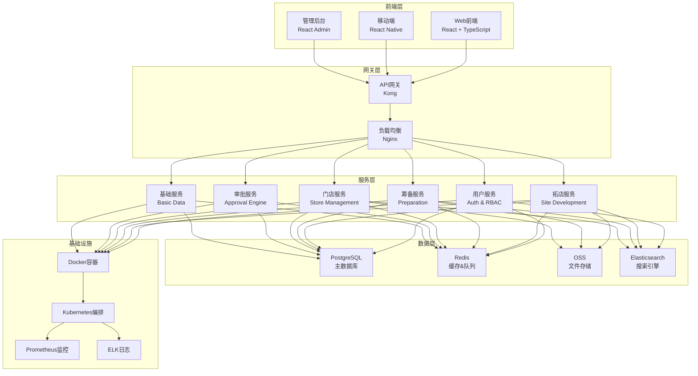
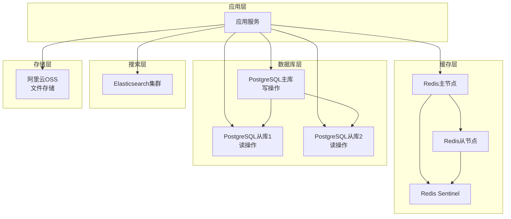
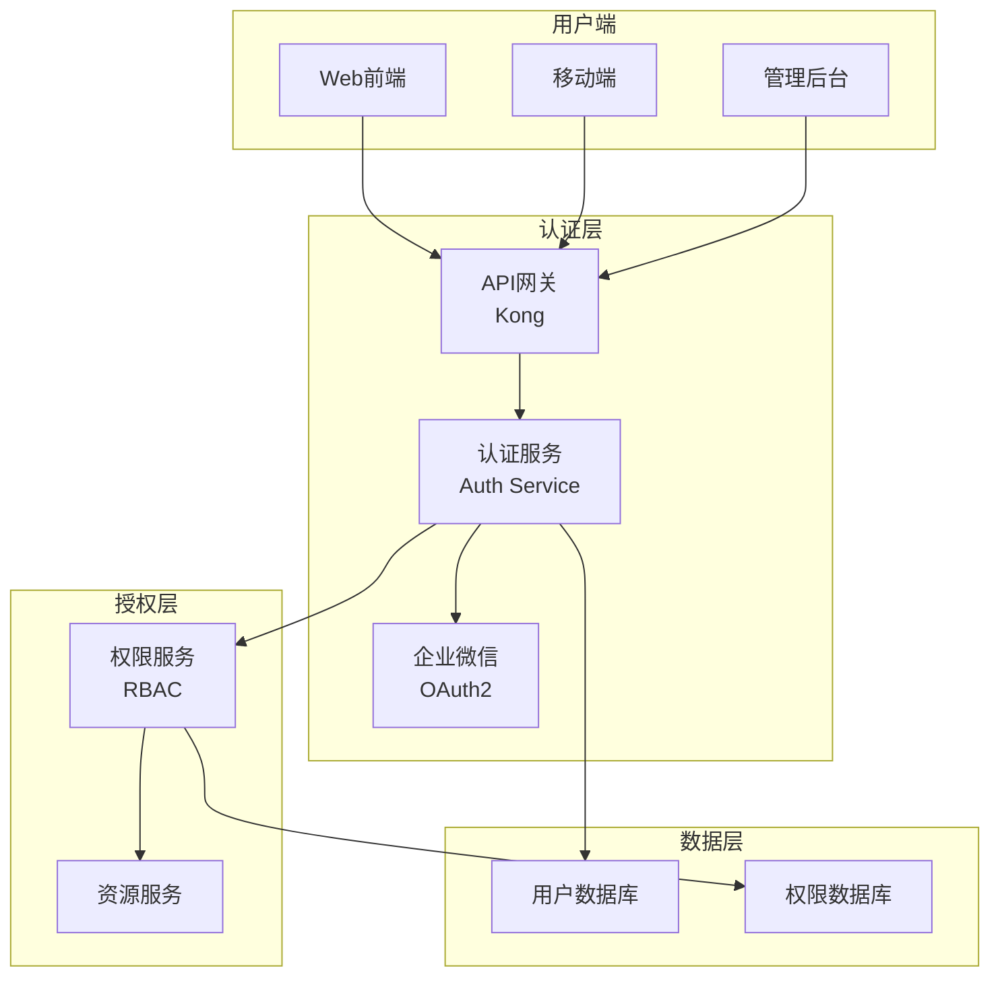
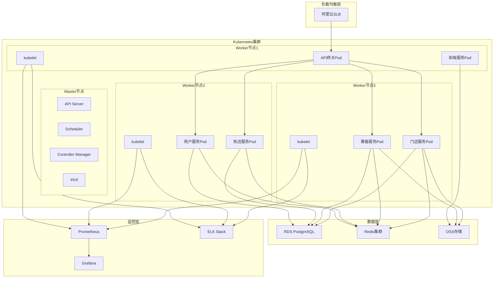
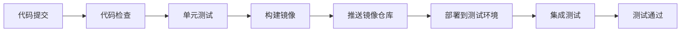
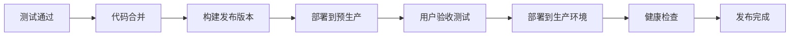
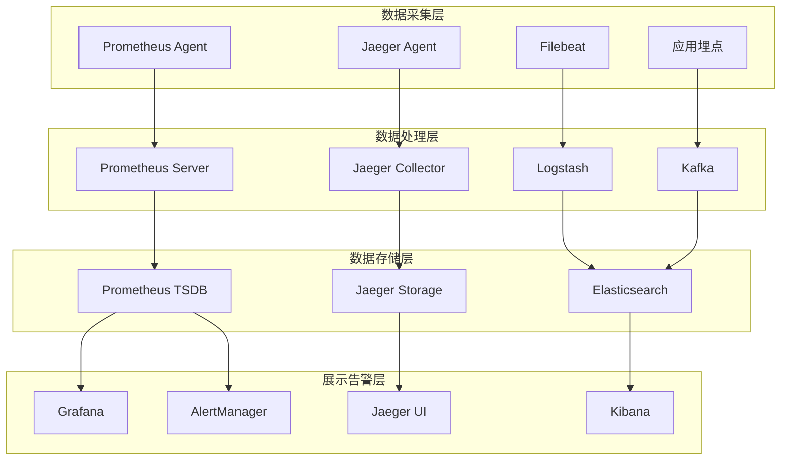

# 系统架构设计_好饭碗门店生命周期管理系统_v1.0_draft

## 文档信息

| 属性 | 值 |
|------|-----|
| 文档标题 | 好饭碗门店生命周期管理系统架构设计 |
| 文档版本 | v1.0 |
| 文档状态 | draft |
| 创建日期 | 2025-08-28 |
| 最后更新 | 2025-08-28 |
| 创建者 | 技术团队 |
| 审核者 | 待定 |
| 批准者 | 待定 |

---

## 1. 架构概述

### 1.1 设计目标
- **可扩展性**：支持业务快速扩张，系统能够水平扩展
- **高可用性**：保证系统99.5%以上的可用性
- **安全可靠**：数据安全、访问控制、操作审计
- **性能优异**：响应迅速，支持100并发用户
- **易维护性**：模块化设计，便于开发维护
- **技术先进性**：采用现代化技术栈，具备前瞻性

### 1.2 架构原则
- **分层解耦**：清晰的分层架构，模块间低耦合
- **服务化**：微服务架构，服务独立部署
- **数据一致性**：保证数据的一致性和完整性
- **标准化**：统一的开发规范和接口标准
- **监控可观测**：完善的监控和日志系统
- **自动化**：CI/CD自动化部署和测试

### 1.3 架构风格
采用**分层架构 + 微服务架构**的混合模式：
- **分层架构**：清晰的职责分离和调用关系
- **微服务架构**：服务拆分，独立开发部署
- **API网关**：统一的API入口和管理
- **事件驱动**：服务间通过事件进行异步通信

---

## 2. 整体架构设计

### 2.1 架构层次图

```
┌─────────────────────────────────────────────────────────────┐
│                        用户层                                │
├─────────────────────────────────────────────────────────────┤
│  Web前端(React)  │  移动端(React Native)  │  管理后台(React) │
├─────────────────────────────────────────────────────────────┤
│                      接入层                                  │
├─────────────────────────────────────────────────────────────┤
│          API网关(Kong) + 负载均衡(Nginx)                    │
├─────────────────────────────────────────────────────────────┤
│                     应用服务层                               │
├─────────────────────────────────────────────────────────────┤
│ 用户服务 │ 拓店服务 │ 筹备服务 │ 门店服务 │ 审批服务 │ 基础服务 │
├─────────────────────────────────────────────────────────────┤
│                     业务逻辑层                               │
├─────────────────────────────────────────────────────────────┤
│ 业务模型 │ 业务流程 │ 业务规则 │ 权限控制 │ 数据验证 │ 事务管理 │
├─────────────────────────────────────────────────────────────┤
│                     数据访问层                               │
├─────────────────────────────────────────────────────────────┤
│    ORM(Prisma)    │    缓存(Redis)    │    队列(Bull)     │
├─────────────────────────────────────────────────────────────┤
│                     数据存储层                               │
├─────────────────────────────────────────────────────────────┤
│ 主数据库(PostgreSQL) │ 从数据库 │ 文件存储(OSS) │ 日志存储 │
├─────────────────────────────────────────────────────────────┤
│                     基础设施层                               │
├─────────────────────────────────────────────────────────────┤
│  容器平台(Docker+K8s)  │  监控(Prometheus)  │  日志(ELK)   │
└─────────────────────────────────────────────────────────────┘
```

### 2.2 技术架构图



---

## 3. 微服务架构设计

### 3.1 服务拆分原则
- **业务边界清晰**：按照业务领域进行服务拆分
- **数据独立性**：每个服务管理自己的数据
- **团队独立性**：服务由独立团队负责开发维护
- **技术异构性**：允许不同服务采用不同技术栈
- **故障隔离性**：单个服务故障不影响整体系统

### 3.2 服务拆分结果

#### 3.2.1 用户服务 (User Service)
**职责范围**：
- 用户认证和授权
- 角色权限管理
- 企业微信集成
- 会话管理
- 操作审计

**技术栈**：
- 框架：Express.js + TypeScript
- 数据库：PostgreSQL
- 缓存：Redis
- 认证：JWT + OAuth2

**API端点**：
```
POST /auth/login           # 用户登录
POST /auth/logout          # 用户登出
POST /auth/refresh         # 刷新令牌
GET  /users                # 用户列表
POST /users                # 创建用户
PUT  /users/{id}           # 更新用户
GET  /roles                # 角色列表
POST /roles                # 创建角色
PUT  /roles/{id}           # 更新角色
```

#### 3.2.2 拓店服务 (Site Development Service)
**职责范围**：
- 开店计划管理
- 候选点位管理  
- 跟进管理
- 盈利测算
- 签约管理

**技术栈**：
- 框架：Express.js + TypeScript
- 数据库：PostgreSQL
- 缓存：Redis
- 队列：Bull Queue

**API端点**：
```
GET  /store-plans          # 开店计划列表
POST /store-plans          # 创建开店计划
PUT  /store-plans/{id}     # 更新开店计划
GET  /candidate-sites      # 候选点位列表
POST /candidate-sites      # 创建候选点位
GET  /follow-records       # 跟进记录列表
POST /follow-records       # 创建跟进记录
POST /profit-calculation   # 盈利测算
```

#### 3.2.3 筹备服务 (Preparation Service)
**职责范围**：
- 工程管理
- 验收管理
- 交付管理
- 进度跟踪

**技术栈**：
- 框架：Express.js + TypeScript
- 数据库：PostgreSQL
- 文件存储：OSS
- 消息队列：Redis

**API端点**：
```
GET  /construction-orders    # 工程单列表
POST /construction-orders    # 创建工程单
PUT  /construction-orders/{id} # 更新工程单
GET  /acceptance-records     # 验收记录列表
POST /acceptance-records     # 创建验收记录
GET  /delivery-records       # 交付记录列表
POST /delivery-records       # 创建交付记录
```

#### 3.2.4 门店服务 (Store Service)
**职责范围**：
- 门店档案管理
- 门店运营数据
- 资产管理
- 付款项管理

**技术栈**：
- 框架：Express.js + TypeScript
- 数据库：PostgreSQL
- 搜索：Elasticsearch
- 缓存：Redis

**API端点**：
```
GET  /stores               # 门店列表
POST /stores               # 创建门店
PUT  /stores/{id}          # 更新门店
GET  /stores/{id}/assets   # 门店资产列表
POST /stores/{id}/assets   # 创建门店资产
GET  /stores/{id}/payments # 门店付款项列表
POST /stores/{id}/payments # 创建付款项
```

#### 3.2.5 审批服务 (Approval Service)
**职责范围**：
- 审批流程引擎
- 审批模板管理
- 审批任务处理
- 流程监控

**技术栈**：
- 框架：Express.js + TypeScript
- 流程引擎：Camunda或自研
- 数据库：PostgreSQL
- 消息队列：Redis

**API端点**：
```
GET  /approval-templates   # 审批模板列表
POST /approval-templates   # 创建审批模板
GET  /approval-instances   # 审批实例列表
POST /approval-instances   # 发起审批
PUT  /approval-tasks/{id}  # 处理审批任务
GET  /approval-tasks       # 审批任务列表
```

#### 3.2.6 基础数据服务 (Basic Data Service)
**职责范围**：
- 业务大区管理
- 供应商管理
- 主体信息管理
- 客户信息管理
- 商务预算管理

**技术栈**：
- 框架：Express.js + TypeScript
- 数据库：PostgreSQL
- 缓存：Redis

**API端点**：
```
GET  /business-regions     # 业务大区列表
POST /business-regions     # 创建业务大区
GET  /suppliers            # 供应商列表
POST /suppliers            # 创建供应商
GET  /subjects             # 主体列表
POST /subjects             # 创建主体
GET  /customers            # 客户列表
POST /customers            # 创建客户
```

#### 3.2.7 通知服务 (Notification Service)
**职责范围**：
- 消息推送
- 通知管理
- 短信邮件发送
- 企微消息推送

**技术栈**：
- 框架：Express.js + TypeScript
- 消息队列：Redis + Bull
- 外部服务：企微API、短信API

**API端点**：
```
GET  /notifications        # 通知列表
POST /notifications        # 发送通知
PUT  /notifications/{id}   # 标记通知状态
POST /notifications/push   # 推送消息
```

#### 3.2.8 文件服务 (File Service)
**职责范围**：
- 文件上传下载
- 图片处理
- 文档管理
- 存储管理

**技术栈**：
- 框架：Express.js + TypeScript
- 存储：阿里云OSS
- 图片处理：Sharp
- 缓存：Redis

**API端点**：
```
POST /files/upload         # 文件上传
GET  /files/{id}           # 文件下载
DELETE /files/{id}         # 删除文件
POST /images/resize        # 图片缩放
```

### 3.3 服务间通信

#### 3.3.1 同步通信
- **协议**：HTTP/HTTPS + RESTful API
- **格式**：JSON
- **认证**：JWT Token
- **超时**：5秒
- **重试**：指数退避，最多3次

#### 3.3.2 异步通信
- **消息队列**：Redis + Bull Queue
- **事件总线**：基于Redis的发布订阅
- **消息格式**：JSON
- **消息持久化**：Redis持久化

#### 3.3.3 服务发现
- **注册中心**：Kubernetes Service Discovery
- **健康检查**：HTTP健康检查端点
- **负载均衡**：Kubernetes内置负载均衡

---

## 4. 数据架构设计

### 4.1 数据架构概述
采用**读写分离 + 缓存 + 数据仓库**的数据架构：
- **主数据库**：PostgreSQL，处理事务性读写操作
- **从数据库**：PostgreSQL只读副本，处理查询操作
- **缓存层**：Redis，缓存热点数据和会话信息
- **搜索引擎**：Elasticsearch，支持全文检索
- **文件存储**：阿里云OSS，存储文件和图片

### 4.2 数据库架构图



### 4.3 数据分片策略
- **水平分片**：按业务域和数据量进行分片
- **垂直分片**：按服务边界进行数据库分离
- **分片键**：主要以租户ID、地区ID为分片键
- **分片路由**：应用层实现分片路由逻辑

### 4.4 数据一致性
- **强一致性**：关键业务数据保证强一致性
- **最终一致性**：非关键数据允许最终一致性
- **分布式事务**：使用Saga模式处理分布式事务
- **数据补偿**：提供数据补偿和修复机制

---

## 5. 安全架构设计

### 5.1 安全架构概述
构建**多层防护**的安全体系：
- **网络安全**：VPC、安全组、WAF
- **应用安全**：认证、授权、加密、审计
- **数据安全**：加密存储、备份、恢复
- **运维安全**：堡垒机、操作审计、权限管控

### 5.2 认证授权架构



### 5.3 数据安全措施
- **传输加密**：全站HTTPS，TLS 1.3
- **存储加密**：数据库透明加密，敏感字段加密
- **密钥管理**：使用专业密钥管理服务
- **数据脱敏**：开发测试环境数据脱敏
- **备份加密**：数据备份加密存储

### 5.4 安全监控
- **入侵检测**：WAF + IDS
- **异常监控**：登录异常、操作异常检测
- **安全审计**：完整的操作日志审计
- **漏洞扫描**：定期安全漏洞扫描

---

## 6. 性能架构设计

### 6.1 性能目标
- **响应时间**：页面加载<3秒，API响应<2秒
- **并发能力**：支持100并发用户
- **吞吐量**：1000 TPS
- **可用性**：99.5%系统可用性

### 6.2 性能优化策略

#### 6.2.1 前端性能优化
- **代码分割**：路由级别的代码分割
- **懒加载**：组件和模块懒加载
- **缓存策略**：浏览器缓存 + CDN缓存
- **资源优化**：图片压缩、JS/CSS压缩
- **Service Worker**：离线缓存支持

#### 6.2.2 后端性能优化
- **数据库优化**：索引优化、查询优化
- **缓存策略**：多级缓存，热点数据缓存
- **连接池**：数据库连接池优化
- **异步处理**：CPU密集型任务异步处理
- **CDN加速**：静态资源CDN分发

#### 6.2.3 系统架构优化
- **负载均衡**：多实例负载均衡
- **数据库读写分离**：读写分离减轻主库压力
- **服务拆分**：微服务减少单点瓶颈
- **消息队列**：异步处理提升性能

### 6.3 监控指标
- **系统指标**：CPU、内存、磁盘、网络
- **应用指标**：响应时间、错误率、吞吐量
- **业务指标**：用户活跃度、功能使用率
- **数据库指标**：慢查询、连接数、锁等待

---

## 7. 部署架构设计

### 7.1 部署架构概述
采用**云原生容器化部署**：
- **容器化**：Docker容器打包应用
- **编排**：Kubernetes编排管理
- **服务网格**：Istio服务网格（可选）
- **监控**：Prometheus + Grafana
- **日志**：ELK Stack

### 7.2 部署架构图



### 7.3 环境规划

#### 7.3.1 开发环境
- **用途**：开发人员日常开发测试
- **部署**：单机Docker Compose
- **资源**：2核4G，1台服务器
- **数据**：模拟数据，定期重置

#### 7.3.2 测试环境
- **用途**：功能测试、集成测试
- **部署**：Kubernetes集群
- **资源**：4核8G，3台服务器
- **数据**：脱敏的生产数据

#### 7.3.3 预生产环境
- **用途**：用户验收测试、压力测试
- **部署**：Kubernetes集群
- **资源**：8核16G，3台服务器
- **数据**：生产数据备份

#### 7.3.4 生产环境
- **用途**：正式对外服务
- **部署**：Kubernetes高可用集群
- **资源**：16核32G，6台服务器
- **数据**：生产数据，多重备份

### 7.4 CI/CD流程

#### 7.4.1 持续集成


#### 7.4.2 持续部署


---

## 8. 监控运维架构

### 8.1 监控体系
构建**全栈监控**体系：
- **基础设施监控**：服务器、网络、存储
- **应用性能监控**：APM、链路追踪
- **业务监控**：业务指标、用户行为
- **日志监控**：日志收集、分析、告警

### 8.2 监控架构图



### 8.3 告警体系
- **告警级别**：紧急、重要、一般、信息
- **告警方式**：短信、邮件、企微、电话
- **告警规则**：基于阈值、趋势、异常检测
- **告警处理**：值班轮替、升级机制

### 8.4 运维流程
- **发布流程**：测试验证、灰度发布、全量发布
- **故障处理**：监控发现、快速响应、根因分析
- **容量规划**：资源监控、容量预测、弹性扩缩
- **备份恢复**：定期备份、恢复演练、灾备方案

---

## 9. 技术选型详述

### 9.1 前端技术栈

#### 9.1.1 Web前端
- **框架**：React 18 + TypeScript
  - 优势：成熟生态、强类型、组件化
  - 版本：React 18.2+, TypeScript 5.0+
- **状态管理**：Redux Toolkit
  - 优势：可预测状态、调试友好、中间件支持
- **UI组件库**：Ant Design 5.0
  - 优势：组件丰富、企业级、国际化
- **构建工具**：Vite
  - 优势：快速构建、HMR、现代化
- **路由**：React Router 6
- **HTTP客户端**：Axios
- **测试**：Jest + React Testing Library

#### 9.1.2 移动端
- **框架**：React Native 0.72+
  - 优势：跨平台、代码复用、原生性能
- **导航**：React Navigation 6
- **状态管理**：Redux Toolkit
- **UI组件**：NativeBase或自定义组件

### 9.2 后端技术栈

#### 9.2.1 运行时和框架
- **运行时**：Node.js 18 LTS
  - 优势：性能优秀、生态丰富、JavaScript全栈
- **框架**：Express.js + TypeScript
  - 优势：简洁灵活、中间件丰富、社区活跃
- **ORM**：Prisma 5.0
  - 优势：类型安全、查询构建器、迁移管理

#### 9.2.2 数据存储
- **主数据库**：PostgreSQL 15
  - 优势：ACID支持、JSON支持、扩展性强
- **缓存**：Redis 7.0
  - 优势：高性能、数据结构丰富、持久化
- **搜索引擎**：Elasticsearch 8.0
  - 优势：全文搜索、分析能力、可扩展
- **文件存储**：阿里云OSS
  - 优势：高可用、CDN支持、成本优化

#### 9.2.3 中间件和工具
- **消息队列**：Bull Queue (基于Redis)
  - 优势：任务调度、失败重试、监控界面
- **API网关**：Kong
  - 优势：高性能、插件丰富、企业级
- **认证**：JWT + Passport.js
- **文档**：Swagger/OpenAPI 3.0
- **测试**：Jest + Supertest

### 9.3 基础设施技术栈

#### 9.3.1 容器和编排
- **容器**：Docker
  - 优势：环境一致性、资源隔离、部署简化
- **编排**：Kubernetes
  - 优势：自动化部署、服务发现、弹性扩缩
- **镜像仓库**：阿里云ACR

#### 9.3.2 监控和日志
- **监控**：Prometheus + Grafana
  - 优势：时序数据库、丰富告警、可视化
- **日志**：ELK Stack (Elasticsearch, Logstash, Kibana)
  - 优势：日志收集、搜索分析、可视化
- **链路追踪**：Jaeger
  - 优势：分布式追踪、性能分析
- **错误监控**：Sentry
  - 优势：错误聚合、性能监控、告警通知

### 9.4 技术选型对比

| 分类 | 技术方案 | 替代方案 | 选择理由 |
|------|----------|----------|----------|
| 前端框架 | React | Vue, Angular | 生态成熟，团队熟悉度高 |
| 状态管理 | Redux Toolkit | Zustand, Recoil | 成熟稳定，调试工具完善 |
| UI组件库 | Ant Design | Material-UI | 企业级组件，中文友好 |
| 构建工具 | Vite | Webpack, Parcel | 构建速度快，开发体验好 |
| 后端框架 | Express.js | Koa, Fastify | 社区活跃，中间件丰富 |
| 数据库 | PostgreSQL | MySQL, MongoDB | ACID支持，JSON功能强 |
| ORM | Prisma | TypeORM, Sequelize | 类型安全，现代化API |
| 缓存 | Redis | Memcached | 数据结构丰富，功能强大 |
| 消息队列 | Bull Queue | RabbitMQ, Kafka | 基于Redis，部署简单 |
| 容器编排 | Kubernetes | Docker Swarm | 功能强大，生态完整 |
| 监控 | Prometheus | Zabbix, Nagios | 云原生，扩展性强 |

---

## 10. 架构质量属性

### 10.1 可扩展性
- **水平扩展**：微服务支持独立扩展
- **垂直扩展**：容器资源动态调整
- **数据扩展**：数据库分片和读写分离
- **缓存扩展**：Redis集群支持

### 10.2 高可用性
- **服务冗余**：多实例部署
- **数据冗余**：主从复制和备份
- **故障转移**：自动故障检测和切换
- **降级策略**：服务降级和熔断

### 10.3 性能表现
- **响应时间**：API响应时间<2秒
- **并发处理**：支持100并发用户
- **吞吐量**：1000 TPS处理能力
- **资源利用率**：CPU和内存利用率<80%

### 10.4 安全可靠
- **身份认证**：多因子认证
- **访问控制**：RBAC权限模型
- **数据加密**：传输和存储加密
- **安全审计**：操作日志审计

### 10.5 可维护性
- **模块化设计**：清晰的模块边界
- **标准化**：统一的开发规范
- **文档完整**：代码和API文档
- **测试覆盖**：单元测试和集成测试

### 10.6 可观测性
- **日志记录**：结构化日志
- **指标监控**：关键指标监控
- **链路追踪**：请求链路追踪
- **告警通知**：实时告警机制

---

## 11. 风险评估

### 11.1 技术风险
| 风险项 | 风险等级 | 影响 | 缓解措施 |
|--------|----------|------|----------|
| 微服务复杂度 | 中 | 开发维护成本增加 | 合理服务拆分，完善监控 |
| 数据一致性 | 高 | 数据不一致问题 | 分布式事务，补偿机制 |
| 技术选型风险 | 中 | 技术债务累积 | 谨慎选型，技术调研 |
| 性能瓶颈 | 中 | 系统响应慢 | 性能测试，优化策略 |

### 11.2 运维风险
| 风险项 | 风险等级 | 影响 | 缓解措施 |
|--------|----------|------|----------|
| 部署复杂度 | 中 | 部署失败风险 | CI/CD自动化，灰度发布 |
| 监控盲点 | 高 | 故障发现滞后 | 全栈监控，告警机制 |
| 容量规划 | 中 | 资源不足或浪费 | 容量监控，弹性扩缩 |
| 数据丢失 | 高 | 业务数据丢失 | 多重备份，恢复演练 |

### 11.3 业务风险
| 风险项 | 风险等级 | 影响 | 缓解措施 |
|--------|----------|------|----------|
| 需求变更 | 高 | 架构调整成本 | 架构弹性设计，快速迭代 |
| 用户量增长 | 中 | 系统负载压力 | 弹性架构，性能优化 |
| 安全合规 | 中 | 合规风险 | 安全设计，合规检查 |

---

## 12. 实施计划

### 12.1 架构实施阶段

#### 12.1.1 第一阶段：基础架构搭建（4周）
- 开发环境搭建
- 基础框架选型和集成
- 核心服务骨架开发
- 数据库设计和初始化
- CI/CD流水线搭建

#### 12.1.2 第二阶段：核心服务开发（8周）
- 用户服务开发
- 拓店服务开发
- 筹备服务开发
- 门店服务开发
- API网关配置

#### 12.1.3 第三阶段：审批和基础服务（6周）
- 审批服务开发
- 基础数据服务开发
- 通知服务开发
- 文件服务开发
- 服务集成测试

#### 12.1.4 第四阶段：监控和运维（4周）
- 监控系统部署
- 日志系统配置
- 告警机制设置
- 运维工具配置
- 性能优化调整

### 12.2 里程碑节点
- **Week 4**: 基础架构完成，开发环境就绪
- **Week 12**: 核心服务开发完成，API接口可用
- **Week 18**: 所有服务开发完成，集成测试通过
- **Week 22**: 监控运维完成，系统上线就绪

---

## 13. 附录

### 13.1 架构决策记录 (ADR)
记录重要的架构决策，包括：
- 决策内容
- 决策背景
- 考虑的替代方案
- 决策理由
- 预期影响

### 13.2 技术债务管理
- **识别技术债务**：代码质量、架构偏差
- **评估优先级**：影响程度、修复成本
- **制定还债计划**：分期还债、持续改进
- **防范新债务**：代码review、架构review

### 13.3 相关文档
- 《PRD_好饭碗门店生命周期管理系统_v1.0_draft.md》
- 《数据库设计文档》
- 《API接口设计文档》
- 《部署运维手册》
- 《安全设计文档》

### 13.4 版本历史
| 版本 | 日期 | 修改内容 | 修改人 |
|------|------|---------|--------|
| v1.0 | 2025-08-28 | 初始版本，完整架构设计 | 技术团队 |

---

**文档状态**：草稿版  
**下一步行动**：架构设计评审，技术选型确认  
**预计完成时间**：2025-09-05