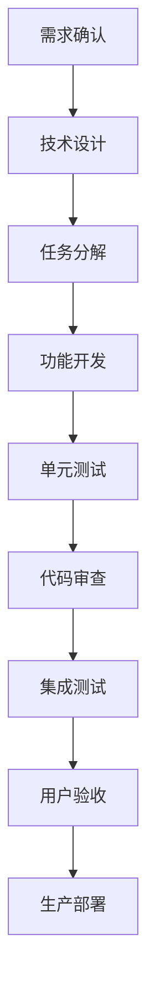
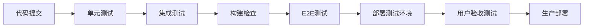

# 好饭碗门店生命周期管理系统 - 前端开发实施计划

## 文档信息

| 属性 | 值 |
|------|-----|
| 文档标题 | 好饭碗门店生命周期管理系统-前端开发实施计划 |
| 文档版本 | v1.0 |
| 文档状态 | draft |
| 创建日期 | 2025-08-28 |
| 创建者 | 前端开发总监 |
| 项目阶段 | 开发实施阶段 |

---

## 1. 现状评估与技术债务分析

### 1.1 代码库现状分析

#### ✅ 已完成的基础设施
- **工程化配置**：pnpm workspace + TypeScript strict mode
- **技术栈基础**：React 18 + Vite + Ant Design 5.x
- **架构框架**：RBAC权限系统、路由守卫、状态管理(Zustand)
- **开发工具链**：ESLint + Prettier + Husky + lint-staged
- **测试框架**：Vitest + Testing Library + MSW mock
- **API服务层**：统一HTTP客户端、错误处理、React Query集成

#### 🔧 需要优化的技术债务
1. **业务组件不足**：当前只有基础页面框架，缺少实际业务组件
2. **测试覆盖率低**：E2E测试和集成测试缺失
3. **移动端支持**：PWA配置不完整，企微集成未实现
4. **性能优化**：代码分割、懒加载、缓存策略待实施
5. **数据可视化**：缺少图表组件库和经营大屏组件
6. **错误监控**：生产环境错误追踪系统未配置

### 1.2 架构优势分析
- **扩展性强**：模块化设计支持快速功能迭代
- **可维护性高**：TypeScript + 统一代码规范
- **开发效率**：完善的开发工具链和Mock数据
- **团队协作**：清晰的目录结构和组件分层

---

## 2. 三阶段开发优先级与里程碑规划

### 2.1 MVP阶段（第1-4个月）：核心架构与基础功能

#### 2.1.1 技术目标
- **架构验证**：确保技术选型和架构设计的可行性
- **核心流程**：实现端到端的基础业务流程
- **集成验证**：完成企业微信集成的技术验证

#### 2.1.2 功能优先级（按开发顺序）

**第1个月：基础设施完善**
```
Week 1-2: 技术债务清理
├── 升级依赖包到最新稳定版
├── 完善ESLint/Prettier配置
├── 配置Sentry错误监控
└── 建立代码审查流程

Week 3-4: 核心组件开发
├── 通用业务组件库（StatCard、StatusTag、ProgressTracker）
├── 表单组件封装（搜索、筛选、分页）
├── 数据展示组件（表格、卡片、详情面板）
└── 移动端基础组件适配
```

**第2个月：企业微信集成与认证系统**
```
Week 1-2: 企微集成开发
├── 企业微信JSSDK集成
├── 免密登录实现
├── 移动端适配和调试
└── 用户信息同步机制

Week 3-4: 权限系统完善
├── 角色权限管理界面
├── 动态菜单和按钮权限
├── 多租户数据隔离
└── 权限缓存机制优化
```

**第3个月：核心业务模块开发**
```
Week 1-2: 开店计划模块
├── 计划列表和详情页面
├── 计划创建和编辑表单
├── 计划审批状态跟踪
└── 计划数据导入导出

Week 3-4: 门店档案模块
├── 门店信息管理界面
├── 门店档案详情展示
├── 档案资料上传管理
└── 历史数据整合
```

**第4个月：集成测试与优化**
```
Week 1-2: 功能集成测试
├── 端到端业务流程测试
├── 企微集成全面测试
├── 权限系统集成测试
└── 移动端兼容性测试

Week 3-4: 性能优化与交付准备
├── 首屏加载性能优化
├── 代码分割和懒加载
├── 生产环境配置
└── MVP版本交付
```

#### 2.1.3 MVP阶段验收标准
- [ ] 企业微信集成完成，支持免密登录
- [ ] 核心业务流程可以端到端运行
- [ ] 移动端基础功能正常使用
- [ ] 代码测试覆盖率达到60%
- [ ] 生产环境稳定运行30天

### 2.2 一期核心期（第5-10个月）：完整业务功能

#### 2.2.1 技术目标
- **功能完整性**：实现所有核心业务模块
- **用户体验**：优化交互和视觉效果
- **系统稳定性**：提高系统可靠性和性能

#### 2.2.2 功能开发计划

**第5-6个月：拓店管理与筹备模块**
```
拓店管理模块：
├── 候选点位管理（地图集成、位置标记）
├── 跟进记录管理（时间线展示、状态跟踪）
├── 商务条件谈判（文档管理、进度追踪）
└── 铺位评估报告（数据分析、决策支持）

开店筹备模块：
├── 筹备任务管理（甘特图展示、任务分配）
├── 工程进度跟踪（照片上传、验收确认）
├── 证照办理管理（流程跟踪、到期提醒）
└── 开业准备清单（检查项管理、完成度统计）
```

**第7-8个月：审批中心与基础数据**
```
审批中心模块：
├── 审批流程引擎（自定义流程、节点配置）
├── 审批任务中心（待办、已办、历史记录）
├── 审批模板管理（7大业务模板、自定义模板）
└── 审批数据分析（效率统计、瓶颈分析）

基础数据模块：
├── 组织架构管理（部门、人员、角色）
├── 供应商管理（资质、合同、评价）
├── 主体公司管理（证照、财务、合规）
└── 客户信息管理（档案、合作历史、信用）
```

**第9-10个月：移动端优化与集成测试**
```
移动端优化：
├── PWA功能完善（离线缓存、推送通知）
├── 移动端专属组件（滑动操作、手势交互）
├── 企微工作台深度集成（卡片、快捷入口）
└── 移动端性能优化（预加载、图片优化）

系统集成：
├── 全业务流程端到端测试
├── 多角色协作场景测试
├── 大数据量性能测试
└── 安全渗透测试
```

#### 2.2.3 一期验收标准
- [ ] 7大业务模块功能完整实现
- [ ] 移动端核心功能体验良好
- [ ] 系统支持100+并发用户
- [ ] 代码测试覆盖率达到80%
- [ ] 用户满意度达到85%以上

### 2.3 二期增值期（第11-14个月）：数据分析与运营支撑

#### 2.3.1 技术目标
- **数据可视化**：构建经营大屏和分析报表
- **智能化**：引入数据分析和决策支持
- **运营效率**：优化业务流程和用户体验

#### 2.3.2 功能开发计划

**第11-12个月：经营大屏与数据报表**
```
经营大屏：
├── 实时业务监控（开店进度、运营指标）
├── 数据可视化展示（图表库、仪表盘）
├── 异常预警系统（指标监控、自动告警）
└── 大屏展示适配（4K分辨率、自动刷新）

数据报表：
├── 报表设计器（拖拽式报表构建）
├── 预设业务报表（财务、运营、管理报表）
├── 自定义查询（SQL构建器、数据导出）
└── 报表订阅（定时推送、邮件通知）
```

**第13-14个月：智能分析与系统优化**
```
智能分析：
├── 选址分析模型（位置评估、风险预测）
├── 运营数据分析（趋势分析、异常检测）
├── 成本效益分析（ROI计算、盈利预测）
└── 决策支持系统（推荐算法、策略建议）

系统优化：
├── 性能深度优化（缓存策略、数据库优化）
├── 用户体验优化（交互改进、流程简化）
├── 系统安全加固（权限审计、安全扫描）
└── 运维监控完善（日志分析、性能监控）
```

#### 2.3.3 二期验收标准
- [ ] 经营大屏实时展示核心业务数据
- [ ] 智能分析功能辅助业务决策
- [ ] 系统性能支持500+并发用户
- [ ] 代码测试覆盖率达到85%
- [ ] 系统可用性达到99.5%

---

## 3. 团队分工与协作模式

### 3.1 前端团队组织架构

#### 3.1.1 团队角色配置
```
前端开发总监（1人）
├── 技术架构与决策
├── 团队管理与协调
├── 代码审查与质量控制
└── 与产品、后端团队协作

高级前端工程师（2人）
├── 核心模块技术难点攻坚
├── 组件库与基础设施建设
├── 初级工程师技术指导
└── 代码审查与技术分享

中级前端工程师（3人）
├── 业务模块功能开发
├── 组件开发与维护
├── 测试用例编写
└── 技术文档撰写

初级前端工程师（2人）
├── 基础页面开发
├── 样式调整与适配
├── 测试用例执行
└── 问题修复与优化

前端测试工程师（1人）
├── E2E测试用例设计与执行
├── 自动化测试脚本开发
├── 性能测试与优化建议
└── 测试报告与质量分析
```

### 3.2 协作流程设计

#### 3.2.1 开发工作流


#### 3.2.2 跨团队协作机制

**与产品团队协作**：
- **需求评审**：每周三需求评审会，确保需求理解一致
- **原型确认**：UI原型评审，确认交互逻辑和视觉效果
- **用户反馈**：建立用户反馈收集和处理机制
- **迭代规划**：每两周一次迭代规划会议

**与后端团队协作**：
- **API设计**：前后端联合设计API接口规范
- **联调测试**：建立联调测试环境和流程
- **数据格式**：统一数据交互格式和错误处理
- **性能优化**：前后端联合性能优化方案

**与测试团队协作**：
- **测试用例**：前端提供组件测试用例，测试团队负责集成测试
- **缺陷管理**：建立缺陷跟踪和修复流程
- **自动化测试**：共同维护自动化测试套件
- **性能监控**：建立生产环境性能监控机制

### 3.3 代码审查与质量控制

#### 3.3.1 代码审查流程
```
1. 开发完成 → 提交Pull Request
2. 自动检查 → ESLint + TypeScript + 测试用例
3. 同级审查 → 至少1人审查，关注业务逻辑
4. 高级审查 → 高级工程师审查，关注架构设计
5. 合并代码 → 通过所有检查后合并到主分支
```

#### 3.3.2 质量门禁标准
- **代码规范**：ESLint检查0警告，Prettier格式化
- **类型检查**：TypeScript编译0错误
- **测试覆盖**：新增代码测试覆盖率>80%
- **构建检查**：生产构建成功，无警告
- **性能检查**：关键组件性能回归测试通过

---

## 4. 技术债务处理与风险管控

### 4.1 技术债务识别与优先级

#### 4.1.1 高优先级技术债务
```
P1 - 影响开发效率和系统稳定性：
├── 依赖包安全漏洞修复（React Query 4.x → 5.x）
├── 企业微信JSSDK集成验证
├── 移动端响应式适配优化
└── 生产环境错误监控配置

P2 - 影响代码质量和维护性：
├── 组件props类型定义完善
├── API服务层错误处理统一
├── 全局状态管理结构优化
└── 测试用例覆盖率提升
```

#### 4.1.2 技术债务处理计划
```
第1个月：
├── 升级React Query到5.x（1周）
├── 修复所有ESLint警告（1周）
├── 完善TypeScript类型定义（2周）

第2个月：
├── 优化移动端响应式布局（2周）
├── 统一API错误处理机制（1周）
├── 配置Sentry错误监控（1周）

持续优化：
├── 每月技术债务评估会议
├── 每个迭代预留20%时间处理技术债务
└── 建立技术债务跟踪和度量机制
```

### 4.2 风险识别与应对措施

#### 4.2.1 技术风险矩阵

| 风险项 | 发生概率 | 影响程度 | 风险等级 | 应对措施 |
|--------|----------|----------|----------|----------|
| 企微集成兼容性问题 | 中 | 高 | 🔴高 | 早期验证，备用方案 |
| 移动端性能问题 | 中 | 中 | 🟡中 | 性能测试，分步优化 |
| 第三方依赖安全漏洞 | 高 | 中 | 🟡中 | 定期扫描，及时更新 |
| 大数据量页面性能 | 中 | 中 | 🟡中 | 虚拟滚动，分页优化 |
| 浏览器兼容性问题 | 低 | 中 | 🟢低 | 测试覆盖，Polyfill |

#### 4.2.2 关键风险应对策略

**企业微信集成风险**：
- **技术验证**：MVP阶段完成完整技术验证
- **备用方案**：传统账密登录作为备用方案
- **专项测试**：建立企微集成专项测试用例
- **文档支持**：与企微技术支持建立直接联系

**移动端适配风险**：
- **渐进增强**：桌面端优先，移动端渐进增强
- **响应式设计**：使用成熟的响应式框架
- **设备测试**：建立多设备测试环境
- **性能监控**：移动端性能专项监控

**性能风险**：
- **基准测试**：建立性能基准和监控指标
- **分步优化**：按优先级分步实施优化方案
- **缓存策略**：多层缓存机制（浏览器、CDN、API）
- **代码分割**：按路由和功能模块分割代码

### 4.3 项目进度风险控制

#### 4.3.1 进度监控机制
- **周报制度**：每周项目进度和风险报告
- **里程碑检查**：每月里程碑完成度评估
- **预警机制**：进度延误超过10%即启动应对措施
- **资源调整**：根据进度情况灵活调整人员分配

#### 4.3.2 质量风险控制
- **自动化测试**：持续集成中的自动化测试
- **代码审查**：严格的代码审查流程
- **用户验收**：每个功能模块的用户验收测试
- **生产监控**：生产环境错误和性能监控

---

## 5. 质量保证与测试计划

### 5.1 测试策略总体设计

#### 5.1.1 测试金字塔模型
```
           E2E Tests (10%)
         ┌─────────────────┐
        │  用户场景测试    │
       └─────────────────┘
      
    Integration Tests (20%)
   ┌─────────────────────────┐
  │   API集成、组件集成    │
 └─────────────────────────┘

    Unit Tests (70%)
┌───────────────────────────────┐
│  组件、工具函数、业务逻辑  │
└───────────────────────────────┘
```

#### 5.1.2 测试覆盖率目标
- **单元测试覆盖率**：>85%（业务逻辑、工具函数、组件）
- **集成测试覆盖率**：>70%（API接口、组件集成）
- **E2E测试覆盖率**：>90%（核心业务流程）

### 5.2 分层测试实施计划

#### 5.2.1 单元测试计划（70%测试量）

**组件测试**：
```typescript
// 示例：业务组件测试
describe('StorePlanList', () => {
  it('应该正确渲染门店计划列表', () => {
    // 测试组件渲染
  })
  
  it('应该处理筛选和搜索功能', () => {
    // 测试交互逻辑
  })
  
  it('应该正确处理权限显示', () => {
    // 测试权限控制
  })
})
```

**业务逻辑测试**：
```typescript
// API服务层测试
describe('StorePlanService', () => {
  it('应该正确处理API响应', () => {
    // 测试数据处理
  })
  
  it('应该正确处理错误情况', () => {
    // 测试错误处理
  })
})

// 工具函数测试
describe('dateUtils', () => {
  it('应该正确格式化日期', () => {
    // 测试工具函数
  })
})
```

#### 5.2.2 集成测试计划（20%测试量）

**API集成测试**：
```typescript
// 使用MSW进行API集成测试
describe('门店计划API集成', () => {
  it('应该完成门店计划的CRUD操作', async () => {
    // 测试完整的API调用流程
  })
  
  it('应该正确处理权限验证', async () => {
    // 测试API权限控制
  })
})
```

**组件集成测试**：
```typescript
// 测试组件间的数据流和交互
describe('门店计划页面集成', () => {
  it('应该完成从列表到详情的完整流程', () => {
    // 测试页面级组件集成
  })
})
```

#### 5.2.3 E2E测试计划（10%测试量）

**核心业务流程测试**：
```typescript
// 使用Playwright进行E2E测试
test('门店开发完整流程', async ({ page }) => {
  // 1. 登录系统
  await page.goto('/login')
  await login(page)
  
  // 2. 创建开店计划
  await createStorePlan(page)
  
  // 3. 添加候选点位
  await addCandidateLocation(page)
  
  // 4. 提交审批
  await submitApproval(page)
  
  // 5. 验证流程完成
  await verifyProcessCompleted(page)
})
```

**移动端测试**：
```typescript
// 移动端E2E测试
test('移动端核心功能测试', async ({ browser }) => {
  const context = await browser.newContext({
    viewport: { width: 375, height: 812 } // iPhone X
  })
  
  const page = await context.newPage()
  // 测试移动端核心功能
})
```

### 5.3 测试环境与工具配置

#### 5.3.1 测试环境配置
```yaml
# 测试环境配置
test-environment:
  unit-test:
    framework: Vitest
    environment: jsdom
    coverage: v8
    
  integration-test:
    framework: Vitest
    mock: MSW
    database: Test DB
    
  e2e-test:
    framework: Playwright
    browsers: [Chrome, Firefox, Safari]
    devices: [Desktop, Mobile, Tablet]
```

#### 5.3.2 持续集成测试流程


### 5.4 性能测试与优化

#### 5.4.1 性能测试指标
```
加载性能：
├── 首屏加载时间 < 2秒
├── 交互响应时间 < 100ms
├── 页面切换时间 < 300ms
└── 资源加载完成 < 5秒

运行性能：
├── 内存占用 < 100MB
├── CPU占用 < 30%
├── 滚动流畅度 60FPS
└── 动画流畅度 60FPS
```

#### 5.4.2 性能优化策略
```
代码层面：
├── 代码分割（React.lazy + Suspense）
├── 组件懒加载（Intersection Observer）
├── 状态优化（useMemo, useCallback）
└── 虚拟滚动（大列表优化）

资源层面：
├── 图片优化（WebP格式，响应式图片）
├── 字体优化（字体预加载，子集化）
├── 静态资源CDN加速
└── 服务端压缩（Gzip, Brotli）

缓存策略：
├── HTTP缓存（静态资源长缓存）
├── 浏览器缓存（LocalStorage, SessionStorage）
├── API缓存（React Query缓存）
└── 服务端缓存（Redis缓存）
```

---

## 6. DevOps与CI/CD流程

### 6.1 开发环境配置

#### 6.1.1 环境分层设计
```
开发环境 (Development)
├── 本地开发环境 (localhost:7000)
├── Mock数据服务
├── 热重载和调试工具
└── 开发调试配置

测试环境 (Testing)
├── 集成测试环境 (test.mendian.com)
├── 真实后端API
├── 测试数据集
└── 自动化测试执行

预生产环境 (Staging)
├── 生产镜像环境 (staging.mendian.com)
├── 生产级数据
├── 性能和安全测试
└── 用户验收测试

生产环境 (Production)
├── 正式生产环境 (www.mendian.com)
├── 高可用配置
├── 监控和告警
└── 备份和恢复
```

#### 6.1.2 环境配置管理
```typescript
// 环境配置文件结构
// .env.development
VITE_API_BASE_URL=http://localhost:7100/api
VITE_MOCK_ENABLED=true
VITE_WX_APP_ID=wx_dev_app_id

// .env.production
VITE_API_BASE_URL=https://api.mendian.com
VITE_MOCK_ENABLED=false
VITE_WX_APP_ID=wx_prod_app_id
VITE_SENTRY_DSN=https://sentry.mendian.com

// 环境变量类型定义
interface ImportMetaEnv {
  readonly VITE_API_BASE_URL: string
  readonly VITE_MOCK_ENABLED: string
  readonly VITE_WX_APP_ID: string
  readonly VITE_SENTRY_DSN?: string
}
```

### 6.2 CI/CD管道设计

#### 6.2.1 持续集成流程
```yaml
# .github/workflows/ci.yml
name: CI/CD Pipeline

on:
  push:
    branches: [main, develop]
  pull_request:
    branches: [main, develop]

jobs:
  test:
    runs-on: ubuntu-latest
    steps:
      - uses: actions/checkout@v3
      - uses: pnpm/action-setup@v2
        with:
          version: 9.0.0
      
      # 依赖安装
      - name: Install dependencies
        run: pnpm install --frozen-lockfile
      
      # 代码质量检查
      - name: Lint check
        run: pnpm lint
      
      - name: Type check
        run: pnpm typecheck
      
      # 测试执行
      - name: Unit tests
        run: pnpm test:coverage
      
      - name: E2E tests
        run: pnpm test:e2e
      
      # 构建检查
      - name: Build
        run: pnpm build
```

#### 6.2.2 自动化部署流程
```yaml
# 生产部署流程
deploy-production:
  needs: test
  runs-on: ubuntu-latest
  if: github.ref == 'refs/heads/main'
  
  steps:
    - name: Build and push Docker image
      run: |
        docker build -t mendian-frontend:${{ github.sha }} .
        docker push mendian-frontend:${{ github.sha }}
    
    - name: Deploy to production
      run: |
        kubectl set image deployment/frontend-deployment \
          frontend=mendian-frontend:${{ github.sha }}
        kubectl rollout status deployment/frontend-deployment
```

### 6.3 监控与运维

#### 6.3.1 应用性能监控
```typescript
// Sentry错误监控配置
import * as Sentry from '@sentry/react'

Sentry.init({
  dsn: import.meta.env.VITE_SENTRY_DSN,
  environment: import.meta.env.MODE,
  integrations: [
    new Sentry.BrowserTracing(),
    new Sentry.Replay()
  ],
  tracesSampleRate: 0.1,
  replaysSessionSampleRate: 0.01,
})

// 性能监控
const performanceObserver = new PerformanceObserver((list) => {
  for (const entry of list.getEntries()) {
    if (entry.entryType === 'navigation') {
      // 上报首屏性能数据
      Sentry.addBreadcrumb({
        category: 'performance',
        message: 'Page load time',
        data: { loadTime: entry.loadEventEnd - entry.fetchStart }
      })
    }
  }
})
```

#### 6.3.2 业务监控指标
```typescript
// 业务指标埋点
interface BusinessMetrics {
  // 用户行为指标
  userActions: {
    loginAttempts: number
    storePlanCreated: number
    approvalSubmitted: number
  }
  
  // 性能指标
  performance: {
    pageLoadTime: number
    apiResponseTime: number
    errorRate: number
  }
  
  // 业务指标
  business: {
    dailyActiveUsers: number
    featureUsageRate: Record<string, number>
    conversionRate: number
  }
}

// 监控数据上报
const reportMetrics = (metrics: BusinessMetrics) => {
  // 上报到监控系统
  fetch('/api/metrics', {
    method: 'POST',
    body: JSON.stringify(metrics)
  })
}
```

#### 6.3.3 告警与通知机制
```yaml
# 告警规则配置
alerts:
  - name: Frontend Error Rate
    condition: error_rate > 5%
    duration: 5m
    notification: slack, email
    
  - name: Page Load Time
    condition: load_time > 3s
    duration: 2m
    notification: slack
    
  - name: API Response Time
    condition: api_response_time > 1s
    duration: 1m
    notification: email
```

---

## 7. 风险控制与应急预案

### 7.1 技术风险应急预案

#### 7.1.1 企业微信集成失败应急预案
```
风险场景：企业微信API不稳定或集成失败

应急措施：
1. 立即切换到传统账密登录模式
2. 启用备用认证服务器
3. 通知用户使用备用登录方式
4. 技术团队紧急排查和修复

恢复计划：
1. 确认企微服务恢复正常
2. 小范围测试集成功能
3. 逐步恢复企微登录
4. 全面监控集成稳定性

预防措施：
1. 建立企微集成健康检查机制
2. 定期测试备用登录功能
3. 与企微技术支持建立快速响应通道
```

#### 7.1.2 性能突发问题应急预案
```
风险场景：系统性能突然下降，用户无法正常使用

应急措施：
1. 立即启用CDN缓存
2. 降级非核心功能
3. 限制并发用户数量
4. 启用静态页面备用方案

恢复计划：
1. 定位性能瓶颈根因
2. 实施针对性优化方案
3. 分步恢复系统功能
4. 验证系统稳定性

预防措施：
1. 建立性能监控基线
2. 定期进行压力测试
3. 实施自动扩缩容机制
```

### 7.2 进度风险控制

#### 7.2.1 关键路径管理
```
关键路径识别：
1. 企业微信集成 → 用户认证 → 权限系统 → 业务功能
2. 基础组件库 → 页面开发 → 集成测试 → 用户验收
3. 后端API → 前端联调 → 业务功能 → 系统测试

风险缓解措施：
1. 关键路径任务优先级最高
2. 关键路径任务分配最优资源
3. 关键路径任务设置缓冲时间
4. 建立关键路径任务的备用方案
```

#### 7.2.2 资源调配机制
```
人力资源调配：
├── 建立技能矩阵，支持人员灵活调配
├── 设立技术专家支持机制
├── 建立外部资源调用机制
└── 实施导师制度，快速技能传递

时间资源管理：
├── 每个迭代预留20%缓冲时间
├── 建立加班和周末工作机制
├── 设立里程碑检查点
└── 实施进度预警机制
```

---

## 8. 实施保障与成功标准

### 8.1 项目成功标准

#### 8.1.1 技术成功标准
- **系统稳定性**：生产环境可用性 > 99.5%
- **性能表现**：首屏加载时间 < 2秒，交互响应时间 < 100ms
- **代码质量**：测试覆盖率 > 85%，代码审查通过率 100%
- **安全性**：通过安全渗透测试，无高危漏洞
- **兼容性**：支持主流浏览器和移动设备

#### 8.1.2 业务成功标准
- **用户满意度**：用户满意度评分 > 4.5/5.0
- **业务覆盖**：7大业务模块功能完整实现
- **用户采用率**：目标用户采用率 > 90%
- **业务效率**：核心业务流程效率提升 > 30%

#### 8.1.3 团队成功标准
- **技能提升**：团队成员技能水平显著提升
- **协作效率**：团队协作效率和代码质量持续改进
- **知识传承**：建立完善的技术文档和知识库

### 8.2 项目治理机制

#### 8.2.1 决策机制
```
技术决策委员会：
├── 前端开发总监（主席）
├── 技术总监
├── 产品总监
├── 项目经理
└── 高级工程师代表

决策范围：
├── 重大技术方案选择
├── 架构设计变更
├── 资源分配调整
└── 风险应对策略
```

#### 8.2.2 沟通机制
```
定期会议安排：
├── 每日站会（15分钟，进度同步）
├── 每周技术评审（1小时，技术方案评审）
├── 每两周迭代回顾（2小时，迭代总结和规划）
├── 每月项目评估（3小时，整体进度和风险评估）
└── 季度技术分享（半天，技术经验分享）
```

### 8.3 持续改进机制

#### 8.3.1 技术债务管理
- **定期评估**：每月进行技术债务评估和优先级排序
- **资源分配**：每个迭代预留20%时间处理技术债务
- **度量指标**：建立技术债务度量指标和趋势分析
- **改进计划**：制定技术债务清理计划和时间表

#### 8.3.2 团队能力建设
- **技术培训**：定期组织内外部技术培训
- **代码审查**：建立严格的代码审查制度
- **技术分享**：鼓励技术分享和经验交流
- **职业发展**：为团队成员制定职业发展计划

---

## 9. 总结与行动计划

### 9.1 核心要点总结

1. **分阶段实施**：MVP → 核心期 → 增值期，确保每个阶段价值交付
2. **技术架构稳固**：基于现有良好基础，重点解决技术债务
3. **团队协作高效**：明确角色分工，建立高效协作机制  
4. **质量保障完善**：完整的测试策略和质量控制体系
5. **风险控制到位**：识别关键风险，制定针对性应对措施

### 9.2 下一步行动计划

#### 即将开始（第1周）：
- [ ] 召集团队启动会议，明确角色和职责
- [ ] 建立项目协作环境（Git仓库、CI/CD、沟通渠道）
- [ ] 开始技术债务清理工作
- [ ] 制定详细的第一个月开发计划

#### 第1个月重点：
- [ ] 完成依赖包升级和安全漏洞修复
- [ ] 开发核心业务组件库
- [ ] 配置生产环境监控和错误追踪
- [ ] 企业微信集成技术验证

#### 持续执行：
- [ ] 每周项目进度评估和风险控制
- [ ] 每月技术债务评估和处理
- [ ] 持续的代码审查和质量控制
- [ ] 定期的团队技能提升和知识分享

这个实施计划将确保好饭碗门店生命周期管理系统的前端开发按时高质量交付，同时建立起可持续发展的技术团队和开发流程。