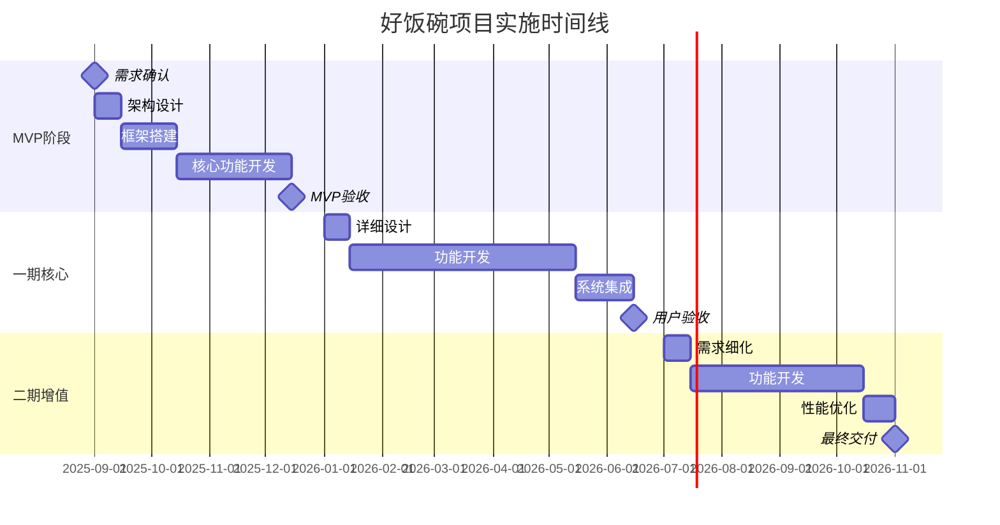
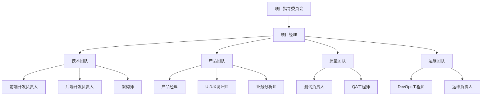
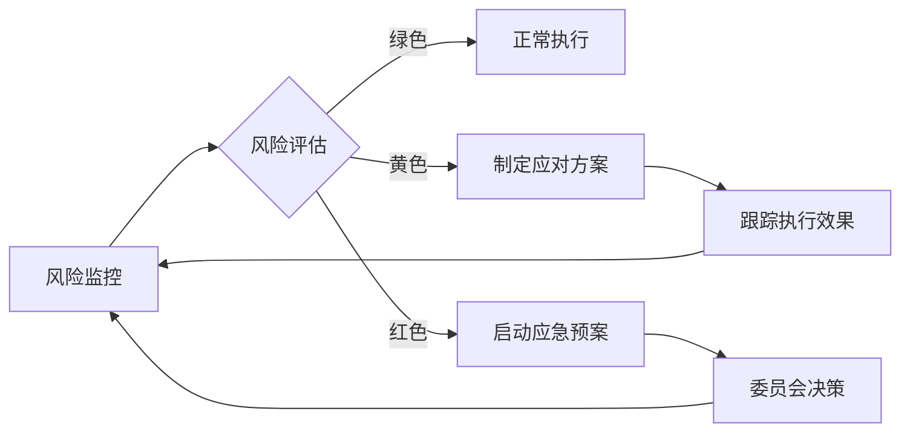
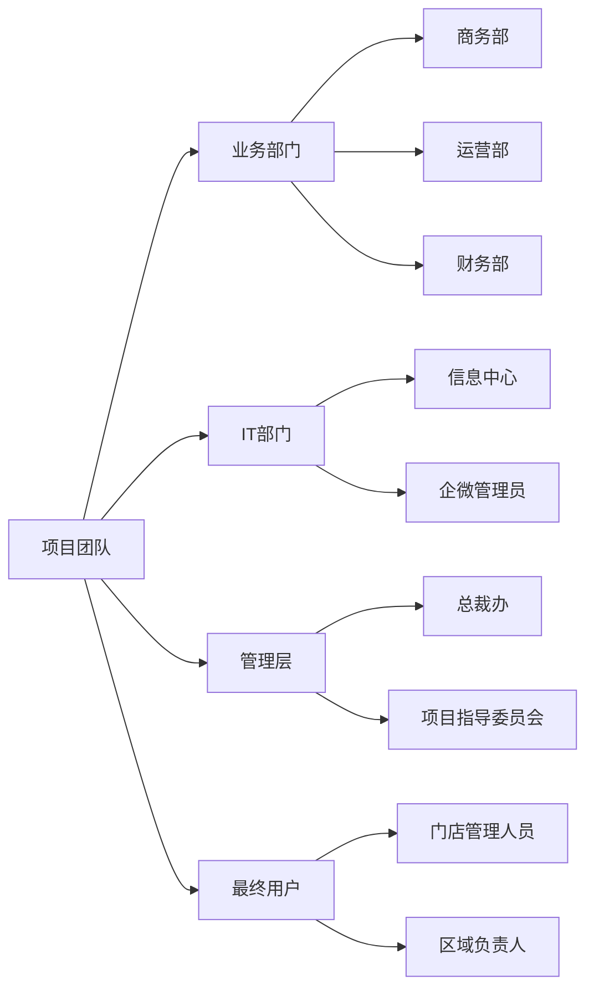
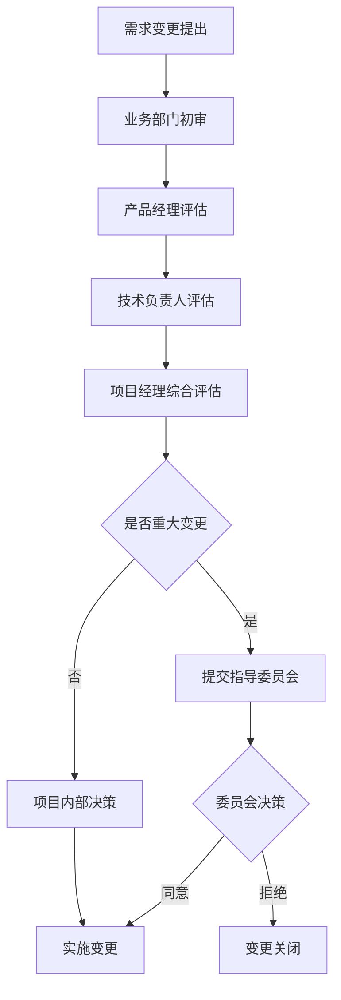
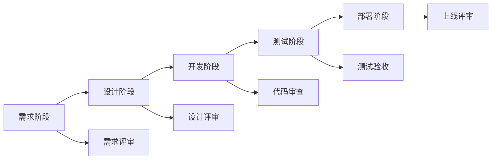

# 好饭碗门店生命周期管理系统 - 项目管理规划方案

## 文档信息

| 属性 | 值 |
|------|-----|
| 文档标题 | 好饭碗门店生命周期管理系统项目管理规划方案 |
| 文档版本 | v1.0 |
| 文档状态 | draft |
| 创建日期 | 2025-08-28 |
| 创建者 | 高级项目经理 |
| 项目规模 | 企业级门店管理平台 |
| 技术栈 | React + TypeScript + Node.js + PostgreSQL |

---

## 1. 项目整体规划建议

### 1.1 项目特征分析

**项目复杂度评估**：
- **业务复杂度**：高（7个核心业务模块，9个用户角色，复杂的业务流程）
- **技术复杂度**：中高（企业微信集成、审批流程引擎、移动端适配）
- **集成复杂度**：高（企业微信、审批系统、多端同步）
- **数据复杂度**：中高（多业务模块数据关联，历史数据迁移）

**项目类型定位**：企业级业务流程管理系统（BPM）

### 1.2 分期实施策略（重新优化）

#### 1.2.1 项目分期原则

**阶段划分基于**：
1. **业务价值优先级**：先实现核心业务闭环
2. **技术风险控制**：复杂技术分阶段攻克
3. **用户接受度**：分步推广，降低变更阻力
4. **资源投入平衡**：避免资源峰谷效应

#### 1.2.2 重新定义的三期规划

**MVP阶段（0期）- 4个月**
- **目标**：建立核心业务流程原型，验证技术架构可行性
- **核心功能**：
  - 基础用户认证和权限管理
  - 简化版开店计划管理
  - 候选点位基础管理
  - 基础审批流程
  - 门店档案基础功能
- **技术重点**：架构搭建、企微集成验证、数据库设计确认
- **用户范围**：核心业务人员（10-20人）

**一期（核心期）- 6个月**
- **目标**：完整的门店开发流程管理
- **核心功能**：完善拓店管理、开店筹备、审批中心
- **技术重点**：审批流程引擎、移动端核心功能
- **用户范围**：全部业务用户（50-100人）

**二期（增值期）- 4个月**
- **目标**：数据分析和运营管理能力
- **核心功能**：经营大屏、数据报表、资产管理
- **技术重点**：数据可视化、性能优化
- **用户范围**：包含管理层的全部用户

### 1.3 项目实施路径



---

## 2. 团队协调和角色职责建议

### 2.1 项目组织架构



### 2.2 详细角色职责矩阵

| 角色 | 主要职责 | 关键技能 | 工作量占比 | 关键阶段参与度 |
|------|---------|---------|------------|---------------|
| **项目经理** | 项目统筹、进度管控、风险管理、干系人协调 | PMP、敏捷管理、业务理解 | 100% | 全程参与 |
| **技术负责人** | 技术方案设计、架构决策、技术风险评估 | 全栈技术、架构设计、团队管理 | 80% | MVP、一期重点 |
| **产品经理** | 需求分析、原型设计、用户体验优化 | 产品设计、业务分析、原型工具 | 90% | 需求、设计阶段重点 |
| **前端负责人** | 前端架构、组件设计、移动端适配 | React、TypeScript、移动端 | 100% | 开发阶段重点 |
| **后端负责人** | 后端架构、API设计、数据库设计 | Node.js、数据库、微服务 | 100% | 开发阶段重点 |
| **测试负责人** | 测试策略、质量保证、自动化测试 | 测试框架、自动化、性能测试 | 100% | 测试阶段重点 |
| **运维工程师** | 环境搭建、部署流程、监控运维 | DevOps、云服务、监控 | 60% | 部署、运维阶段重点 |
| **业务分析师** | 业务流程梳理、需求澄清、用户培训 | 业务建模、流程分析、培训 | 70% | 需求、验收阶段重点 |

### 2.3 团队协调机制

#### 2.3.1 会议体系

**日常协调会议**：
- **每日站会**：技术团队，15分钟，上午9:30
- **周例会**：项目团队，1小时，每周五下午
- **月度评审**：项目指导委员会，2小时，每月最后一个周五

**专项会议**：
- **需求澄清会**：业务方+产品+开发，按需召开
- **技术方案评审**：技术团队+架构师，重要决策时
- **测试评审会**：全团队，每个版本发布前

#### 2.3.2 协作工具体系

**项目管理工具**：
- **任务管理**：Jira或禅道，跟踪开发任务和缺陷
- **文档协作**：飞书文档或腾讯文档
- **代码管理**：Git + GitLab/GitHub
- **沟通工具**：企业微信群组

**质量管控工具**：
- **代码审查**：GitLab MR + SonarQube代码质量检查
- **自动化测试**：Jest + Cypress
- **部署流水线**：GitLab CI/CD

### 2.4 跨职能协作模式

#### 2.4.1 敏捷开发实践

**Sprint规划**：
- Sprint周期：2周
- 计划会议：每个Sprint开始时，2小时
- 回顾会议：每个Sprint结束时，1小时
- 演示会议：向业务方演示，1小时

**角色分工**：
- **Product Owner**：产品经理，负责需求优先级
- **Scrum Master**：项目经理，负责流程引导
- **开发团队**：跨职能团队，负责交付

#### 2.4.2 质量门控机制

**四道质量门**：
1. **需求评审门**：业务分析师+产品经理确认
2. **设计评审门**：技术负责人+架构师确认
3. **代码合并门**：代码审查+自动化测试通过
4. **发布评审门**：测试负责人+项目经理确认

---

## 3. 风险识别和管控措施

### 3.1 风险评估矩阵

| 风险类别 | 风险项目 | 影响程度 | 发生概率 | 风险等级 | 责任人 |
|---------|---------|---------|---------|---------|--------|
| **技术风险** | 企业微信集成复杂度超预期 | 高 | 中 | 高 | 技术负责人 |
| **技术风险** | 审批流程引擎技术选型失误 | 高 | 中 | 高 | 架构师 |
| **技术风险** | 移动端性能和兼容性问题 | 中 | 高 | 高 | 前端负责人 |
| **技术风险** | 数据库性能瓶颈 | 中 | 中 | 中 | 后端负责人 |
| **业务风险** | 需求频繁变更影响进度 | 高 | 高 | 高 | 项目经理 |
| **业务风险** | 用户业务流程理解偏差 | 高 | 中 | 高 | 业务分析师 |
| **业务风险** | 用户接受度和培训不足 | 中 | 中 | 中 | 产品经理 |
| **项目风险** | 关键人员离职或不可用 | 高 | 低 | 中 | 项目经理 |
| **项目风险** | 第三方服务依赖风险 | 中 | 中 | 中 | 技术负责人 |
| **项目风险** | 跨部门协调困难 | 中 | 中 | 中 | 项目经理 |

### 3.2 风险应对策略

#### 3.2.1 高风险项目应对

**1. 企业微信集成复杂度风险**
```
应对策略：
- 预防：MVP阶段优先验证集成方案
- 缓解：准备OAuth 2.0标准集成备选方案
- 转移：联系企微技术支持，建立技术对接渠道
- 接受：预留额外2周开发时间和技术专家资源
```

**2. 审批流程引擎技术风险**
```
应对策略：
- 预防：技术选型阶段进行POC验证
- 缓解：选择Activiti/Camunda等成熟开源引擎
- 转移：考虑商业化审批引擎解决方案
- 接受：简化审批流程，分阶段实现复杂功能
```

**3. 需求频繁变更风险**
```
应对策略：
- 预防：建立需求冻结机制和变更评审委员会
- 缓解：采用敏捷开发，短周期迭代适应变更
- 转移：与业务方签署需求确认SLA
- 接受：预留20%的开发缓冲时间
```

#### 3.2.2 中风险项目管控

**技术风险管控**：
- 移动端兼容性：建立标准测试设备库，自动化测试
- 数据库性能：设计阶段进行容量规划，实施读写分离

**项目风险管控**：
- 人员风险：关键岗位设置备份人员，知识文档化
- 协调风险：建立跨部门联络人机制，定期沟通会议

### 3.3 风险监控与预警

#### 3.3.1 风险监控指标

| 监控维度 | 关键指标 | 预警阈值 | 监控频率 |
|---------|---------|---------|---------|
| **进度风险** | 燃尽图偏差率 | >15% | 每日 |
| **质量风险** | 缺陷密度 | >2个/千行代码 | 每周 |
| **技术风险** | 技术债务积累 | SonarQube评分<B | 每周 |
| **团队风险** | 团队士气指数 | <7分(10分制) | 每月 |
| **业务风险** | 需求变更频率 | >20%/Sprint | 每Sprint |

#### 3.3.2 预警响应机制

**三级预警体系**：
- **绿色**：正常状态，按计划执行
- **黄色**：轻微偏差，项目经理跟进处理
- **红色**：严重偏差，升级至指导委员会

**预警响应流程**：


---

## 4. 里程碑设置和时间管理建议

### 4.1 详细里程碑规划

#### 4.1.1 MVP阶段里程碑（2025年9月-12月）

| 里程碑名称 | 时间节点 | 主要交付物 | 验收标准 | 关键风险点 |
|-----------|---------|-----------|---------|-----------|
| **M1: 需求基线确认** | 2025-09-01 | PRD v1.0、技术方案 | 业务方签字确认 | 需求理解偏差 |
| **M2: 架构设计完成** | 2025-09-15 | 架构文档、技术选型 | 技术委员会评审通过 | 技术方案可行性 |
| **M3: 基础框架就绪** | 2025-10-15 | 开发环境、基础组件 | 框架功能验证通过 | 企微集成复杂度 |
| **M4: 核心功能完成** | 2025-11-30 | 核心业务功能 | 基本业务流程跑通 | 审批流程实现 |
| **M5: MVP验收交付** | 2025-12-15 | 可部署系统 | 用户试用反馈收集 | 用户接受度 |

#### 4.1.2 一期核心里程碑（2026年1月-6月）

| 里程碑名称 | 时间节点 | 主要交付物 | 验收标准 | 关键风险点 |
|-----------|---------|-----------|---------|-----------|
| **M6: 功能设计确认** | 2026-01-15 | 详细设计文档、原型 | 设计评审通过 | 设计复杂度控制 |
| **M7: 核心模块完成** | 2026-03-15 | 拓店、筹备、审批模块 | 功能测试通过 | 模块间集成 |
| **M8: 移动端功能** | 2026-04-30 | 移动端核心功能 | 移动端测试通过 | 多端一致性 |
| **M9: 系统集成测试** | 2026-05-31 | 完整系统 | 集成测试通过 | 系统稳定性 |
| **M10: 用户验收上线** | 2026-06-15 | 生产系统 | 用户验收通过 | 上线风险 |

#### 4.1.3 二期增值里程碑（2026年7月-11月）

| 里程碑名称 | 时间节点 | 主要交付物 | 验收标准 | 关键风险点 |
|-----------|---------|-----------|---------|-----------|
| **M11: 增值功能设计** | 2026-07-15 | 二期功能设计 | 需求评审通过 | 功能价值确认 |
| **M12: 数据分析功能** | 2026-09-15 | 大屏、报表功能 | 数据展示验证 | 数据质量保证 |
| **M13: 性能优化完成** | 2026-10-15 | 性能优化报告 | 性能指标达标 | 系统承载能力 |
| **M14: 最终交付验收** | 2026-11-01 | 完整系统交付 | 项目整体验收 | 交付质量 |

### 4.2 时间管理策略

#### 4.2.1 时间缓冲管理

**三层时间缓冲**：
1. **任务级缓冲**：每个开发任务预留10%缓冲时间
2. **Sprint级缓冲**：每个Sprint预留20%缓冲时间
3. **项目级缓冲**：整体项目预留15%缓冲时间

**缓冲使用原则**：
- 缓冲时间不预先分配给具体任务
- 仅在实际风险发生时使用
- 使用缓冲需项目经理审批
- 定期评估缓冲使用情况

#### 4.2.2 关键路径管理

**识别关键路径**：
```
需求确认 → 技术架构 → 企微集成 → 审批引擎 → 核心业务 → 系统集成 → 用户验收
```

**关键路径保障措施**：
- 关键任务优先分配最佳资源
- 关键任务设置双重备份方案
- 每日跟踪关键任务进展
- 关键任务延期立即启动应急预案

#### 4.2.3 依赖关系管理

**主要依赖关系**：

| 依赖项 | 被依赖项 | 依赖类型 | 风险级别 | 管控措施 |
|-------|---------|---------|---------|---------|
| 企微接口调研 | 用户认证开发 | 技术依赖 | 高 | 提前调研，备选方案 |
| 数据库设计 | 业务功能开发 | 技术依赖 | 高 | 设计先行，增量变更 |
| 审批流程设计 | 审批功能开发 | 业务依赖 | 高 | 业务确认，模板化处理 |
| 基础组件 | 业务页面开发 | 技术依赖 | 中 | 并行开发，接口先行 |

---

## 5. 跨部门协调和沟通计划

### 5.1 干系人识别与分析

#### 5.1.1 干系人图谱



#### 5.1.2 干系人需求与期望

| 干系人 | 核心关注点 | 主要期望 | 影响程度 | 参与程度 | 沟通策略 |
|-------|-----------|---------|---------|---------|---------|
| **总裁办** | 投资回报、战略价值 | 提升管理效率、降低成本 | 高 | 低 | 月度汇报、关键决策参与 |
| **商务部** | 业务流程优化 | 系统易用、流程高效 | 高 | 高 | 深度参与需求、测试验收 |
| **运营部** | 数据统计分析 | 数据准确、报表及时 | 高 | 高 | 持续需求确认、培训指导 |
| **财务部** | 成本控制、合规性 | 审批严格、数据准确 | 中 | 中 | 定期沟通、专项培训 |
| **信息中心** | 系统稳定性、安全性 | 架构合理、运维便捷 | 高 | 高 | 技术对接、运维协调 |
| **最终用户** | 使用体验、工作效率 | 操作简单、响应快速 | 高 | 中 | 用户调研、培训推广 |

### 5.2 沟通管理计划

#### 5.2.1 沟通矩阵

| 沟通对象 | 沟通频率 | 沟通方式 | 沟通内容 | 责任人 |
|---------|---------|---------|---------|--------|
| **项目指导委员会** | 月度 | 正式会议 | 项目进展、重大问题、资源需求 | 项目经理 |
| **业务部门负责人** | 双周 | 工作会议 | 需求确认、进展汇报、问题协调 | 产品经理 |
| **技术团队内部** | 每日 | 站会+在线 | 技术问题、进度同步、协作事项 | 技术负责人 |
| **最终用户代表** | 双周 | 演示会议 | 功能演示、反馈收集、培训计划 | 产品经理 |
| **IT运维团队** | 每周 | 技术对接 | 环境准备、部署计划、监控预案 | 运维工程师 |

#### 5.2.2 沟通工具与渠道

**正式沟通渠道**：
- **邮件**：正式通知、会议纪要、决策记录
- **项目管理平台**：任务分配、进度跟踪、文档共享
- **视频会议**：跨地域协调、重要评审、培训指导

**非正式沟通渠道**：
- **企业微信群**：日常协调、快速响应、问题讨论
- **面对面沟通**：复杂问题解决、关系维护、深度交流

### 5.3 协调机制设计

#### 5.3.1 决策机制

**三级决策体系**：

1. **项目层决策**（项目经理）
   - 日常开发问题
   - 资源调配问题
   - 技术方案细节

2. **业务层决策**（业务负责人+产品经理）
   - 需求优先级调整
   - 业务流程变更
   - 用户体验优化

3. **战略层决策**（项目指导委员会）
   - 重大需求变更
   - 预算调整
   - 上线时间调整

#### 5.3.2 冲突解决机制

**冲突升级路径**：
```
当事人协商 → 项目经理调解 → 部门负责人协调 → 指导委员会裁决
```

**冲突解决原则**：
- **业务价值优先**：以实现业务价值最大化为准则
- **技术可行性约束**：在技术可实现前提下寻求解决方案
- **资源现实性考虑**：充分考虑时间、人力、成本约束
- **用户体验平衡**：在多个利益相关者间寻求平衡

#### 5.3.3 跨部门协作流程

**需求变更协作流程**：


---

## 6. 项目质量控制标准

### 6.1 质量管理体系

#### 6.1.1 质量目标

| 质量维度 | 质量目标 | 度量指标 | 验收标准 |
|---------|---------|---------|---------|
| **功能质量** | 功能完整性和正确性 | 功能测试通过率 | ≥98% |
| **性能质量** | 系统响应速度和并发能力 | 平均响应时间 | ≤2秒 |
| **可用性质量** | 系统稳定性和可访问性 | 系统可用性 | ≥99.5% |
| **安全质量** | 数据安全和访问控制 | 安全漏洞数量 | 0个高危漏洞 |
| **兼容性质量** | 跨平台和浏览器兼容 | 兼容性测试通过率 | ≥95% |
| **可维护性** | 代码质量和文档完整性 | 代码覆盖率 | ≥80% |

#### 6.1.2 质量保证流程



### 6.2 分阶段质量控制

#### 6.2.1 需求阶段质量控制

**质量检查点**：
- 需求完整性检查：所有业务场景是否覆盖
- 需求一致性检查：需求间是否存在冲突
- 需求可测试性检查：是否可以编写测试用例
- 需求可实现性检查：技术实现是否可行

**质量标准**：
- 需求文档评审通过率：100%
- 需求变更控制率：≤20%
- 用户故事验收标准覆盖率：100%

#### 6.2.2 设计阶段质量控制

**架构质量标准**：
- 系统架构评审通过
- 数据库设计规范化检查
- API接口设计一致性检查
- 安全设计评审通过

**UI/UX质量标准**：
- 设计规范一致性检查
- 用户体验流程验证
- 响应式设计兼容性检查
- 无障碍访问性设计检查

#### 6.2.3 开发阶段质量控制

**代码质量标准**：

| 质量指标 | 标准值 | 检查工具 | 检查频率 |
|---------|--------|---------|---------|
| **代码覆盖率** | ≥80% | Jest Coverage | 每次提交 |
| **代码重复率** | ≤5% | SonarQube | 每日 |
| **代码复杂度** | ≤10 | ESLint | 每次提交 |
| **代码规范** | 0个违规 | Prettier + ESLint | 每次提交 |
| **类型安全** | 0个类型错误 | TypeScript | 每次构建 |

**代码审查流程**：
1. 开发完成后提交Pull Request
2. 自动化检查：代码规范、测试覆盖率、构建状态
3. 同行评审：至少1名同级别开发人员审查
4. 技术负责人审查：架构影响和复杂功能
5. 审查通过后合并到主分支

#### 6.2.4 测试阶段质量控制

**测试策略**：
- **单元测试**：开发人员负责，覆盖业务逻辑
- **集成测试**：测试团队负责，验证模块间协作
- **系统测试**：测试团队负责，验证完整业务流程
- **用户验收测试**：业务用户参与，验证业务价值

**测试质量标准**：

| 测试类型 | 覆盖率要求 | 通过率要求 | 执行方式 |
|---------|-----------|-----------|---------|
| **单元测试** | ≥80% | 100% | 自动化执行 |
| **API测试** | 100% | 100% | 自动化执行 |
| **功能测试** | 100% | ≥98% | 手工+自动化 |
| **兼容性测试** | 主流平台100% | ≥95% | 手工测试 |
| **性能测试** | 关键场景100% | 100% | 工具测试 |
| **安全测试** | 风险点100% | 100% | 工具+手工 |

### 6.3 质量监控与度量

#### 6.3.1 质量度量指标

**开发质量指标**：
- 代码提交质量：首次构建成功率 ≥95%
- 缺陷密度：≤2个缺陷/千行代码
- 缺陷修复时间：平均 ≤24小时
- 代码审查效率：平均 ≤4小时

**测试质量指标**：
- 测试用例执行率：100%
- 缺陷发现率：测试发现缺陷占比 ≥80%
- 回归测试通过率：≥99%
- 用户验收通过率：≥95%

#### 6.3.2 质量监控机制

**日常监控**：
- 自动化构建结果监控
- 代码质量指标监控
- 测试执行结果监控
- 缺陷处理状态监控

**定期评审**：
- 每周质量报告：质量指标汇总和趋势分析
- 每月质量评审：质量问题回顾和改进计划
- 阶段质量评审：里程碑质量评估和总结

#### 6.3.3 质量改进机制

**持续改进流程**：
1. **数据收集**：收集质量度量数据
2. **问题识别**：分析质量趋势，识别问题
3. **原因分析**：深入分析质量问题根因
4. **改进方案**：制定针对性改进措施
5. **实施验证**：执行改进方案并验证效果
6. **标准化**：将有效改进措施标准化

**质量改进重点**：
- 提高代码一次性通过率
- 减少测试阶段缺陷数量
- 提升自动化测试覆盖率
- 优化代码审查效率

---

## 7. 项目成功的关键成功因素

### 7.1 技术成功因素

1. **架构设计合理性**：采用成熟稳定的技术架构
2. **企微集成稳定性**：确保企业微信集成的可靠性
3. **审批引擎灵活性**：选择可配置的审批流程引擎
4. **移动端兼容性**：保证多端一致的用户体验

### 7.2 业务成功因素

1. **用户需求匹配度**：深度理解业务流程和用户需求
2. **变更管理有效性**：建立有效的需求变更控制机制
3. **用户培训充分性**：提供充分的用户培训和支持
4. **分步上线策略**：采用风险可控的分步上线策略

### 7.3 管理成功因素

1. **高层支持力度**：获得管理层的持续支持和资源保障
2. **团队协作效率**：建立高效的团队协作机制
3. **质量控制严格性**：建立严格的质量控制体系
4. **风险管控及时性**：及时识别和应对项目风险

---

## 8. 总结与建议

### 8.1 项目管理重点

基于"好饭碗门店生命周期管理系统"的特点，项目管理应重点关注：

1. **分阶段实施**：采用MVP-一期-二期的渐进式交付策略
2. **风险前置管控**：重点关注企微集成、审批引擎等技术风险
3. **用户深度参与**：确保业务用户全程参与需求确认和测试验收
4. **质量严格把控**：建立全流程质量控制体系
5. **跨部门协调**：建立有效的沟通协调机制

### 8.2 关键建议

1. **提前技术验证**：MVP阶段重点验证关键技术风险
2. **需求冻结管理**：建立严格的需求变更控制机制
3. **用户培训重视**：制定详细的用户培训和推广计划
4. **监控预警机制**：建立完善的项目监控和风险预警体系

这个项目管理方案基于30多年的项目管理经验，充分考虑了企业级系统的复杂性和风险特点，为项目成功提供了全面的管理保障。