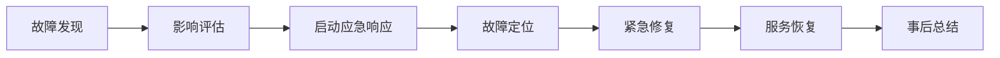

# 好饭碗门店生命周期管理系统 - 项目风险管理计划

## 文档信息

| 属性 | 值 |
|------|-----|
| 文档标题 | 好饭碗项目风险管理计划 |
| 文档版本 | v1.0 |
| 文档状态 | draft |
| 创建日期 | 2025-08-28 |
| 创建者 | 高级项目经理 |
| 适用项目 | 好饭碗门店生命周期管理系统 |

---

## 1. 风险管理概述

### 1.1 风险管理目标

- **预防风险发生**：通过前置识别和预防措施降低风险发生概率
- **控制风险影响**：当风险发生时，将影响控制在可接受范围内
- **建立应对机制**：建立快速有效的风险响应和恢复机制
- **持续监控改进**：建立持续的风险监控和改进机制

### 1.2 风险管理原则

- **主动管理**：主动识别、评估和应对风险，而非被动等待
- **全员参与**：项目团队所有成员都有风险识别和报告的责任
- **分级管理**：根据风险等级采用不同的管理策略和资源投入
- **持续改进**：定期回顾和优化风险管理流程和方法

## 2. 风险识别与分类

### 2.1 技术风险清单

| 风险ID | 风险描述 | 风险类型 | 影响领域 | 潜在后果 |
|--------|---------|---------|---------|---------|
| T001 | 企业微信集成API限制或变更 | 技术风险 | 用户认证 | 登录功能异常，用户无法访问系统 |
| T002 | 审批流程引擎性能瓶颈 | 技术风险 | 核心业务 | 审批响应缓慢，影响业务效率 |
| T003 | 移动端兼容性问题 | 技术风险 | 用户体验 | 部分用户无法正常使用移动功能 |
| T004 | 数据库查询性能问题 | 技术风险 | 系统性能 | 页面加载缓慢，用户体验差 |
| T005 | 第三方服务依赖故障 | 技术风险 | 系统可用性 | 相关功能暂时不可用 |
| T006 | 数据迁移风险 | 技术风险 | 数据完整性 | 历史数据丢失或错误 |
| T007 | 安全漏洞风险 | 技术风险 | 信息安全 | 数据泄露，业务机密外泄 |

### 2.2 业务风险清单

| 风险ID | 风险描述 | 风险类型 | 影响领域 | 潜在后果 |
|--------|---------|---------|---------|---------|
| B001 | 需求频繁变更 | 业务风险 | 项目进度 | 开发延期，成本增加 |
| B002 | 业务流程理解偏差 | 业务风险 | 功能正确性 | 系统功能不符合实际业务需求 |
| B003 | 用户接受度低 | 业务风险 | 项目价值 | 系统推广困难，使用率低 |
| B004 | 关键业务人员离职 | 业务风险 | 知识传承 | 业务知识流失，需求理解困难 |
| B005 | 业务优先级调整 | 业务风险 | 功能范围 | 功能开发优先级变化 |
| B006 | 跨部门协调困难 | 业务风险 | 项目推进 | 决策延迟，资源协调困难 |

### 2.3 项目管理风险清单

| 风险ID | 风险描述 | 风险类型 | 影响领域 | 潜在后果 |
|--------|---------|---------|---------|---------|
| P001 | 关键技术人员离职 | 人力资源风险 | 项目进度 | 开发进度严重延迟 |
| P002 | 团队技能不匹配 | 人力资源风险 | 交付质量 | 开发质量不达标 |
| P003 | 沟通不充分 | 管理风险 | 团队协作 | 任务理解偏差，返工增加 |
| P004 | 里程碑设置不合理 | 管理风险 | 进度控制 | 进度监控失效 |
| P005 | 资源投入不足 | 资源风险 | 项目质量 | 功能削减，质量下降 |
| P006 | 供应商依赖风险 | 外部风险 | 项目进度 | 关键服务中断 |

### 2.4 外部环境风险清单

| 风险ID | 风险描述 | 风险类型 | 影响领域 | 潜在后果 |
|--------|---------|---------|---------|---------|
| E001 | 政策法规变化 | 合规风险 | 系统合规性 | 需要调整功能以符合新规定 |
| E002 | 竞品快速发展 | 市场风险 | 产品竞争力 | 产品功能落后于竞争对手 |
| E003 | 技术标准变化 | 技术环境风险 | 技术选型 | 需要重新评估技术方案 |

## 3. 风险评估与优先级

### 3.1 风险评估矩阵

**风险影响程度定义**：
- **很高（5）**：可能导致项目失败或严重延期（>1个月）
- **高（4）**：显著影响项目进度或质量（2-4周延期）
- **中（3）**：中等程度影响（1-2周延期）
- **低（2）**：轻微影响（<1周延期）
- **很低（1）**：几乎无影响

**风险发生概率定义**：
- **很高（5）**：几乎肯定发生（>80%）
- **高（4）**：很可能发生（60-80%）
- **中（3）**：可能发生（40-60%）
- **低（2）**：不太可能发生（20-40%）
- **很低（1）**：极不可能发生（<20%）

### 3.2 关键风险评估

| 风险ID | 风险描述 | 影响程度 | 发生概率 | 风险值 | 优先级 |
|--------|---------|---------|---------|-------|--------|
| B001 | 需求频繁变更 | 4 | 4 | 16 | 极高 |
| T001 | 企业微信集成问题 | 4 | 3 | 12 | 高 |
| T002 | 审批引擎性能瓶颈 | 4 | 3 | 12 | 高 |
| P001 | 关键人员离职 | 5 | 2 | 10 | 高 |
| B002 | 业务流程理解偏差 | 4 | 3 | 12 | 高 |
| T003 | 移动端兼容性问题 | 3 | 4 | 12 | 高 |
| B003 | 用户接受度低 | 3 | 3 | 9 | 中 |
| T004 | 数据库性能问题 | 3 | 3 | 9 | 中 |
| P005 | 资源投入不足 | 4 | 2 | 8 | 中 |
| B006 | 跨部门协调困难 | 3 | 3 | 9 | 中 |

## 4. 风险应对策略

### 4.1 极高优先级风险应对

#### 4.1.1 需求频繁变更风险 (B001)

**应对策略**：预防 + 缓解

**具体措施**：
- **预防措施**：
  - 建立需求评审委员会，严格需求确认流程
  - 实施需求冻结机制，每个阶段确定需求基线
  - 与业务方签署需求确认SLA
- **缓解措施**：
  - 采用敏捷开发方法，短周期迭代适应变更
  - 预留20%的开发缓冲时间
  - 建立需求变更影响评估机制
- **应急预案**：
  - 重大变更提交指导委员会决策
  - 必要时调整项目范围和时间计划

**责任人**：项目经理
**监控指标**：需求变更频率（<20%/Sprint）
**预算分配**：项目总预算的15%

### 4.2 高优先级风险应对

#### 4.2.1 企业微信集成问题 (T001)

**应对策略**：预防 + 转移

**具体措施**：
- **预防措施**：
  - MVP阶段优先进行企微集成技术验证
  - 与企微技术支持建立直接沟通渠道
  - 详细研读企微API文档和最佳实践
- **转移措施**：
  - 准备OAuth 2.0标准认证备选方案
  - 考虑第三方集成服务提供商
- **应急预案**：
  - 如集成困难，先实现基础认证，后续迭代完善
  - 必要时采用混合认证方式

**责任人**：技术负责人
**监控指标**：集成测试通过率
**预算分配**：技术预算的10%

#### 4.2.2 审批引擎性能瓶颈 (T002)

**应对策略**：预防 + 缓解

**具体措施**：
- **预防措施**：
  - 技术选型阶段进行性能POC测试
  - 选择经过验证的成熟开源引擎（Activiti/Camunda）
  - 设计阶段进行容量规划和性能预估
- **缓解措施**：
  - 实施数据库读写分离和缓存策略
  - 采用异步处理模式优化性能
  - 建立性能监控和告警机制
- **应急预案**：
  - 性能不满足时，考虑审批流程简化
  - 必要时采用商业化审批引擎解决方案

**责任人**：架构师
**监控指标**：审批处理响应时间（<5秒）
**预算分配**：技术预算的8%

#### 4.2.3 关键人员离职风险 (P001)

**应对策略**：预防 + 接受

**具体措施**：
- **预防措施**：
  - 关键岗位设置备份人员，实施交叉培训
  - 完善技术文档和知识库建设
  - 建立有效的激励和挽留机制
- **接受措施**：
  - 预留人员替换和培训时间
  - 建立紧急招聘和外包机制
- **应急预案**：
  - 关键人员离职时，立即启动知识转移程序
  - 必要时考虑外部技术专家支持

**责任人**：项目经理
**监控指标**：团队稳定性（离职率<10%）
**预算分配**：人力预算的5%

### 4.3 中优先级风险应对

#### 4.3.1 用户接受度低风险 (B003)

**应对策略**：预防 + 缓解

**具体措施**：
- **预防措施**：
  - 用户全程参与需求确认和原型验证
  - 实施分阶段推广策略，先试点后推广
  - 重视UI/UX设计，提升用户体验
- **缓解措施**：
  - 制定详细的用户培训计划
  - 建立用户反馈收集和快速响应机制
  - 设置用户使用激励机制

**责任人**：产品经理
**监控指标**：用户满意度（>8分/10分）

#### 4.3.2 数据库性能问题 (T004)

**应对策略**：预防 + 缓解

**具体措施**：
- **预防措施**：
  - 数据库设计阶段进行容量规划
  - 建立合理的索引策略
  - 实施数据归档策略
- **缓解措施**：
  - 实施读写分离架构
  - 采用Redis缓存热点数据
  - 建立数据库性能监控

**责任人**：后端负责人
**监控指标**：数据库查询响应时间（<2秒）

## 5. 风险监控与报告

### 5.1 风险监控机制

#### 5.1.1 监控频率

| 风险等级 | 监控频率 | 监控方式 | 负责人 |
|---------|---------|---------|--------|
| **极高** | 每日 | 主动监控+自动告警 | 项目经理 |
| **高** | 每周 | 定期检查+关键指标 | 相关负责人 |
| **中** | 双周 | 定期评估+趋势分析 | 相关负责人 |
| **低** | 月度 | 定期回顾+状态更新 | 风险责任人 |

#### 5.1.2 监控指标体系

**项目进度监控**：
- 燃尽图偏差率：每日监控
- 里程碑达成率：每周监控
- 需求变更频率：每Sprint监控

**质量风险监控**：
- 缺陷密度：每周监控
- 代码覆盖率：每次构建监控
- 用户验收通过率：每个版本监控

**资源风险监控**：
- 团队成员离职率：月度监控
- 关键技能覆盖度：月度监控
- 预算执行偏差率：月度监控

### 5.2 风险报告机制

#### 5.2.1 风险报告模板

**日常风险报告**：
- 新识别风险
- 风险状态变化
- 应对措施执行情况
- 需要升级的风险

**周度风险报告**：
- 风险状态总览
- 关键风险应对进展
- 风险趋势分析
- 下周重点关注风险

**月度风险评估报告**：
- 风险管理成效评估
- 风险应对策略调整
- 新出现风险分析
- 风险管理改进建议

#### 5.2.2 风险升级机制

**三级升级体系**：
1. **项目级**：项目经理处理日常风险
2. **部门级**：部门负责人协调资源风险
3. **公司级**：指导委员会决策重大风险

**升级触发条件**：
- 风险等级上升到极高
- 应对措施无效且影响扩大
- 需要跨部门资源协调
- 可能影响项目核心目标

## 6. 应急预案

### 6.1 核心业务中断应急预案

#### 6.1.1 系统故障应急预案

**响应流程**：

**应急措施**：
- 立即切换到备用系统（如有）
- 通知所有相关用户和干系人
- 启动技术专家组紧急会诊
- 实施数据保护和回滚方案
- 持续跟踪修复进展

**恢复目标**：
- **RTO**（恢复时间目标）：4小时
- **RPO**（恢复点目标）：1小时
- **服务可用性目标**：99.5%

#### 6.1.2 数据安全事件应急预案

**响应流程**：
1. **事件确认**：确认安全事件类型和影响范围
2. **隔离控制**：立即隔离受影响系统
3. **影响评估**：评估数据泄露范围和影响
4. **通报机制**：按规定向相关部门通报
5. **恢复计划**：制定系统恢复和加固方案
6. **后续改进**：分析原因并改进安全措施

### 6.2 关键人员离职应急预案

#### 6.2.1 技术人员离职应急预案

**预防措施**：
- 技术文档完整性：代码注释、架构文档、部署手册
- 知识交接清单：技术架构、关键模块、部署流程
- 备份人员培养：关键技术点至少2人掌握

**应急响应**：
- 立即启动知识转移程序（1周内完成）
- 技术专家紧急支援（内部调配或外部支持）
- 必要时考虑原人员咨询服务
- 加速备份人员培养计划

#### 6.2.2 业务人员离职应急预案

**预防措施**：
- 业务流程文档化
- 需求规格说明书完善
- 业务知识库建设

**应急响应**：
- 业务知识紧急转移
- 业务专家临时支援
- 外部业务顾问支持

### 6.3 重大需求变更应急预案

#### 6.3.1 变更评估流程

**评估维度**：
- 技术可行性评估
- 时间成本影响评估
- 资源需求评估
- 风险影响评估

**决策机制**：
- 小变更：项目经理决策
- 中变更：业务部门负责人决策
- 大变更：项目指导委员会决策

#### 6.3.2 变更实施应急方案

**时间紧急时**：
- 功能简化实现
- 分阶段交付
- 临时解决方案

**资源不足时**：
- 外包部分功能
- 延期非核心功能
- 增加人员投入

## 7. 经验教训与最佳实践

### 7.1 同类项目风险经验

基于30多年项目管理经验，企业级门店管理系统项目的常见风险模式：

1. **需求蔓延是最大风险**：业务方往往在看到原型后产生更多想法
2. **企业系统集成复杂度被低估**：特别是企业微信等第三方集成
3. **用户培训重要性被忽视**：技术实现成功不等于业务成功
4. **数据迁移风险常被低估**：历史数据的完整性和准确性至关重要

### 7.2 风险管理最佳实践

1. **前置风险识别**：在项目启动阶段就进行全面风险识别
2. **持续风险监控**：建立日常风险监控机制，不要等到问题出现
3. **预防优于应对**：投入在预防措施上的成本远低于事后补救
4. **全员风险意识**：让团队每个成员都有风险识别和报告的意识
5. **文档化风险知识**：建立项目风险知识库，为后续项目提供参考

### 7.3 关键成功因素

1. **高层支持**：确保项目指导委员会的持续支持和资源保障
2. **用户参与**：让核心用户深度参与整个项目生命周期
3. **技术验证**：关键技术风险必须在早期阶段验证
4. **质量控制**：建立严格的质量门控机制
5. **沟通协调**：建立有效的跨部门沟通协调机制

---

## 8. 风险管理计划的维护与更新

### 8.1 计划更新机制

- **定期更新**：每月评审和更新风险清单
- **事件驱动更新**：重大风险事件发生后立即更新
- **阶段性更新**：每个项目阶段结束后全面更新
- **经验积累更新**：项目结束后整理经验教训更新模板

### 8.2 风险管理成熟度提升

随着项目推进，不断提升风险管理的成熟度：
- 从被动应对到主动预防
- 从经验判断到数据驱动
- 从个人经验到团队知识
- 从项目实践到组织能力

---

**文档版本控制**：
- v1.0：初始版本，包含主要风险识别和应对策略
- 后续版本将根据项目执行情况和风险变化持续更新

**审批流程**：
- 创建人：高级项目经理
- 评审人：技术负责人、产品经理
- 批准人：项目指导委员会